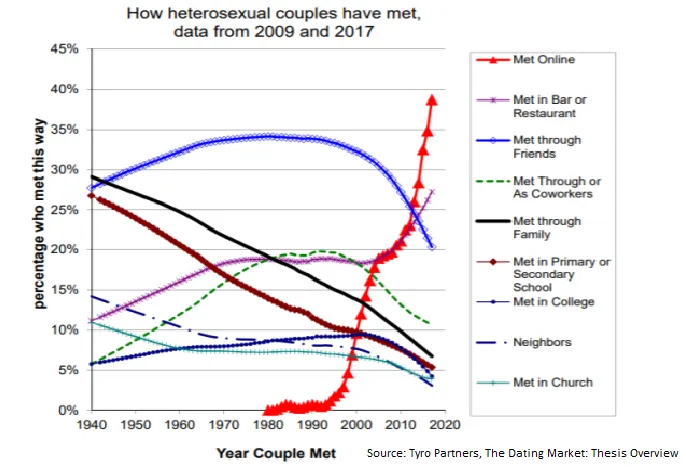

## 要点

1. 电子游戏是下一个文化现象，虚拟现实将引领这场革命
2. 你重新平衡投资组合的时间点可能会显著影响你的回报
3. 我们不擅长描述概率，更糟糕的是组合概率

### 电子游戏扼杀了这位体育明星

11月21日，这家知名游戏公司 [Valve](https://store.steampowered.com/ 'Steam') 宣布了一款新游戏， [Half-Life Alyx](https://half-life.com/en/alyx 'Alyx')\.《爱丽克斯》是《半条命》系列的续作，被广泛认为是有史以来最伟大的游戏之一\;上一次更新发布于十二年前。你可以在下方观看《爱丽克斯》的2分钟预告片。请记住，这款游戏是为玩家设计的 _在VR中！_

  <iframe src="https://www.youtube.com/embed/O2W0N3uKXmo" title="Alyx Trailer" frameborder="0" allowfullscreen style="position:absolute;top:0;left:0;width:100%;height:100%;"></iframe>

<a href="https://www.youtube.com/watch?v=O2W0N3uKXmo" target="_blank" rel="noopener">Watch on YouTube</a>

这为什么重要？你们订阅了关于科技、金融以及偶尔自嘲笑话的内容\;你们中可能有一半人没点进视频。 _谁在乎电子游戏？_

以下是你应该关心的原因。我相信电子游戏和电子竞技（为了娱乐而看电子游戏）是下一个文化现象。就像如果你没看过最新的《复仇者联盟》电影，你会觉得被排除在对话之外一样，很快你会因为没玩或没看过最新的游戏而感到被边缘化 [^1]\.我也相信，增强现实和虚拟现实将成为我们娱乐方式的下一种形式，就像手机、个人电脑或电视一样。我希望Alyx能成为推动VR进入主流的催化剂，但也要承认市场可能还为时过早。

听起来很荒谬，对吧？毕竟，光《复仇者联盟：终局之战》就是一部票房达30亿美元的电影，你连一块石头都扔不出来 [^2] 没有撞到那些无趣的复仇者梗，而且 [Marvel movie spinoffs are reproducing like rabbits](https://time.com/5167535/upcoming-marvel-movies/ 'List of upcoming Marvel movies')\. _电子游戏能有多大？_

嗯：

游戏比胶片大，但增长速度更快。随着 [global sports industry at $500bn in size](https://www.businesswire.com/news/home/20190514005472/en/Sports---614-Billion-Global-Market-Opportunities 'Sports')游戏在达到与体育同等规模之前，还有很大的成长空间。

要做到这一点，游戏需要超越孩子们用父母信用卡玩《堡垒之夜》的范围。 [The largest esports tournament already has about the same number of viewers as the Super Bowl](https://marginalrevolution.com/marginalrevolution/2018/08/esports-update.html 'MR')但小型比赛还无法相比。你希望新游戏能成为包容性的体验，让成年人甚至老人都能欣赏。 _奶奶会玩电子游戏吗？_

嗯 [^3]\:

我并不是唯一一个对游戏持乐观态度的人。知名风险投资公司A16Z也增加了对游戏的兴趣， [wrote about some trends they believe in](https://a16z.com/2019/10/16/trends-revolutionizing-games/ 'a16z') [^4]\:

> 游戏是下一个社交网络

> 随着跨平台游戏成为新标准，多人游戏将比老一代游戏发展得更快、规模更大

> 下一个大型电影系列、主题公园或玩具系列很可能会来自游戏。

我至少有三个理由相信这会发生：

1. 人口统计。游戏爱好者孩子正在成长为玩家父母。他们的孩子很可能自己也是玩家，不再需要解释为什么不能暂停多人游戏。

2. 增加包容性和互动性。每个人都可以玩电子游戏， [even a Saudi prince](https://www.dailydot.com/parsec/saudi-arabian-prince-on-steam/ 'Saudi')\.你可以直接从观看球队获胜，直接进入同一个房间亲自玩游戏。当VR真正起飞时，你甚至不必再担心复杂的操作，因为互动将变得直观。

3. 渴望社区。每个人都想归属某个群体。游戏基本上提供了无限的选择，让你认同自己是更大群体的一部分。随着越来越多的游戏意识到它们也提供了社交体验，开发者将开始加入类似的社区功能 [Fortnite's in-game concert](https://www.theverge.com/2019/2/21/18234980/fortnite-marshmello-concert-viewer-numbers 'Fortnite') [^5]

我很好奇游戏的经济模式会如何改变。用游戏内虚拟物品卖真钱 [not that old](https://www.eurogamer.net/articles/USD25-wow-horse-makes-millions 'WoW')暗示游戏变现仍不成熟，未来我们应见证变现模式的演变。关于电竞，前游戏公司高管Mitch Lasky [^6]指出 [the current structure of esports is different from live sports](https://www.quora.com/What-is-your-view-on-the-future-of-eSports-in-comparison-to-other-major-US-sports 'Mitch')\.电竞游戏直接与发行商挂钩，发行商更看重电子竞技作为营销工具。电竞队伍确实赚钱，但只占整体游戏收入的一小部分。这与现场体育赛事形成对比，后者获得体育场票和电视合约收入，队伍和选手从中获得更大份额。

也许我是在说服自己，我花了成千上万小时玩游戏并没有白费。不过我对此表示怀疑 [^7]并且认为电子游戏和虚拟现实将长期存在。我预测玩电子游戏将成为常态而非例外，并且有50\%的把握认为VR是推动这一转变的平台。如果你不想感到被排斥，我认为值得体验一下VR体验，这样下次你能向孩子炫耀你是早期用户。

### 时机运气和幸运时机

拥有多元化投资组合的投资者通常会定期重新平衡投资组合，也就是说他们调整投资以回到理想的投资比例。例如，如果你的理想投资组合是60\%股票和40\%债券，你可以每年检查一次这个比例，根据需要买卖，以恢复到60\%股票和40\%债券的状态。

重新平衡的时机重要吗？ [This research by Corey Hoffstein](https://blog.thinknewfound.com/2019/11/the-dumb-timing-luck-of-smart-beta/ 'Newfound Research') 他们声称会。他们将“时机运气”定义并衡量为选择再平衡日期（例如选择6月而非12月）在表现上的差异。然后他们构建包含各种投资策略、投资数量和再平衡频率的投资组合\;为了简洁起见，我省略了细节 [^8]\.

他们发现：

> 高流动率的策略需要更高的时机运气。

> 更频繁再平衡的策略时机运气较低。

> 宇宙受限较少的策略时机运气会更高。

换句话说，如果你的周转率高、再平衡频率较低或约束较少，重新平衡时机对最终回报的影响就越大。下方箭头表示表现最佳和最差表现变体之间的差额， _同一档案_\.

他们还提供了一张汇总表，展示了不同投资策略之间的差异。为了理解下面的内容，说明“增强价值”组合中的1美元可能让你从4\.45美元回报到5\.45美元，而这1美元的差额完全是你重新平衡时的运气。

他们总结道：

> 对于相对集中的投资组合（100只股票）且半年一度再平衡频率（许多指数定义中常见），年度时机运气范围为1\%至4\%，这意味着年表现离散度的95\%置信区间约为\+\/\-1\.5\%至\+\/\-12\.5\%。

> 时机运气的巨大程度让人质疑我们能否在两种策略之间得出有意义的相对表现结论。

为了让大家了解情况， [stocks have averaged a nominal return of ~10% a year](https://mebfaber.com/2018/11/14/episode-129-mebs-take-on-return-expectations-portfolio-construction-and-practical-market-approaches/ 'Meb')\.假设你的投资组合回报差不多 [^9]10个百分点中最多4个百分点可能只是因为调整平衡日期。

个人投资者的一个建议方案是拆分投资组合，尽管这看起来工作量很大：

> 我们认为动量投资组合应每季度进行一次再平衡，我们提议将资本分散到三个涵盖不同三个月再平衡期的投资组合（例如：1月\-4月\-7月\-10月，2月\-5月\-8月\-11月，3月\-6月\-9月\-12月）。这种解决方案被称为“分层”或“重叠投资组合”。

或者，你可以通过逆转前面提到的条件来降低时机运气。低周转率、更频繁地再平衡或投资组合集中度较低，都会降低时机对预期收益差的影响。

### 可能性有多大

如果我告诉你：

- 一位专家说，我很可能辞职去做贾米拉·贾米尔的专属调酒师 [^10]
- 另一位专家也说这很有可能

你觉得这种情况“很可能”还是“极有可能”发生？

如果：

- 第一位专家说上述情况发生的概率有80\%
- 第二位专家说有70\%的概率

你觉得现在发生这种事的概率有多大？你觉得这“很可能”吗？“非常可能？”

[This paper by Celia Gaertig and Robert Mislavsky](https://papers.ssrn.com/sol3/papers.cfm?abstract_id=3454796 'paper') 讨论人们如何通过进行类似上述的实验，结合来自多个来源的概率预测。如果你已经阅读这份通讯一段时间了，我们判断和概率组合时存在不一致也就不足为奇了 [^11]\.

我们对语言概率和数字概率的处理方式各不相同\;不同组织和个人对“可能性”的理解各不相同：

> 在IPCC报告中被描述为“可能发生”的事件，必须有66\%到100\%的概率。另一方面，在美国国家情报总监报告中被描述为“可能发生”的事件，发生概率必须达到55\%到80\%。

当然，如果你问朋友们对“可能”的定义， [you'd get such a wide range of answers it'd be unhelpful.](https://link.springer.com/article/10.3758/BF03327890 'polls')

论文提出：

> 一般来说，数值概率是精确但缺乏方向性的，而口头概率有方向但缺乏精确度

这里的方向意味着正面或负面含义。例如，听到某件事“很可能发生”，比起“80\%”的预测，我能获得更多的背景和信心。

在确定了数值概率和语言概率的区别后，作者研究了人们如何将这些概率组合起来：

> 我们指的是参与者在结合预测时采用“平均”或“计数”策略，

> “平均化”指的是一种组合策略，参与者对顾问的预测进行加权平均，并将自己的预测置于顾问预测之间

> “计数”指的是一种组合策略，参与者将每位顾问的预测解读为积极信号，并根据信号方向调整自己的预测

例如，如果收到多个预测，范围在60\%到80\%之间，“平均”策略会让你接近70\%，而“计数”策略则能让你超过80\%，因为很多预测都证实了你的观点 [^12]\.如果你收到多个预测，大多说某个事件“很可能发生”，那么“平均”策略会认为它“很可能发生”，而“计数”策略则认为该事件“极有可能”，因为很多人都说它“很可能发生”

研究人员发现，人们在数值概率和语言概率的组合上有不同的表现：

> 虽然人们会平均多个数值预测，但他们“计数”多个口头概率预测，导致预测比每位顾问的预测更极端

换句话说，我们用平均法达到上述例子中的70\%，但一旦将这些数值预测转换为口头预测，我们“计数”预测数量，变成“高度可能”，而非平均。研究人员还表明，这会影响行为，消费者可能会根据预测的呈现方式被影响购买商品。

不过你应该“计数”还是“平均”，取决于你的专家是否有相似或不同的信息。如果他们基于相同信息，“平均化”更能抵消特殊误差。如果不是，那么“计数”可能是贝叶斯策略的一种近似，能改善你的个人预测。

## 其他

1. [Obvious career mistakes (that might not be so obvious)](https://www.calnewport.com/blog/2019/11/11/the-obvious-way-to-improve-your-career-that-might-not-be-so-obvious/ 'Cal')

   > 显而易见的职业错误\#1：你大多是在寻求一般性的建议

   > 显而易见的职业错误\#2：你只模仿表面，而不是原因

   > 显而易见的职业错误\#3：你规划了一条轻松的路线，即使它并非指向你的目的地

2. [What the WSJ got wrong in their investigation of Google's search algorithms](https://searchengineland.com/misquoted-and-misunderstood-why-we-the-search-community-dont-believe-the-wsj-about-google-search-325241 'SEL')
3. [How has the dating market changed?](https://gallery.mailchimp.com/2506bda6ca9a8b7ce8b3c54b4/files/1a8cc94c-6198-4f3d-b27d-8a6060ed6c5d/Tyro_Dating_Market_Thesis_Final_For_Twitter_Pub_v2.pdf 'Tyro')

   

   > 请注意上方图表中“在酒吧或餐厅遇见”的激增。在数据科学中，这些举报者被技术术语称为“骗子”。

4. [How to build a pyramid](https://analog-antiquarian.net/2019/08/30/chapter-16-how-to-build-a-pyramid/ 'pyramid')
5. [Explaining a math olympiad problem](https://aeon.co/videos/can-you-solve-this-slippery-maths-puzzle-that-doubles-as-a-morality-tale 'aeon')

[^1]: 游戏玩家已经有25亿，定义得很宽泛， [according to Statista.](https://www.statista.com/statistics/748044/number-video-gamers-world/ 'Stats') 即使你大幅减少这个数字以反映统计方法不佳，它依然会很大。玩家——他们生活在我们中间。你会注意到我把游戏和电子竞技交替使用，而实际上电竞只是整体电子游戏中的一小部分。我认为定义上有足够的模糊性，电竞会发展到足以让这两个区别变得无关紧要。

[^2]: 呵。

[^3]: 我有一个 ~~无理性~~ 对《精灵宝可梦GO》的强烈反感是完全合理的，但也承认它一手就被改造成了更老的版本 ~~上瘾~~ 比我所知的任何游戏都更热情的玩家

[^4]: 我并不完全同意他们所有的趋势，尤其是一次性的点击点（游戏在预期中仍然是一次性的热门）和自然发现点（这只是广告渠道的转变），但这些评论留待另一篇文章再说。

[^5]: 我仍然希望有某种《一级玩家》的元游戏平台，能把你想玩的所有游戏连接起来，并且你在一个游戏中的状态会转移到另一个游戏中。

[^6]: 来源：以下 [Blake Robbins](https://twitter.com/blakeir/status/1110954210747650052?s=20 'Blake')

[^7]: 是说服自己，而不是浪费时间。这绝对是浪费时间。

[^8]: 你可以在论文中找到详细信息，简单总结是他们基于2000年至2019年间标普500的持仓，创建了四个不同的投资组合：1）价值：按盈利收益率排序。2）动量：按之前12个月的收益率排序。3）低波动率：按实现的12个月波动率排序。4）质量：按股本回报率（ROE）、应计比率和杠杆比率的平均排名评分排序。对于这四个投资组合，它们进一步调整了1）持仓数量：50、100、150、200、250、300、350、400\;2）再平衡频率：季度、半年和每年。

[^9]: 当然这是个很大的假设，但为了简化来说是合理的。你可以说你期望的回报远高于10\%，但其他人也是这么认为的，我怀疑人们在没有显著更高预期风险的情况下真的能获得回报。

[^10]: 她因最近在这部精彩剧集中的角色而闻名 [The Good Place](https://www.nbc.com/the-good-place 'Good') 同时也用于健康倡导。当然，这纯属假设。除非你恰好是贾米拉，那就不行了 _请雇佣我，谢谢，这非常有可能。_

[^11]: 这份通讯的副标题可以是“人类在我们所做的一切都很糟糕”，但听起来太戏剧化了。

[^12]: 当然，这取决于预测的分布和权重方式，但我为了方便解释做简化。
