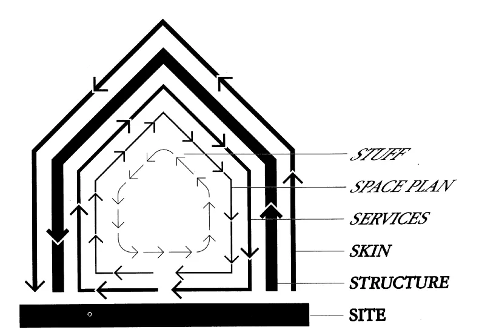

## 摘要

节奏层框架可以用来建模文明，每个层以自己的速度移动，并引发其他层的变化。强迫层级过快变化会导致灾难性后果。

## 房屋与文明

想象一栋建筑。也许是你工作的办公室，或者你居住的房子。 **建筑的哪些部分会随着时间变化？变化速度有多快？**

房间里的东西一直在变。你买了新的亚马逊回声，你 [throw away the old lamp](https://www.youtube.com/watch?v=dBqhIVyfsRg 'lamp')\.变化是持续且频繁的。

空间布局或室内布局变化较少。也许你的办公室终于在你离开公司的第二天，在办公桌和浴室之间筑起一堵墙。或者你决定这样做 [convert your yard into an arcade](https://www.reddit.com/r/mancave/comments/e58v6r/mancave_arcade_in_the_backyard/ 'arcade')\.这里的变更是间歇性且较少发生的。

内部的服务，比如管道、电力、燃气等，变化更少。建筑外观或外观也一样。这些在你搬出之前可能都不会改变。

结构，或者 [skeleton](https://www.designingbuildings.co.uk/wiki/Skeleton_frame 'skeleton')除非是翻新或拆除，否则很少发生变化。

建筑本身的地理位置基本保持不变。

1994年， [Stewart Brand](https://en.wikipedia.org/wiki/Stewart_Brand 'Stewart') 关于 [Long Now Foundation](http://longnow.org/ 'Long Now') 提出上述模型，作为思考建筑如何学习和演变的方式 [^1]\.一座建筑可以被看作有多层，每层变化的速度都不同。 **健康的建筑允许层级间有控制的互动，各层以自己的节奏移动。**

1999年，斯图尔特进一步将该框架扩展到文明领域。 **文明的哪些部分会随着时间发生变化？它们变化的速度有多快？它们是如何相互作用的？**

他称这个框架为 **节奏叠加，** 并提出 ["six significant levels of pace and size in the working structure of a robust and adaptable civilization."](https://jods.mitpress.mit.edu/pub/issue3-brand 'pace')

按移动最快到最慢的顺序，这些关卡分别是：

- 时尚\/艺术
- 商业
- 基础设施
- 治理
- 文化
- 自然

时尚移动迅速，自然流动缓慢。斯图尔特描述了这些层次如何相互作用：

> 快者学习，慢者记忆。快者提出，缓慢者决定。快者不连续，慢者持续。快与小通过积累的创新和偶尔的革命教导慢与大。慢与大通过约束和恒常控制小而快。快者吸引我们全部注意力，慢者拥有全部权力。

变化会在所有层级中发生，但每个层面都有自己的节奏：

> 在一个持久的社会中，每个层级都能以自己的节奏运作，由较低的层级安全地维持，而上层更活跃的层级则保持活力。

我假设上述意思是变化并非坏事，实际上是值得追求的。移动更快的层能提供能量，重新激活移动较慢的层，朝更好的方向发展。 **不过，它需要尊重较慢移动层的节奏：**

> 例如，如果商业被治理和文化允许以商业化的速度推动自然，那么所有支持的自然森林、渔业和含水层将会丧失。

> 如果治理发生在突然而非渐进的改变中，就会出现灾难性的法国和俄罗斯革命。

> 在苏联，治理试图无视文化和自然的限制，同时强迫商业和艺术实现五年计划的基础设施建设。因此切断了支持和创新，注定失败。

以上都是例子 **我们不应该强迫缓慢的层级加快速度。** 一层具有自然速度 [^2]\.即使能做到，也应避免让其他层达到更快的速度。

有没有一种情况是我们不应该推动快速层次变慢？换句话说，我们什么时候想加速时尚、商业或基础设施这些更快层次的变化？还是我们应该始终以降低速度为目标？文章中似乎没有明确的答案。

另外，斯图尔特指出，“随着年龄增长，人们的兴趣往往会转移到节奏较慢的部分。”相比你想传给孙辈的文化，时尚问题更小。这似乎从轶事中看来是真的，尽管相关研究似乎 [mixed](https://www.journals.uchicago.edu/doi/abs/10.1086/706889?mobileUi=0&journalCode=jop 'research') [^3]\.

斯图尔特描述了每个节奏层如何相互影响：

时尚的活力激发着商业活力。最新款手机发布，人人争相购买。

商业吸收了这种冲击，并影响了基础设施。新的无线技术被部署以满足企业需求。

基础设施往往无法完全由商业融资，需要政府支持 [^4]\.政府分配资本用于支持新技术所需的系统建设。

政府随后随着时间塑造一个国家的文化。它们的隐性或显性激励决定了社会对电话使用的看法，从漠不关心到不等 [mobile game time restrictions.](https://www.scmp.com/news/china/society/article/3036444/chinas-minors-face-new-limits-mobile-games-war-gaming-addiction 'china')

文化推动自然。鉴于自然的规模，我们需要小心自己扰乱了什么。

一层对周围层的影响最直接，然后这种影响会扩散到整个层叠。健康的文明允许层以自己的节奏变化，并且还能随时间演变。

斯图尔特总结道：

> 文明层层之间的权力分工让我们对一些担忧得以放松。我们不必谴责科技和商业快速变化，而政府控制、文化风俗和“智慧”却缓慢变化。那是他们的工作

每一层都有自然的速度，我们需要在该层内以这种速度工作。急于推进反而适得其反。 [Wisely and slow, they stumble that run fast.](https://www.bbc.co.uk/bitesize/guides/zw7nk7h/revision/8 'Romeo')

我再次想知道的是，是否有理由以更快的层次推动变革。历史上的政府管控和文化风俗，我们今天回顾时仍对之感到遗憾。我们能更快学会吗？

> 节奏层的整体效果是它们在整个系统中提供了多层次的纠正和稳定反馈。正是在节奏层之间表面上的矛盾中，文明找到了最稳固的健康状态

**这些层相互影响，在交替的时间点进行强化和破坏。** 健康的文明允许层级内部和层之间发生变化，但不会强迫所有层级以相同的速度前进。否则会导致不稳定的反馈。

[^1]: 《建筑如何学习：建成后发生的事情》一书的完整注释可以找到 [here](https://www.gyford.com/phil/writing/2004/10/24/how-buildings-le/ 'notes')\.Stewart最出名的是Whole Earth的作品目录。另外，我是Long Now的成员，觉得值得一听。他们做的东西很酷。

[^2]: 斯图尔特给出了建筑构件的时间范围，但遗憾的是没有给出文明的时间范围

[^3]: [Other ](https://academic.oup.com/gerontologist/article-abstract/21/6/580/819080?redirectedFrom=PDF '1') [papers](https://www.jstor.org/stable/1041104?seq=1 '2') 似乎发现了一个小的因素或其他因素来解释老年人更保守的认知。

[^4]: 斯图尔特的观点是：“交通和通信系统等项目的回本周期过长，标准投资难以承受，因此你会得到政府担保的工具，如债券或政府担保的垄断。治理和文化必须愿意承担建设下水道系统、道路和通信系统的巨大成本和长期中断，同时考虑更慢的\'自然\'基础设施——水、气候等的健康状况。”
