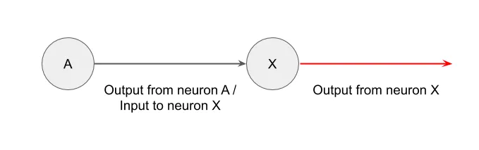
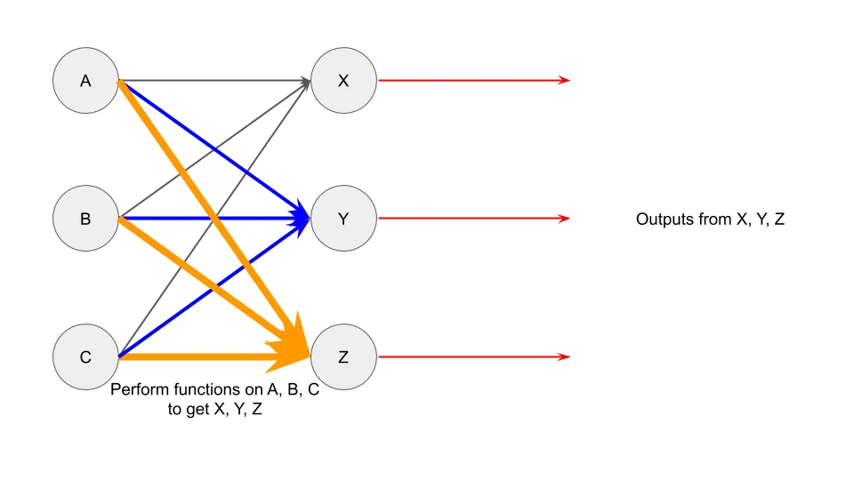

## 摘要

机器学习比你想象的要不可怕，反而更常见。

## 机器学习魔法

我们现在经常听到机器学习（ML）、深度学习或人工智能的讨论 [^1]\.

根据搜索兴趣：

书中提及：

关于机器人接管我们工作的报纸头条：

人们对机器学习的兴趣日益增长，似乎几乎每天都有新创业公司凭借他们那新奇的机器学习技术筹集了1亿美元。

然而，大多数人对机器学习感到畏惧，认为它就像只有尖端初创公司才能拥有的魔法。数学本身也可能让人望而生畏，这也无济于事：

今天我想帮助你更好地理解机器学习，先看看一家使用机器学习的公司，然后讲解神经网络的基本原理。我最后的目标是，当有人随意提到“机器学习”这个词时，你能少点害怕，好像他们太酷了，不适合上学。

## 机器学习案例研究

想象一下，我来找你，想投资一家使用机器学习的公司。这是我的提案：

“公司M使用机器学习和 [optical character recognition (OCR)](https://en.wikipedia.org/wiki/Optical_character_recognition 'OCR') 能够在几分之一秒内将输入数据与数亿条记录进行匹配。它已经与亚马逊、美国政府和Fedex建立了合作关系。M公司已经扩大规模，允许每年处理\>1000亿笔交易，并已将覆盖范围扩展到全美。”

听起来很刺激，对吧？我挑选了一些语言，但其实差别不大 [actual press releases by other companies:](https://www.eu-startups.com/2020/01/anyline_raises_over_10_million_and_zooms_to_us/ 'eu')

“Anyline，一家领先的光学字符识别（OCR）初创公司，利用人工智能进行文本识别，已在A轮融资中筹集了1070万欧元。这家奥地利初创公司已与丰田、IBM、佳能、联合国和百事公司等大公司合作，将利用这笔资金在波士顿开设其首个美国办事处。”

但回到公司M。OCR指的是他们通过机器学习识别图像并识别其内容。看起来他们高效、准确且规模地做到这一点。他们的合作关系也很值得尊敬。你可能觉得他们是斯坦福毕业生带头的有前途的独角兽，他们在穿尿布时就开始编程。

你会投资吗？

如果你答应了，那你就投资了 [United States Postal Service](https://www.enterpriseai.news/solution_content/hpe/governmentacademia/machine-learning-applications-for-the-modern-enterprise/ 'USPS')\.

不，真的，邮局已经用机器学习很久了。 [They started trialing it in 1997, and by 2014 were already mostly recognising addresses via ML algorithms.](https://www.buffalo.edu/content/dam/www/research/pdf/Postal-Automation-Highlights_20160516.pdf 'ML') 这可不是你想象中的创业刻板印象。

我说的不是要贬低Anyline或类似的初创公司。我相信他们是在解决棘手的问题，而不是纯粹的炒作 [^2]\.相反，我想让你意识到 **机器学习已经被用于听起来很平凡的场景，而且已经持续了一段时间。** 下次有人向你推介机器学习时，请记住这一点。

## 机器学习直觉

既然我们知道机器学习的用途，让我们来看看机器学习是如何工作的。我会用一个 [neural network](http://news.mit.edu/2017/explained-neural-networks-deep-learning-0414 'NN') 为此，机器学习还有许多其他运行方式。

神经网络是以大脑的神经元为模型，因此了解这种连接是如何工作的会很有帮助的。神经元的外观如下：

当我们还是 [aren't quite sure how the brain works, a leading theory is that the neurons can take inputs, do some computation, and then send outputs.](https://www.quantamagazine.org/neural-dendrites-reveal-their-computational-power-20200114/ 'neural') [^3] 一个简化的表示两个神经元相互作用的方式可以是这样。想象圆是主体，那条线是连接其他神经元的轴突：

如果你有三对神经元，可能看起来像这样：

如果神经元之间能相互作用，情况可能就是这样 [^4]\:

让我们记住这个形象，思考这与计算机和机器学习的关联。

我们设一个简单的数学方程，比如 2 x 3 \= 6。我们设“2”为输入数据，“x 3”为我们想执行的函数，“6”为输出数据。这样得到的就是这样：

如果你有多个输入数据呢？你可以做 （2 \+ 5） x 3 \= 21。这给我们得到类似的结果：

我们也可以将多个函数在多个输入上相互作用结合起来，比如这样：

你可以看到这和上面的神经元相互作用图看起来很像，所以才叫“神经网络”。

我们再往前一步。想象你有A、B、C的值，就像之前一样。这次，这些值代表 [pixel values.](https://homepages.inf.ed.ac.uk/rbf/HIPR2/value.htm#:~:text=For%20a%20grayscale%20images%2C%20the,is%20taken%20to%20be%20white. 'pixel') 在这种情况下，我们看到的是3个像素。

你也可以对这些数据点做某种数学函数，得到X、Y、Z的输出。我们暂且不考虑具体使用的数学函数 [^5]但从数据点中返回的只有0或1。不仅如此，它也只会给出一个“1”，其余的都是“0”。这里的输出代表预测的字母表，如果该圆圈中返回“1”。

这看起来像：

在这个例子中，我们可以看到原本表示为X的输出返回了“1”，其他输出返回了“0”。这告诉我们，X是基于我们给出的3个像素（0， 100， 255）输入的预测值。

你可以想象将这样的框架扩展到字母表的所有字母，以及你需要的输入像素数量。直觉类似，只是涉及更多的步骤。例如，如果你想根据一张1000像素的图像预测26个字母中的任意一个，你需要左边1000个输入，右边26个输出。在输出中，只有一个会有“1”，其余的都是“0”。

你也不仅限于两层输入和输出。你还可以加入更多“隐藏层”，从左边接收输入，然后返回右边的输出。只要你设置函数在最后一层返回“1”和“0”，就没问题。隐藏层可以有任意数量，每层可以包含任意数量的元素，不必和输入或输出相同。

就这样！你已经见识过一个流程如何将数据输入（比如图像的像素值）转换为输出（字母表和地址）。你现在已经理解了大多数神经网络的工作原理。许多机器学习实现都使用神经网络，这意味着你现在也了解了驱动这些机器学习公司的背后原理。

当然，实际的设置更复杂，需要更多的时间和专业知识 [^6]\.我跳过了所有让机器学习在现实中更难实现的数学、统计和编程。不过，希望你现在的直觉能让你在未来有人用“机器学习”这个流行词时不那么害怕。

[^1]: 我会在整篇文章中交替使用机器学习（ML）、深度学习（DL）或人工智能（AI），但从技术上讲它们是不同的概念， [some being a subset of the other.](https://towardsdatascience.com/clearing-the-confusion-ai-vs-machine-learning-vs-deep-learning-differences-fce69b21d5eb 'ML') 不过就帖子而言，这其实无关紧要。

[^2]: 嗯，有些可能是彻头彻尾的骗局

[^3]: 我不是科学家，如果我错了请纠正我。

[^4]: 我把一个神经元的所有输入都用一种颜色和大小表示，方便理解，尤其是在将其转化为神经网络数学时。不过你也可以用其他方式来理解分组，比如把一个神经元的所有输出都看作一种颜色。

[^5]: 这里发生的情况是，首先有一个参数乘以输入的函数，然后 [logistics function](https://en.wikipedia.org/wiki/Logistic_function 'log') 应用到输出范围范围从0到1的范围限制。其理念是反复训练训练数据集上的数据，使得参数的第一函数在与验证数据集对比时预测误差较低。

[^6]: 比如，你怎么知道该用什么函数？你怎么在程序里设置这个？你怎么检查预测的准确性？我已经简化了大部分技术细节，但如果你有兴趣了解更多， [Andrew Ng's coursera is a good place to start](https://www.coursera.org/learn/machine-learning 'coursera')\.提醒你，这会更复杂、更难。
