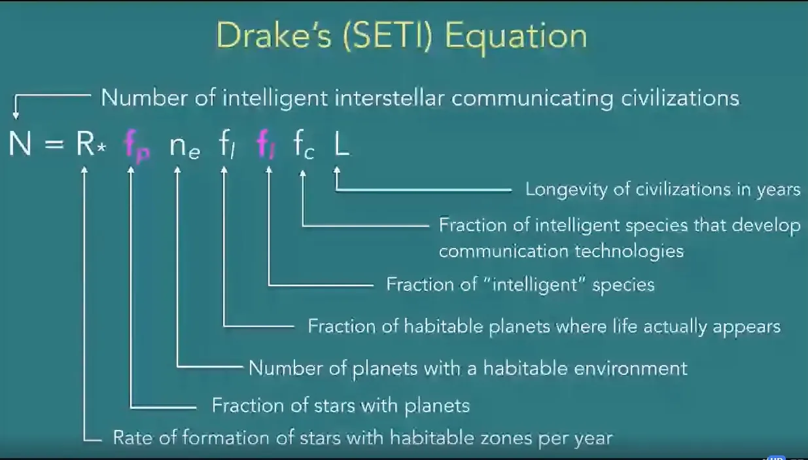
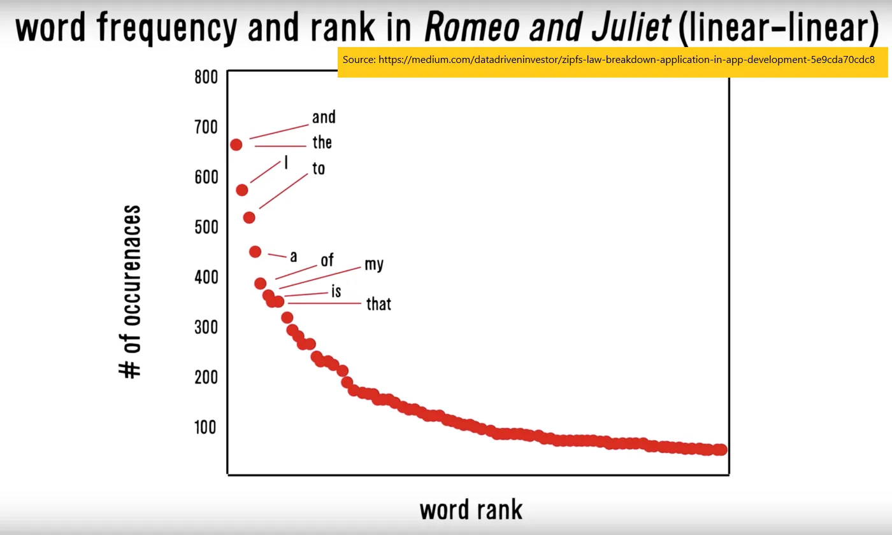

## 摘要

齐普夫定律和香农信息熵可以帮助我们发现外星生命

## 我们如何找到外星生命？

我们已经谈过了 [how machine learning companies use data to recognise text](/writing/ml 'ML') 以及 [investors use data to pick companies.](/writing/data 'invest')

本周，让我们谈谈科学家们如何利用数据寻找外星人。以下部分内容将摘自 [Laurance Doyle's talk with the Long Now group.](http://longnow.org/seminars/02020/apr/29/interspecies-communication-and-search-extraterrestrial-intelligence/ 'Long')

### 问题的框架

寻找地外智慧研究所（SETI）是寻找外星生命最著名的研究机构。其使命是 ["to explore, understand and explain the origin and nature of life in the universe and the evolution of intelligence."](https://www.seti.org/about-us/mission 'mission')

我们到底该如何定位这样的问题呢？

如果我们想找外星生命，它们一定存在于别的星球上。所以我们知道，寻找行星可能是一个起点。

从基础科学中我们也知道行星是围绕恒星形成的。所以我们知道，寻找能够支持行星的恒星也是一个重要的点。

我们知道大多数行星环境恶劣。所以我们只列出那些我们认为能支持生命的行星 [^1]\.

在这些行星中，并非所有行星都会有生命出现，所以我们以实际出现的比例为例。

我们可能觉得这里已经足够，有足够的特征可以开始查找。不过我们还有一些功能可以添加，以缩小搜索精度。

当我们观察行星时，我们希望找到来自行星的信号，因为那会更有力地证明行星存在生命。想象一下你在看一栋房子，而不是一栋有人在演奏音乐的房子。在第二种情景中，更容易得出有生命体的结论。

那么，让我们把生命真正出现的星球，缩小到“智能”物种出现的星球。

而在这些“智能物种”中，我们只考虑那些最终发展出通信技术的物种。

最后，即使物种发展出通讯，如果他们已经不在人世无法发送通讯，我们也永远接收不到。所以我们也需要考虑这些文明的寿命。

那真是很多。但现在我们拥有了所有关键因素来构建问题，并寻找能够发送信号的智能外星文明数量。

综合起来，我们做的就是 [Drake equation](https://en.wikipedia.org/wiki/Drake_equation#:~:text=The%20Drake%20equation%20is%20a%20statement%20that%20stimulates%20intellectual%20curiosity,a%20part%20of%20that%20universe. 'Drake')，一种著名的智能生命估算方法 [^2]\.注意我们刚才提到的所有点如何相乘，来猜测有多少聪明的外星人：

### 缩小范围

不过变量很多，所以今天我们先聚焦于其中一个部分，即“智能”物种的比例。

我们需要找到一种方法来区分“智能”信号和“非智能”信号。比如，我想区分麦克风上唱歌和唱歌 [audio feedback](https://en.wikipedia.org/wiki/Audio_feedback 'audio')\.

如果我们有外星人交流的例子，或者知道我们要找什么，那会很有帮助。显然我们没有前者 [^3]但我们可以通过进一步缩小后者的范围。我们想要找到智能信号可能具备的特性，以区别于随机噪声。

其中一种方法是观察我们周围的非人类智能生命。 [We use Antarctica as a proxy for Mars,](https://www.cnn.com/2015/12/09/health/white-mars-antarctica-concordia/index.html 'Mars') 并且同样可以用动物作为外星语言的代理。

如果我们有认为必须遵守的智能通信规则，我们可以将这些规则与动物通信进行测试，看看效果如何。这将帮助我们判断是否需要扩大或缩小搜索标准。

事实证明，语言理论中有两个主要规则——齐普定律和香农的信息熵。我们来逐一看看它们。

### 关于词频的齐夫定律

齐夫定律提出，对于每种语言，如果按出现频率对所有词排序，词的出现频率与其排名成反比。例如，如果“the”是最常见的词，它有\#1的排名。如果“I”是第二常见的词，它的排名是\#2。排名\#1的词“the”在该语言中的出现次数是排名\#2的词“I”的两倍。它在该语言中的出现次数是run词\#3词的三倍，依此类推。

有了这样的定律，我们可以在该语言的样本文本上进行测试。例如，有人绘制了《罗密欧与朱丽叶》中词频：

我不满足于依赖网络上的陌生人，开始分析自己的通讯帖子。用一些简单的Python代码 [^4]我从所有子堆栈帖子中提取了文本，挑选了我使用的前50个词，并将它们与其频率做成图表。这种关系并不完美，但非常接近Zipf定律的预测。你可以想象，“the”、“to”、“a”、“and”、“of”这些词都经常出现。

太好了，现在我们有了一条定律。我们可以用海豚和鲸鱼等动物来测试它，看看它是否仍然成立。 [Researchers did that,](https://www.seti.org/animal-communications-information-theory-and-search-extraterrestrial-intelligence-seti#:~:text=We%20also%20found%20that%20bottlenose,Zipf's%20Law%20distribution%20of%20signals.&text=In%20other%20words%2C%20baby%20bottlenose,start%20to%20whistle%20like%20adults. 'dolphin') 结果发现他们确实有！ [^5] 换句话说，齐普夫定律很可能同样适用于外星语言。通过将其应用于来自外太空的信号，我们可以过滤掉部分噪声。

### 香农关于预测下一个词的信息理论

香农的信息理论 [^6] 他提出，知道前一个词的词会让你知道那个词是什么。换句话说，句子中的词会因每个词而异。例如，你很可能已经理解上一句了，尽管我省略了最后一个词“other”。

知道词语之间存在某种联系， [we can also derive a way to score the language based on those relationships.](https://langev.com/pdf/plotkin00languageEvolution.pdf 'shannon') 我对数学部分只是敷衍了事，因为我自己也不懂，但我们能理解的主要结论是语言是有分数的。

通过绘制这些分数，我们可以了解大多数语言的分布范围。我们可以做之前的同样过程，给海豚和鲸鱼评分，看看它们的语言表现如何：

如你所见，大多数语言都属于一个范围。如果我们对信号应用同样的评分系统，也能过滤掉那些不太可能是语言的信号。

### 寻找外星人与机器学习其实没什么不同

我们一开始有一个很宽泛的目标——想要找到外星人。

然后我们对问题进行了框架，并提出了可能有助于研究的各个组成部分。

我们缩小到问题的某一部分，并寻找提高搜索精度的方法。我们从人类语言中提出了两个主要标准，然后与其他非人类语言进行了交叉验证。未来，我们可以采用类似的方法来缩小想要进一步研究的信号范围。

如果你以为这只是假设，上述方法如下 [exactly what one team at SETI is using to analyse signals.](https://www.seti.org/animal-communications-information-theory-and-search-extraterrestrial-intelligence-seti#:~:text=We%20also%20found%20that%20bottlenose,Zipf's%20Law%20distribution%20of%20signals.&text=In%20other%20words%2C%20baby%20bottlenose,start%20to%20whistle%20like%20adults. 'SETI')

正如你所见，这个过程本身可以和其他数据分析问题类似。首先，你有一个目标。然后，你框架你可能需要什么。接着，你想出一个算法。最后，你测试它是否经得起作用。一个领域的问题解决和另一个领域的解决问题并没有太大区别。

[^1]: 定义什么是适宜居住，什么是不可居住 [is difficult of course,](https://en.wikipedia.org/wiki/Circumstellar_habitable_zone 'zone') 因为对我们有效的方法可能对外星生命不适用。不过，有些人可能相信的是硅基生命，而不是碳基（我们现在的生命）。 [there are difficulties with that assumption](https://astronomy.stackexchange.com/questions/20858/why-do-aliens-have-to-be-carbon-based-lifeforms 'carbon')

[^2]: 注意，“德雷克方程的实用性不在于求解，而在于思考科学家在考虑生命在考虑他处问题时必须纳入的所有各种概念，并为他处生命的问题提供了科学分析的基础。”

[^3]: 除非你知道我不知道的事，那我很想知道更多\.\.\.\.\.\.

[^4]: 简单是指写了\<30分钟，排查又花了3小时。代码是 [here](https://github.com/leonlinsx/ABP-code/blob/master/Python-projects/File%20extractor.py 'git') 如果你有兴趣根据自己的需求调整它。

[^5]: 他们还用人类和海豚婴儿的咿呀学语进行了测试。结果发现这些都不符合齐夫定律。

[^6]: 是的，这就是 _该_ [Claude Shannon, the guy who essentially taught us how to create electronic communications](https://www.itsoc.org/about/shannon 'Shannon')
