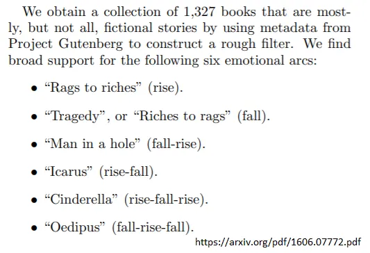
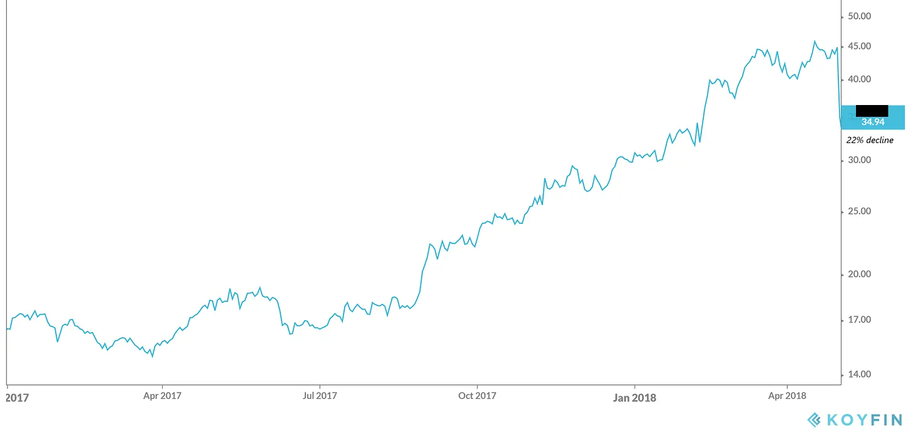
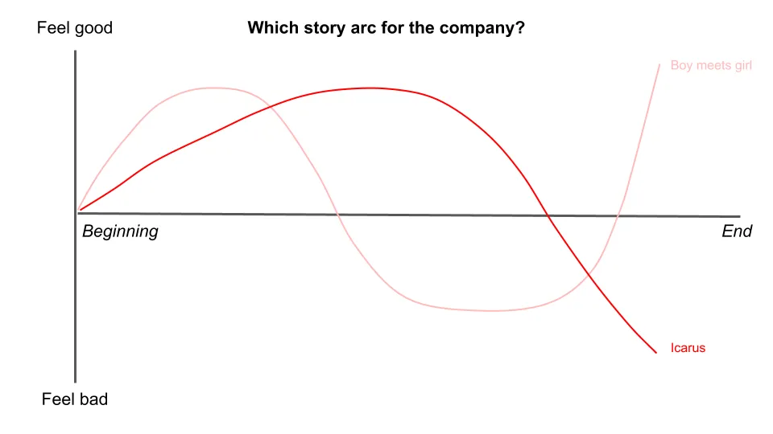

## 摘要

这次不带任何收获，否则会剧透。

---

让我们从一个关于故事的故事开始。

[Bestselling author Kurt Vonnegut](https://en.wikipedia.org/wiki/Kurt_Vonnegut 'Kurt') 以《第五号屠宰场》、《猫的摇篮》及许多其他作品闻名。在他的自传中， [he claimed that this was his greatest contribution to culture:](https://books.google.com/books?id=Zd_9o3uyoVsC&pg=PA285&dq=vonnegut+shape+story+thesis&hl=en&sa=X&ei=tasCU8yjEML-oQSXloKIBQ#v=onepage&q=vonnegut%20shape%20story%20thesis&f=false 'book')

所以， _故事有形状，_ 他说。

那是什么意思？库尔特解释道 [^1]\:

想象你有一个图表，一边是好运和坏运，另一边显示故事从头到尾的进展。

你可以在这个图表上绘制任何故事，看看它的形状。如果你绘制世界上所有的故事，会出现几个共同的模式。

例如，在 [The Godfather,](https://en.wikipedia.org/wiki/The_Godfather 'Godfather') 迈克尔起初很幸福，但家人陷入麻烦，他被迫离开国家。他最终回国，重新掌控局面，杀死大部分反对者，成为城市黑帮的教父。

我们把这个画在图表上，称之为“洞里的人”故事。人过得不错，掉进洞里，然后出来后比以前更好。

另一方面，在 [About Time,](<https://en.wikipedia.org/wiki/About_Time_(2013_film)> 'About Time') [^2] 主角们相爱，失去彼此，然后在一系列事件后重新相遇。

我们称之为“男孩遇见女孩”类型的故事。你可以想象，这在许多爱情电影中很常见。

而且在这样的故事中 [The Metamorphosis,](https://en.wikipedia.org/wiki/The_Metamorphosis 'Kafka') 主角的处境越来越糟，他变成了虫子并死去。这将是一场“悲剧”。

除了上面的形状，库尔特还想到了几个可能的。一个“白手起家”的故事可以涉及稳步上升，一个 ["icarus" story](https://en.wikipedia.org/wiki/Icarus 'icarus') 可能包括上升然后下降，以及 ["oedipus" story](https://en.wikipedia.org/wiki/Oedipus 'oedipus') 可能包括跌落、上升，再跌落。

基于这个想法， [a team of researchers from Vermont and Adelaide used machine learning to classify 1,327 famous stories](https://arxiv.org/pdf/1606.07772.pdf 'paper') 关于 [Project Gutenberg](https://www.gutenberg.org/ 'proj')\.他们发现大多数故事确实可以归类为几种主要类型。有关其方法论的详细信息，请参见脚注 [^3]\.

他们把“男孩遇见女孩”换成了“灰姑娘”，但这本质上证明了冯内古特是对的 [^4]\. _故事有形状，有几种标准形状。_

这有什么关系？你来这里是为了获取股票建议和创业公司的垃圾话题 [^5]，关于叙事的笔记是怎么回事？

我会很快发链接，现在先把这些故事形态放在心上。

---

### 枪托有形状

上个月，我们讨论了你的投资推介糟糕的一个原因： [you aren't accounting for consensus.](/writing/relative_billionaire 'pitch')

本月，让我们讨论另一个更令人沮丧的常见原因。

以2018年4月30日为例，这家公司：

X公司是一家互联网公司，主要通过应用订阅赚钱，凭借其在不断扩大的消费品类别中的垄断地位。其总订阅用户有700万，其中300万是主应用的订阅者。其收入同比增长\~30\%。EBITDA（一种盈利指标）的利润率为40\%。股价创历史新高，过去一年已翻倍多 [^6]\.

看起来挺不错的，也许值得进一步研究看看你是否愿意拥有它。

还要考虑截至2018年5月1日的同一家公司：

X公司是一家互联网公司，主要通过应用订阅赚钱，凭借其在不断扩大的消费品类中的垄断地位。其总订阅用户数为700万，其中300万是其主应用的订阅者。其收入同比增长\~30\%。EBITDA（一种盈利指标）的利润率为40\%。股价创历史新高，过去一年已翻倍以上。 _[Facebook just announced they're planning to enter the category](https://techcrunch.com/2018/05/01/facebook-dating/ 'FB')_

公司基本面未变，但一天内22\%的价格下跌明显 _什么东西_ 有。那当然就是 _故事_ 投资者正在谈论这只股票。

**因为推销不过是关于股票的故事吗？**

4月30日，共识提案 [^7] 而是公司在没有竞争对手的情况下以高利润率快速增长。投资者不断买入股票，价格也不断上涨。

5月1日，故事到了分岔路口。你可以说Facebook要把这家公司压垮，你应该尽可能多卖出它。或者你可以说恐惧被夸大了，Facebook非核心产品表现糟糕，你应该尽可能多地买下它。

听起来熟悉吗？

这家公司是 Match\.com，Tinder的母公司，在那次下跌大约一年后，股价又翻了一倍。男孩遇见女孩，结果很顺利。

5月1日，这两个故事同样真实，聪明的投资者在这笔交易中支持了双方。重要的是，股价甚至在Match的业务发生任何实际变化之前就已经做出反应。故事已经到了十字路口，投资者开始选择不同的阵营。那些认为会像《伊卡洛斯》那样失败的人，而认为相反的人则获益。随着故事的变化，股价也在变化。

**这对你的投资推介意味着什么？** 这暗示说故事是好推介的关键。你讲故事越好，越有可能获得关注。无论是在老板面前，还是其他投资者。这很烦人，但“最好的点子”往往是“最好的故事”。

**你的想法是否获得支持有什么关系？** 记住，投资不仅仅是关于你是对的，更是让别人意识到你是对的。如果价格不变，你坐拥一家好公司是赚不到钱的 [^8]\.你通过反对共识和正确来赚钱，但如果你不能让别人站在你这边，你就会永远反对共识，也就是错误的。股市短期内可能是投票机器，长期是权衡机器，但如果你不传播自己的故事，你的机器就坏了 [^9]\.

**你应该重点关注哪里？** 如果你的投资期较短，你很可能会寻找故事弧中的转折点\;也就是所谓的催化剂。例如，你需要有可信的理由说明为什么某只股票目前处于亏损状态，以及它为何看起来会被抛出。如果你的时间范围较长，也许你更感兴趣的是“从白手起家”的故事。

当然，故事可以双向发展。我举了一个反弹股票的例子，完全可以选择反向的股票。人们讲述了关于安然、提莱雷、卢金等公司的精彩故事，直到它们全部崩溃。再多的故事讲述也不能神奇地创造收入（尽管及时退出的人确实赚了很多钱）。

我也不是说你只需要把股价对应曲线就能赚钱 [^10]\.我的意思是，股票的认知确实会呈现出一个叙事弧线，这通常可以从价格中看出来。知道你想讲的故事会提升你的推销能力。

我们早已知道，基本面并不是推动股价的唯一因素\;参见 [Shiller's work on a history of stock forecasting theory.](https://pubs.aeaweb.org/doi/pdfplus/10.1257/089533003321164967 'shiller') 讲好故事的能力是传达投资理念的关键。你认为为什么这么多投资者会公开谈论他们的想法？你越能说服他人相信你的故事，作为投资者赚钱的可能性就越大。

投资者互相讲述故事，并押注他们希望成为真相的事物。

### 初创企业有其形状

讲故事在科技领域同样重要。关键在于如何 [startups raised millions with just a pitch deck,](https://www.businessinsider.com/pitch-decks-that-helped-hot-startups-raise-millions-2019-4 'pitch') 或者说怎么做 [Masa raised $45bn in an hour from the Saudis](https://youtu.be/Sa2_VBu0d7k?t=92 'masa')\.前者中，初创企业告诉风险投资如何实现10亿美元增长。后者中，马萨说服穆罕默德·本·萨勒曼相信他能增长到10亿美元。他们的业绩无疑起到了一定作用，但他们在投资者心中描绘的形象才是获得资金的关键。

没人愿意支持失败者，所以创业公司必须以让自己看起来最好的方式讲述自己的故事。他们试图把自己定位为“从贫穷到富有”，而投资者则在试图判断他们是否是“伊卡洛斯”。当风险投资拒绝一家公司时，他们隐含地表示觉得故事太无聊了。避免无聊的故事。

这也意味着 **初创企业被激励讲述关于自己最激动人心的故事。** 这样做时，大多数人会尽可能夸大事实。他们更愿意卖给你结尾章节，而不是开头。有经验的投资者知道这一点，尽管公众可能不太清楚。这是否构成欺诈是一条细微的界限。

让我们想象这样一个场景：

> 你的公司对趋势的认识太早，你为了挽救它而背负了债务。你接到一个大学生的电话，他告诉你你的产品很棒。甚至好到他正在为你的产品写一个能让你赚大钱的程序。你感兴趣，同意和他见面演示。

> 电话那头，一个紧张的大学生挂断电话，意识到自己快拿到第一份合同了。唯一的问题是？他甚至没有你的产品副本，更别说任何可用的程序了。

是骗局，还是乐观的想法？也许你在想，应该永远避免和这个孩子做生意。如果你真的这么做了， [you just missed out on Bill Gates, and the forming of Microsoft.](http://www.computinghistory.org.uk/det/5946/Bill-Gates-and-Paul-Allen-sign-a-licensing-agreement-with-MITS/ 'MITS') 有时候，故事并不完全真实 _还没_ 可以变成真相。

让我们想象另一个情景：

> 你会见一位年轻的创始人，他向你推介一个革命性的医疗解决方案。你看到的原型并不十分精致，但他们有信心最终打造出一个面向大规模使用的成品。

> 创始人不断获得更多关注，登上多本杂志封面，还与药房签下了大合同。董事会似乎也充满了名人，尽管你不太明白为什么他们中有这么少人有医疗经验。

这里的初创公司当然是 [Theranos](https://www.businessinsider.com/theranos-former-board-members-henry-kissinger-george-shultz-james-mattis-2019-3 'Theranos')该案最终成为本十年最大的骗局之一。霍尔姆斯的故事如此精彩，以至于人人都想听\;投资者表示被她的提案“吸引”。如果你从Microsoft事件中学到的教训是“相信所有激动人心的故事”，那你就能理解为什么这会成为问题。有时候，尚未成真的故事将永远是童话故事。

**欺诈与乐观思维之间的界限可能很模糊。** 史蒂夫·乔布斯以他的 [reality distortion field](https://en.wikipedia.org/wiki/Reality_distortion_field 'rdf')或者说，说服任何人某件事是可能的。我相信霍尔姆斯当时相信自己能做到不可能的事，就像许多其他初创企业创始人一样。我们现在以成绩来评判他们，但你完全可以想象史蒂夫回归苹果的情景是如此。

或者考虑其他创业失败案例，剧情反转本可以带来不同的结局。 [WeWork, Pets.com, Moviepass etc](https://f3fundit.com/11-of-top-startup-failures-in-history/ 'startup') 他们都有精彩的故事，但都已失宠。如果WeWork发展得不快，可能会更好，Pets\.com 有Chewy这个精神继承者，Moviepass如果有更多资金可能会更好 [^11]\.直到最后，我相信公司里所有人都希望故事弧能迎来好转。

**除了投资者，你的创业故事对员工、客户和竞争对手也很重要。**

股权是你故事中的一个利益。由于初创公司的员工通常以较低现金支付，更多以股票支付，他们在打赌你的故事会是一个好故事。招聘人才的难点在于说服他们公司有足够的潜力去牺牲更好、更安全的替代方案 [^12]\.

客户在决定购买前会先看你的故事。他们会考虑你的产品能为他们带来什么，无论是节省时间、减少工作量、提升地位，还是更多。正如之前所说，没有人喜欢支持失败者。

你的竞争对手也会关注你讲述的故事，并根据你似乎在做的事情制定计划。如果你的增长比他们快，他们会试图找出原因。如果你表现得不好，他们会利用这个机会向你的目标受众推销自己的故事。

故事对初创企业的重要性众所周知。除了吸引投资者，故事对创业公司与其他任何互动对象同样重要。 [As Bill Gurley from Benchmark put it:](http://abovethecrowd.com/1999/10/18/the-rising-importance-of-the-great-art-of-storytelling/ 'Bill')

> 在当今独特的互联网商业环境中，讲故事的艺术变得越来越重要。由于“网络效应”和“回报递增”现象，许多人认为先行者（或至少是率先达到显著规模的公司）很可能占据互联网市场的大部分份额。

公司讲述他们的故事，并努力让它们成为现实。

### 你的身形

我们从一个关于故事的故事开始。

让我们以一个关于自我的故事结束。

很久很久以前，有一个人离开了家，去探索世界。他们经历了起伏，在最低谷时承受着难以想象的痛苦。但他们克服了这些，变得比以前更好。

听起来熟悉吗？

但这到底是什么故事？

可能是 [the story of Jesus, from Christianity](https://www.learnreligions.com/the-resurrection-story-700218 'Jesus')\.

可能是 [the story of the Buddha, from Buddhism](https://tricycle.org/magazine/who-was-buddha-2/ 'Buddha')\.

甚至可能是你的故事。

**我们都是自己故事线中的主角，** 不断尝试将我们的故事往上、向右调整。通过运气、技巧和努力的结合，我们中的一些人可能已经感觉自己已经到了那里。另一些人可能觉得自己被困在某种无情的悲剧中。我们必须创造自己的故事，我们也要承受选择带来的后果。生活不公平，但我们仍然可以自主去做一些事情。

因为我们是自己的作者，这也意味着我们不知道别人的完整故事弧。我们能看到他们享受生活，却不知道自己经历了多少不幸。我们能看到他们经历痛苦，却不知道自己努力了多少去避免。我们会比较他们的现状和我们曾经经历过的状态，感到沮丧，因为我们的平均经历不如他们的高光时刻。

整个世界都是舞台，但我们不是演员，我们是导演。只有我们自己决定要投入多少精力来构建叙事。告诉自己你会成功并不一定意味着你一定会成功，但相信你的故事弧注定会遭遇悲剧，是确保它成为悲剧的好方法。

[As Neil Gaiman put it:](https://www.youtube.com/watch?v=Xn2n7N7Q2vw 'Neil')

> 人们讲故事，这也是我们成为人类的重要部分。我们会为故事付出很多，也会忍受很多。而故事反过来又帮助我们忍受并理解我们的生活。

你可以给我讲一个故事，而让它成真取决于你自己。

## 其他

1. [How SaaS securitisation could look like](http://conordurkin.com/some-thoughts-on-saas-abs/ 'SaaS')
2. [Does Commodification Corrupt? Lessons from Paintings and Prostitutes](https://scholarship.shu.edu/cgi/viewcontent.cgi?article=1732&context=shlr 'corrupt')
3. [Spatial is allowing AR/VR users to attend meetings with desktop users](https://www.wired.com/story/spatial-vr-ar-collaborative-spaces/ 'Spatial')
4. ['The argument that Apple should change its practices developed to price as it does, distribute as it does or design as it does because it was too successful or is “unfair” is getting the causality wrong.'](http://www.asymco.com/2020/06/20/subscribe-again/ 'subscribe')
5. [Weddell seals make tardis sounds.](https://www.youtube.com/watch?v=megeZ8zhKJ0&feature=youtu.be 'weddell') 谢谢\@rosetazetta。还有一个 [2 hour version](https://www.youtube.com/watch?v=4dbSA4dTICc 'seal') 写这篇文章时我可能听完了，也可能没听完。

[^1]: 无论是在他的自传中，还是在他的演讲中 [here](https://youtu.be/GOGru_4z1Vc 'Kurt')

[^2]: 我不会停止推销这部电影\;它是我最喜欢的电影之一

[^3]: 完整论文为 [here](https://arxiv.org/pdf/1606.07772.pdf 'paper')\.这些方法包括主成分分析\/奇异值分解、层级聚类和无监督机器学习的聚类。他们首先应用情感分析来获取故事中的情感价值。我不太确定他们具体是如何用SVD，似乎是先用维度缩减，然后从相似矩阵中提取顶部特征，找到能够解释大部分变异的顶级故事类型。分层聚类似乎是一种标准的树轮图，用来聚类故事类型。无监督机器学习使用了Kohonen的自组织映射，这看起来是一个用于将群体聚类的算法，类似于K的表示。

[^4]: 严格来说，冯内古特将男孩遇见女孩和灰姑娘区分开来，因为灰姑娘的剧情铺垫更为分级，且在恢复前有急剧下降。它们与我足够相似，所以我将它们归为一组。冯内古特还提出了像《哈姆雷特》这样“什么都没发生”的故事，采用一条平线。我不同意这种结构，为了简化我省略了。关于故事类型的不同解读， [Christopher Booker discusses seven basic plots](https://en.wikipedia.org/wiki/The_Seven_Basic_Plots)

[^5]: 请不要来这里寻求股票建议和创业的垃圾话，你会失望，因为我不做前者，后者只偶尔做。

[^6]: 公司8K [here](https://d18rn0p25nwr6d.cloudfront.net/CIK-0001575189/63f15bf6-7324-446e-b762-fb1ac98ccf14.pdf 'MTCH')，不过你会破坏惊喜。

[^7]: 为了简化起见，我们暂且忽略空头的说法，价格表现表明人们是看涨的。

[^8]: 是的，我知道股息存在， [they're less important in driving returns](https://media-publications.bcg.com/pdf/VCR/2006-VCR-Spotlight-on-Growth.pdf)

[^9]: 我一直不太明白投票机是什么意思\;我觉得它只是指一台机器，负责实时统计选票，因此会不断变化。

[^10]: 以技术分析为职业的人对此持不同意见。

[^11]: 这些都是假设，没有办法得出结论。指望Moviepass在大量订阅的情况下赚钱，这不现实吗？我的意思是，这真的取决于他们能烧掉多少现金，对吧？如果软银给它钱而不是WeWork会怎样？

[^12]: 有些人可能不同意传统公司比初创公司更安全。有人认为，做技术工作能保障你的职业安全，但不能保证工作。我认为对大多数人来说，被裁员依然很糟糕，且可能对经济造成重大损失。
