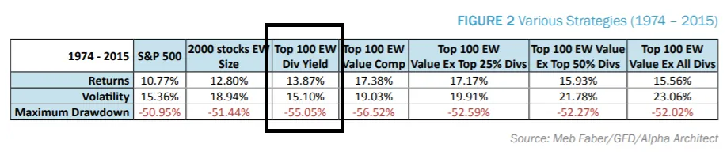
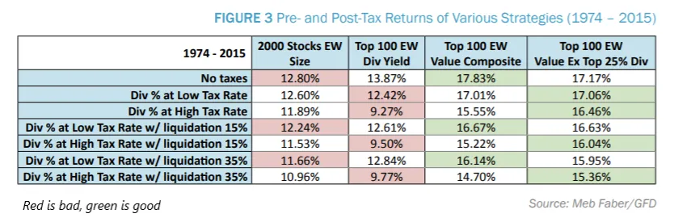

## 摘要

投资股息比表面看起来更为复杂。

## 股息回报率

在 [footnote 8 of last week's post](/writing/stories 'footnote') 我随口说了句股息不如资本回报重要，因为我不想花更多时间深入探讨这个话题。

今天，让我们真正深入探讨股息。

我们将概述股息，然后讨论缺点，最后附上其他使故事复杂化的研究链接。

一如既往，这些都不是投资建议 [^1]\.

### 这些钱该怎么处理

假设你是一家上市公司，并且盈利 [^2]\.你已经支付了供应商、员工和自己。不过你还有更多现金，那你能用这些钱做什么呢？

第一，你什么都不做。就让它放在某个银行里 [^3]\.

第二，你可以重新投资业务。你想要的那台机器用于你的生产线？那个给你人力资源团队的软件产品？ [That Gulfstream G650 to get high?](https://www.wsj.com/articles/this-is-not-the-way-everybody-behaves-how-adam-neumanns-over-the-top-style-built-wework-11568823827 'WSJ') 也许现在是买它们的时候了。

第三，你可以收购其他企业。也许你可以以低成本收购一个较小的竞争对手，获得银行朋友们告诉你的“协同效应”，从而扩大市场份额 [^4]\.

第四，你可以回购部分股票。这会增加你对公司的持股比例，这意味着如果公司表现好，你会获得更多收益。本文不涉及回购，你可以阅读Cliff Asness对其的初步（带有偏见）观点 [here.](https://images.aqr.com/-/media/AQR/Documents/Journal-Articles/Buyback-Derangement-Syndrome.pdf 'Cliff')

第五，你可以向投资者支付股息。每给投资者一股股票，你每季度给他们一些现金。

我一如既往地简化了，上述行动是公司主要用钱做的事情。CS的一张图表显示了这些行为组合随时间的变化：

今天我们将重点关注第五项行动，即股息支付。我就跳过资本结构理论上的无关讨论了 [^5]但你可以阅读莫迪利亚尼·米勒的复习 [here.](https://pubs.aeaweb.org/doi/pdfplus/10.1257/jep.2.4.99 'MM')

### 评估股息

乍一看，作为投资者，股息听起来不错。能从股票上拿回一些现金似乎不错。让我们看看如何评估它。

如果我告诉你公司股息是5美元，这是好是坏？听起来很多钱，但除非和价格对比，否则我们真的不知道。

如果你以5美元买入股票，股票回还给你5美元，那就很高了。你实际上已经拿回了投资的回报。

如果你以1万美元买入股票，而股票回还给你5美元，那可能微不足道。

所以我们知道 **价格很重要，就像所有与投资相关的事物一样。** 为此，我们可以计算股息收益率，即股息金额除以价格。通过相互比较股息收益率，我们可以判断哪些股票股息“高”，哪些股票股息“低”。

顺便说一句，按惯例我们会收取12个月的股息。大多数公司按季度发放股息，所以如果一家公司每季度支付1美元，那么他们的年股息就是4美元。我们也忽略税收 [^6]\.

除了让我们能够评估派息股票的股息收益率外，这种收益率还让我们能够与其他证券进行比较。毕竟收益率就像预期回报。所以我们可以比较4\%的股息收益率和1\%的债券，说在其他条件相同的情况下，股息股票给我们的收入更高。

这正是我们看到的 [Vanguard report](https://personal.vanguard.com/pdf/ISGADOS.pdf 'Van')，下面的图表显示 **过去10\+年，股息收益率一直高于债券收益率。**

仔细看，现在看起来更好了。一个比债券还多的现金返还期？我们是不是应该都找股息率最高的股票全部买下？有什么陷阱吗？

### 总回报，而不仅仅是股息回报

第一个问题很简单，我们之前已经部分提到过，就是价格问题。高股息率可能来自公司大量现金支付，从而在相对较小的价格下获得较大股息。或者也可能来自股价大幅下跌，从而以相对较小的价格获得同样较大的股息。

在下面的例子中，你会更满意1\%的股息率而非50\%，因为导致这种情况的具体情况。由于第二种情况中价格下跌，你实际上损失的钱远远超过了从股息收益率“增加”中获得的。

你甚至不能确定高收益是否会持续，因为股息金额并不保证未来。确实，公司不喜欢削减股息，因为他们担心股东抛售他们的股票。 [However, that also menas that a company can cut its dividend when things are so bad they have no choice.](https://www.cnbc.com/2018/12/07/ge-makes-it-official-lowers-dividend-to-a-penny.html 'GE')

这意味着我们必须 **考虑除了股息收益率之外的另一个因素，就是价格变动。** 通过将资本回报（价格变动）与股息收益率结合，我们将得到更接近预期绩效指标的总回报数值。现在听起来很明显，但你经常会看到许多投资手册推销高股息股票，却忽略了资本回报的部分。

当我们考虑资本回报时会发生什么？我们来看总回报的组成部分，但先猜测它可能是什么样子。我们可能认为对于高股息收益率的股票，大部分回报来自股息。对于低收益（或无收益）股票，大部分回报来自价格变动。

令人惊讶的是，我们发现的情况并非如此。在同一个地方 [Vanguard report](https://personal.vanguard.com/pdf/ISGADOS.pdf 'Van')作者将股票按高到低的四个类别分类。然后他们比较了股息与价格的回报。我们看到了 **资本回报对总回报的贡献更大，** 即使包括高股息股票。

更有趣的是，一个 [Miller Howard report](https://mhinvest.com/download.html?docId=2246 'Miller') 显示当你将股息股票拆分为10个类别时，大多数实际上 **表现不佳** 过去十年的标普指数。更糟的是，股息收益率最高的投资组合反而表现最差。这意味着投资策略与我们之前的设想完全相反。

### 相关因素

第二个陷阱则不那么明显，是与高股息收益率相关的其他因素。

假设我们根据高股息收益率选出了前100只股票。如果我们发现这些股票还有其他共同点，比如说 [Emma Watson being on the board of directors](https://www.mugglenet.com/2020/06/emma-watson-joins-kerings-board-of-directors-to-advocate-for-sustainable-fashion/ 'Emma')，或许真正重要的不是股息收益率，而是艾玛的明星效应神秘地影响了总回报。

实际上，人们用一些常见的因素来分类股票。这些因素包括性价比、公司规模和价格动能。例如，你可能想把所有小公司归为一类，发现小公司表现优于大公司。如果你找到足够有力的证据支持这一点，你可能想只包含小公司。

我就不详细解释这些因素是如何产生的\;你可以在相关资料中了解更多 [Fama and French's five factor model here.](https://www.sciencedirect.com/science/article/abs/pii/S0304405X14002323 'model') 重要的是要注意，我们还有其他特征来描述股票，而不仅仅是股息收益率。

该 [Vanguard report](https://personal.vanguard.com/pdf/ISGADOS.pdf 'Van') 区分了两种股息股类型：1）高股息收益率，2）高股息增长。然后他们比较了这些群体与我们上述提到的一些共同因素的相关性 [^7]\.

事实证明，无论是第一组还是第二组，许多特征是相关的。换句话说，如果你忽略股息因子，只考虑这些其他因素，你就能大大捕捉到股息股的回报。

[Meb Faber went ahead to do just that,](https://www.cambriainvestments.com/wp-content/uploads/2017/10/DTAX-10.23.17.pdf 'Meb') 通过创建能够复制股息股的综合投资组合，而不必真正是股息股。这意味着他找到了与股息股回报相同但实际上不支付股息的股票。他的发现表明 **此类投资组合的回报优于股息投资组合。** 将黑框列与右侧其他列进行比较：

这些结果在他对比税后申报表时依然成立：

## 结论与并发症

总之，

1. 股票的价格和总回报显然比股息收益率更重要
2. 我们能够通过创建有意排除股息股的替代投资组合，复制股息股的积极因素。这种表现甚至优于股息组合

和所有投资一样，也存在一些复杂性。一些研究者发现研究的时间周期很重要。通过将研究进行时间远超10年，股息对回报的重要性会增加。另一些人认为，公司对现金几乎没有什么有效的行动可做，返还给股东则有利于股东，他们现在可以选择将股息重新分配到哪里。还有人认为股息增长是公司健康状况的一个代理指标。

不过，我看到的那些还没有反驳Meb的另类投资组合研究，这也是我对股息投资整体上兴趣较低的原因。如果你能打造一个回报更高且有税后优势的投资组合，似乎应该是更好的选择。

我就留给你自己去探索下面的链接，看看你是否觉得有说服力：

1. [Is dividend investing dangerous?](https://blog.thinknewfound.com/2016/12/dividend-investing-dangerous/ 'Divd')
2. [Surprise! Higher Dividends = Higher Earnings Growth](https://www.researchaffiliates.com/documents/FAJ_Jan_Feb_2003_Surprise_Higher_Dividends_Higher_Earnings_Growth.pdf 'Divd')
3. [Dividends and the three dwarfs](https://www.researchaffiliates.com/content/dam/ra/documents/FAJ_Mar_Apr_2003_Dividends_and_the_Three_Dwarfs.pdf 'Divd')

[^1]: 我从来没有，也永远不会给出投资建议。别起诉我，我没钱。

[^2]: 这比现在想象的要少得多\.\.\.\.\.\.

[^3]: 现实中情况没那么简单，公司有财务部门管理手头现金流动量，以区别于其他能带来收益的货币工具。没人会随身携带数十亿美元的纸币，甚至没有人会在支票账户里。

[^4]: 协同效应通常被认为是收入或成本协同效应。收入协同来自于能够卖出更多东西，而成本协同来自于解雇员工。

[^5]: 在某些假设下，公司融资方式并不重要。如果是这样，资本配置政策基本是一样的。

[^6]: 股息的税务处理会根据你的具体情况有所不同。不过通常，你的股息净回报会减少，因为你必须为该收入缴纳相当可观的税款。

[^7]: 如果想看不同的分工，可以看看 [this other source doing a similar analysis](https://www.indexologyblog.com/2020/05/15/why-did-dividend-indices-underperform-during-the-coronavirus-sell-off/ 'div')
