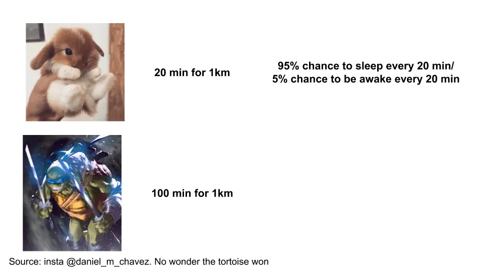
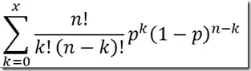

## 摘要

公司没有动力去冒险，这损害了公司内部的创新，也增加了初创企业获胜的可能性。

## 与野兔

我就默认大家都熟悉 [tortoise vs hare fable.](http://read.gov/aesop/025.html 'aesop') 兔子和赛跑，睡着了，输了，余生都活在羞愧中，直到写出一篇爆炸性的爆料故事 [all a shell game](https://en.wikipedia.org/wiki/Shell_game 'shell') [^1]\.

[Drawing on this post by Farnam Street](https://fs.blog/2016/07/james-march-the-trouble-with-genius/ 'FS')，我们再用一点数学来扩展这个类比。我知道这会立刻吓跑一半读者，但我们还别慌。作为一个最近因为加错1\+1而浪费了15分钟做数学题的人，我会尽量简化数学，至少为了自己 [^2]\.

我们设一个1公里的赛道。假设陆龟跑1公里需要100分钟，野兔跑1公里需要20分钟。然而，由于新冠疫情，兔子的睡眠时间被打乱了，每隔20分钟时有95\%的概率会睡觉。换句话说，在第0到20分钟有5\%的几率它是醒着的，另外5\%的概率在第20到40分钟是清醒的，还有5\%的几率在第40到60分钟是清醒的，依此类推。

兔子打败的几率有多大？

对于那些还记得中学概率的人，我们可以用 [binomial distribution formula.](https://online.stat.psu.edu/stat414/lesson/10/10.3 'binom') 公式如下：

但用求和符号和感叹号看起来很吓人，我也答应过数学简单。简化计算的一个方法是观察兔子有5个“20分钟区块”，因为兔子比快5倍。只要兔子醒一次，它就会赢。所以，兔子唯一输的时候是它连续睡觉的次数。这计算简单多了，因为那只是95\%乘以自身5次方，也就是0\.95的5次方 [^3]\.

这得出77\%，这意味着根据我们的假设，野兔输给陆龟的概率是77\%，赢的概率只有23\%。

现在，我们稍微调整一下框架。如果我们跑了100场比赛，至少有一场比赛兔子获胜的可能性有多大？

只有一种情况是没有野兔获胜，那就是所有比赛都是赢的。假设黑帮没有再次操控游戏，这种情况发生的概率是77\%乘以自身100次，四舍五入为0\%。

换句话说，几乎可以肯定至少有一次，野兔会赢。

我已经把数学数据放进了谷歌表格 [here](https://docs.google.com/spreadsheets/d/1-_LV1ewb0D4DsERENaM_xp0oy8pHH7xWmAvNX8H9bdE/edit?usp=sharing 'sheet') 你可以随意玩弄 [^4]\.你还可以从下面的图表看到，甚至不需要多少场比赛，至少有一只野兔获胜的几率就接近100\%。记住，这是一只野兔赢的，而不是大多数野兔赢。

不过数学本身不如要点重要。 **我们推断出，即使某件事本身发生的概率很低，重复游戏也很可能会确保事件发生一次。** 就像你中彩票的可能性不大，但很可能至少会有一位彩票中奖者。

## 与技术

让我们把这件事联系到科技行业。科技行业以创新自豪，但我们必须指出，推动进步的是累积失败的总和。如果你把初创企业看作这里的兔子，把大型企业看作，那么任何特定初创企业击败现有企业的概率很低，但至少有一家会赢。

有许多大型公司在巨大的收入机会上失职的例子。关于近期情况，想想Microsoft和Google如何失去了价值700亿美元 [(mkt cap of Zoom)](https://finance.yahoo.com/quote/ZM/ 'ZM') 通过拥有一个还算不错但不算出色的视频会议产品。对于较老的东西，想想如何 [Xerox invented the mouse, graphical user interface, and the PC, but failed to follow up on them](https://www.forbes.com/sites/tendayiviki/2017/07/01/as-xerox-parc-turns-forty-seven-the-lesson-learned-is-that-business-models-matter/#eaf579075482 'xerox')\.

大多数公司在这方面做得不好有几个原因。首先， **人们都怕风险，** 也就是说，他们不愿意容忍大量失败才能让新想法成功。项目的成功取决于个人，而不是公司层面。“你能支持一个最可能结果完全浪费资源的项目吗？”这句销售口号并不理想。

问题在于天才是多变的。如果你想要疯狂的结果，有时你需要疯狂的人。无论是运气、技巧，还是两者兼有（更可能），更疯狂项目的结果范围会分布到更广泛的可能性范围内。每部iPhone背后，就有上百个 [cheetos lip balm](https://www.usatoday.com/story/money/2018/07/11/50-worst-product-flops-of-all-time/36734837/ 'cheetos') 那种永远不会起飞的项目。

因为大多数人也会用 [outcomes rather than process,](https://www.schroders.com/id/uk/the-value-perspective/blog/all-blogs/outcomes-and-timeframes--with-annie-duke-part-3/?t=true 'annie') 项目的判断是二元的。要么成功，要么失败。没人愿意和失败挂钩，即使潜在回报很高，因为期望值很低。我们只想在天才被识别后，且不愿事先承受损失。

其次，相关地， **缺乏激励机制的对齐** 在大公司，为了小项目的成功。大多数大公司的员工更希望不被解雇，而不是追求卓越。这是有充分理由的，因为大公司产生的价值主要归公司所有，而不是你自己。相比之下，小公司的员工更希望不让公司破产 [^5]\.初创公司的激励对齐度高于大型公司，导致每人平均投入的努力量更高。

公司能解决这个问题吗？可能，但激励和管理人员是个出了名的棘手领域。你或许可以尝试给员工高于市场价的薪酬，给他们 [15 percent time for special projects](https://www.fastcompany.com/1663137/how-3m-gave-everyone-days-off-and-created-an-innovation-dynamo '15')或者提供某种奖励和表彰计划来激励员工。然而，普通员工可能仍然更关心他们下班后的Netflix计划，而不是他们那个可能失败的特别宠物项目。可能有一定的资金可行，但这额外的费用对大多数公司来说可能难以合理化 [^6]

最后， **公司喜欢“聚焦”。** 通常这句话是削减成本和重组的流行词，比如 [Ruth Porat took over as Google CFO.](https://www.bizjournals.com/sanjose/news/2015/07/15/google-reins-in-hiring-and-spending.html 'Ruth') 你现在在新冠裁员中也能看到类似情况，大多数公司都说必须“无情地优先排序”，出于某种公关友好的理由。情况糟糕时，管理层会把项目分成“可有可有”和“必备”，大多数创新项目都会被丢弃。

即使在经济状况良好的情况下，项目也常常被拒绝，理由是“太小无法推动进展”或“无法扩大规模”。你能想象向万豪推销Airbnb吗？你不仅会难以证明市场规模足够大以至于值得花时间，还要难以理解为什么蚕食自己的收入是个好主意。

创新并不容易，而且更难的是，大多数地方评判的是结果而不是流程。如果你是一家初创公司，想要彻底改变某个行业，那就要弄清楚 [base rate](https://en.wikipedia.org/wiki/Base_rate 'base') 成功是，并且要做好失败的准备。很多失败。如果你是一家希望保持相关性的公司，要意识到你几乎所有的激励结构都是针对平均水平设计的。而且 **从长远来看，平均意味着无关紧要。**

[^1]: 也被称为“\#Me [Tu](https://www.echineselearning.com/blog/chinese-character-tu-rabbit-beginner 'tu') 动静。

[^2]: 好吧，那是1\-\-1，我脑子里记错了手势，所以还没那么糟。我不是在为此防备。

[^3]: 我特意选了这些数字，以保持示例简单。我想找的是兔子大部分时间都会输，且只有少数间隔的情况。

[^4]: 我用几种方法做概率计算，用了指数公式和谷歌表格的双因计算函数，只是为了证明它们是等价的

[^5]: 现在创业公司倒闭对员工来说可能没那么糟，因为职位很多，尤其是软件工程师。不过被裁员确实很糟糕，而且在初创公司发生这种可能性更高。

[^6]: 举个例子，假设员工能获得50\%的收入或50\%的成本节省。我们暂且不考虑衡量困难，但这大概已经足够成为大公司动力，因为小幅度的改变可以节省数百万美元。问题在于员工赚了钱，但公司没有。
