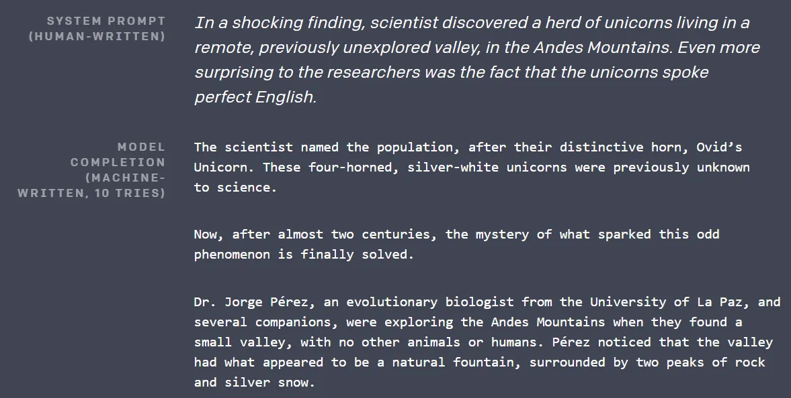
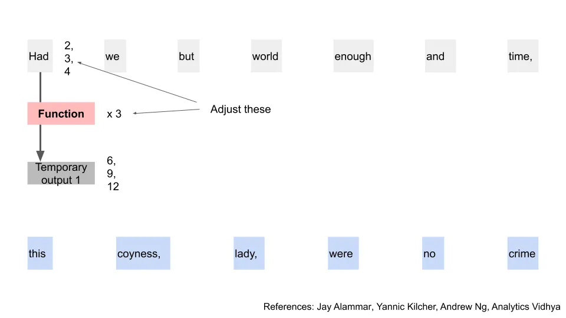
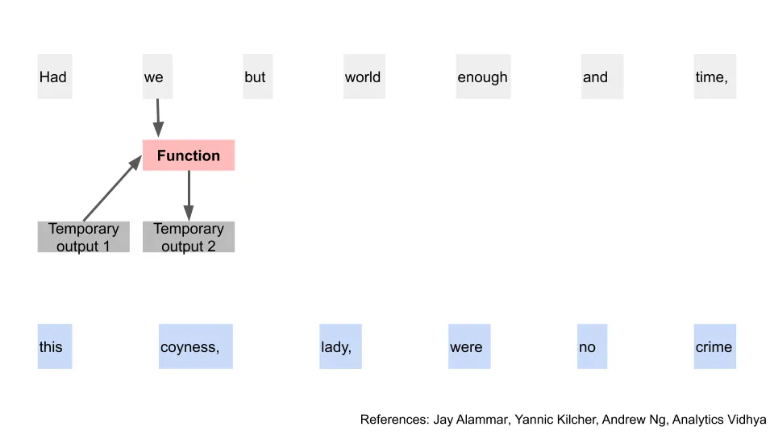
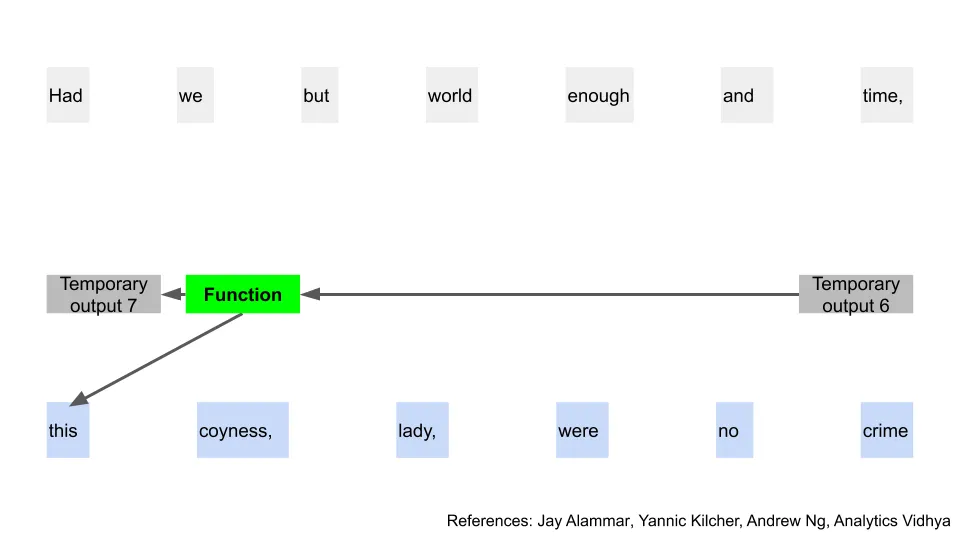
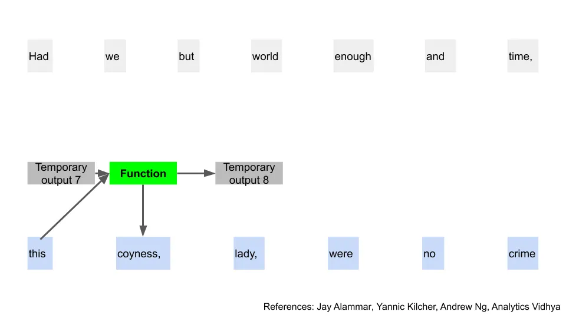
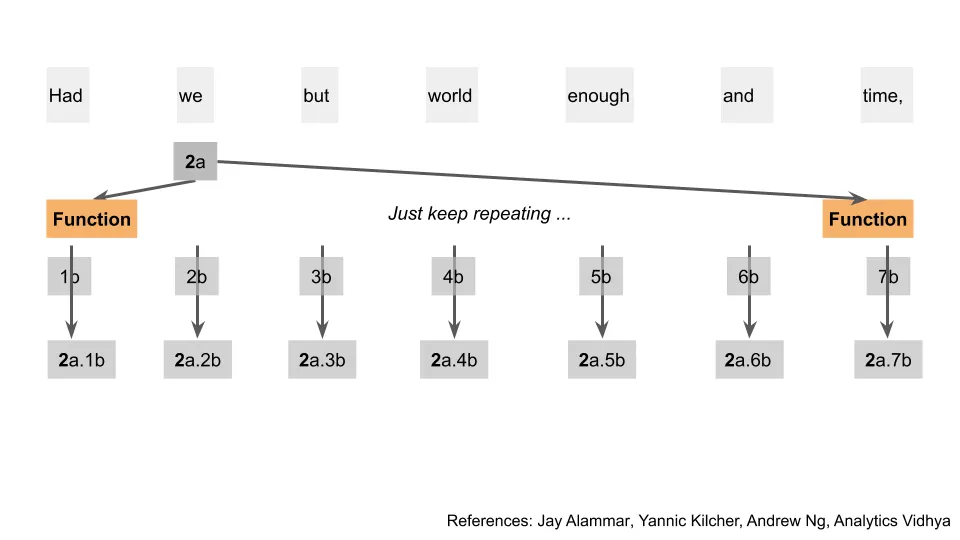
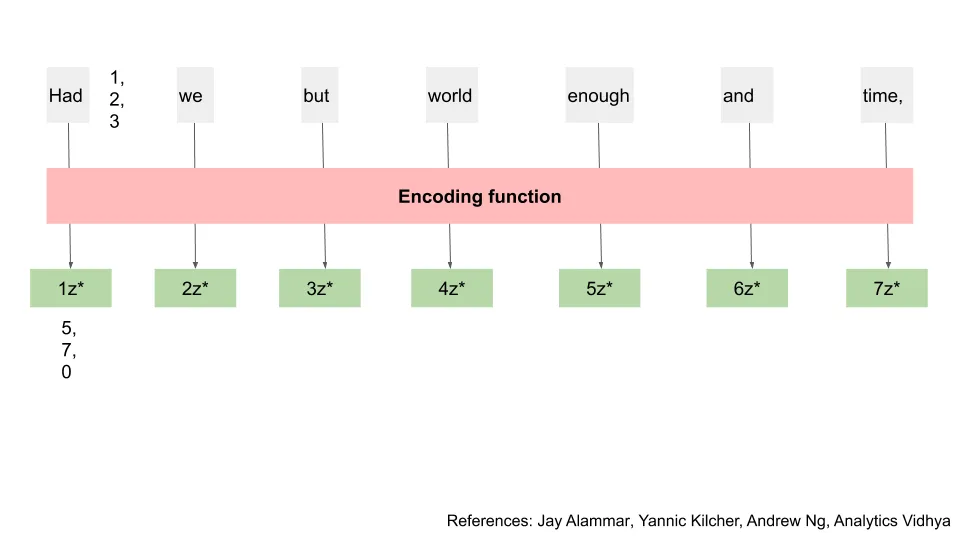
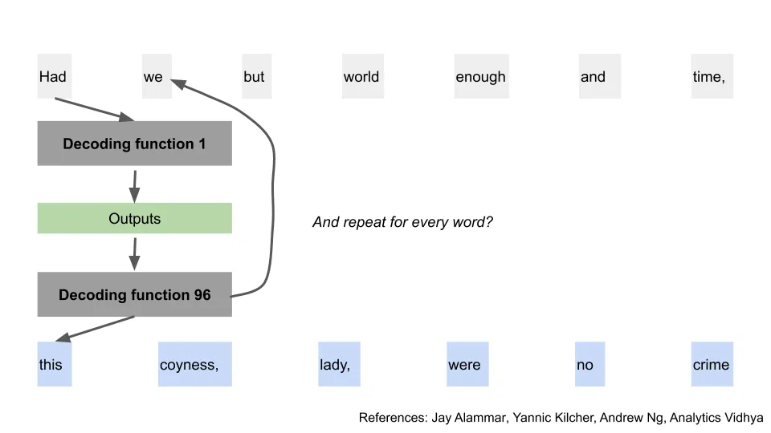

## 摘要

GPT\-3是一个令人印象深刻的文本预测模型，能够推广到许多用例。我会详细介绍它高层次的工作原理，炒作是否应得，如何检测GPT，以及它是否会掠夺我们的工作。

## 毕竟只是人类

大约一周前，沙里夫·沙米姆分享了 [this video on twitter
demonstrating the abilities of a new AI, GPT-3](https://twitter.com/sharifshameem/status/1282676454690451457)

还有。推特。惊慌失控。出局。

也许意识到他们轻松的工作 [copying stack overflow answers](https://www.zdnet.com/article/the-most-copied-stackoverflow-java-code-snippet-contains-a-bug/ 'SO') 或 [gossiping about startups](https://twitter.com/magdalenakala/status/1285597906892988417?s=20 'startup') 处于风险之中 [^1]程序员和风险投资人在推特上开始大量发布GPT\-3演示和对最新人工智能的犀利观点。如果你愿意，这些内容还在继续 [take a look](https://twitter.com/hashtag/gpt3?lang=en 'gpt3')

所以，我来这里，带着我自己的犀利观点，想借助这群被吸引的人工智能观众来赚一笔。

兄弟，我也是个普通人。

本文分为五个部分：

1. 解释GPT\-3的能力、它的优点以及人们为何担忧
2. 关于GPT\-3出现之前语言模型工作原理的略微技术概述
3. GPT\-3的工作原理略有技术概述
4. 如何检测GPT\-3编写的文本
5. GPT\-3的影响

我们开始吧。

## 1\. GPT\-3令人印象深刻的是它能够为各种用例创建可理解的输出

[GPT-3](https://arxiv.org/pdf/2005.14165.pdf 'GPT') 由 [OpenAI](https://openai.com/about/ 'Open')一家公司试图“确保通用人工智能造福全人类”，也就是说机器人不会害死我们所有人。

GPT\-3 是一个通用语言模型，意味着它接收一些单词作为输入，输出更多单词。 **可以把它当作一个了不起的 [autocomplete function](https://en.wikipedia.org/wiki/Autocomplete#:~:text=Autocomplete%2C%20or%20word%20completion%2C%20is,to%20accept%20one%20of%20several. 'auto')\.** 因为它是一个通用模型，可以解决许多不同类型的任务。你可以让它写一段关于独角兽的文字，翻译一句话，生成编程代码，或者更多。

这很方便，因为你通常会期望算法只做它训练时的任务。你不会直接在Excel里找它来告诉你一首诗。很长一段时间以来，我们一直期望程序按指令执行，但完成它们本不该设计的任务的能力很差。

既然这是一个通用模型，你也会认为GPT\-3在某项任务上比专门做该任务的模型差，比如比较GPT的翻译结果和专注于翻译的算法，GPT不会那么好。

令人惊讶且令人印象深刻的是，情况并非总是如此。下面是来自 [GPT paper](https://arxiv.org/pdf/2005.14165.pdf 'GPT') 通过翻译测试的结果。为了简化，我们可以直接比较代表“最先进”模型的第一行和表现最佳的GPT模型的最后一行 [^2]\.这里数字越大越好。我们可以在某些翻译任务中看到这一点（尤其是翻译 _到_ 英文）， **GPT和最先进模型一样好，甚至更好。**

OpenAI还测试了GPT在许多其他任务上的应用，比如文本预测、问答题，且不让GPT搜索独立数据集，或确定代词指的是哪个词 [^3]\.虽然GPT并非所有案例都获胜，但在大多数情况下都能取得很好的效果。 **如果你只能选一个模型，你可能会想用GPT。** 这是 [Simone Biles](https://www.nytimes.com/2019/10/13/sports/simone-biles-worlds.html 'Simone') 在AI社区中，他在许多活动中都是顶尖，其他方面也很出色。

让我们来看一些例子。

在下面的这张第一张图片中，模型在顶部收到一个提示，然后在下面弹出剩余的文字。文字会写得更长\;我只是为了展示目的把它剪掉了。它想出来的东西挺酷的，对吧？

在第二张图片中，我们看到模型生成的另一个示例文本，这次显示它也能产生诗歌。这可能比我自己写的还要好。

太棒了，那么所有的炒作都是有道理的？这是不是某个分水岭，人工智能的能力跨越了某种人为的界限？推特和谷歌的趋势显然是这么认为的。

嗯\.\.\.\.\.\.是也不是。

我刚才给你看的那两张图片？我撒谎了，那不是GPT\-3的。

它们实际上来自2019年2月发布的较早型号GPT\-2。事实上，长期阅读本通讯的读者可能还记得 [this article](/writing/moloch 'Moloch') 当时我写道，强调了该模型已经令人钦佩的成果 [^4]\.旧型号生成的文字已经很棒了。

那么，这次有什么不同？机器人只是有了更好的市场部门吗？

部分是的。GPT\-3发布于 [the end of May](https://minimaxir.com/2020/07/gpt3-expectations/ 'GPT')\.如果你往回翻到那个谷歌搜索趋势，仔细眯眼，你会注意到图表中那个微小的涨幅，就在它真正开始激增前两周。那是公众对GPT\-3的兴趣，在那条病毒式推文爆发之前。这说明演示格式确实能带来改变，我应该放弃写作去做TikTok视频。

不过，这次确实有令人印象深刻的改进。GPT\-3 比 GPT\-2 更优，且能推广到更多场景。这主要归功于训练中使用的数据增加和模型参数的增加。

我会在下面详细说明，这些模型的工作方式是接收数据，训练数据，并根据训练集调整模型权重。

大家早就知道更多的训练数据通常会有帮助 [^5]，GPT\-3 的结果继续证明这是真的。GPT\-3 被摄入 [~50x the amount of data](https://lambdalabs.com/blog/demystifying-gpt-3 'lambda') 而旧版本则有，这让它直观地理解了如何为输出产生如此多相关引用 [^6]\.

GPT\-3 还有 [~100x the amount of parameters](https://minimaxir.com/2020/07/gpt3-expectations/ 'params') 其模型与旧版本相比。参数为1750亿 [isn't unheard of](https://twitter.com/iamtrask/status/1285301017878441988?s=20 'params')但这确实帮助GPT\-3在回复中获得更多差异化 [^7]\.

马克斯·伍尔夫指出，GPT\-3还改进了另外两点： [1) It allows for text generation twice as long, and 2) prompts to the model are even more helpful in steering the direction of text generated](https://minimaxir.com/2020/07/gpt3-expectations/ 'Max')\.GPT\-3可以接受零、一或几个“提示”的样本答案，当你给它输入时。提示帮助它理解该给出的答案，提示越多越好。

总体而言，Max估计GPT\-3给他带来可用结果的频率大约是旧版GPT\-2的5倍。在炒作方面，公众的关注度从0提升到了100，而关注该领域的人则从50\%升至70\%。

这允许以下结果 [this, a plugin to pull GPT results to autofill google sheets](https://twitter.com/pavtalk/status/1285410751092416513?s=20 'twitter') （这次是真正的演示，我保证）：

由于GPT的推广能力很好，因此人们对它在任何“知识工作”领域被广泛应用充满期待。从编程到银行再到医学，人们普遍认为GPT最终能给出与专业人士同等质量的答案。下次你去看医生时，也许你的诊断会来自GPT博士。

听起来都很好，有哪些担忧？

马克斯详细讲解了 [here](https://minimaxir.com/2020/07/gpt3-expectations/ 'expectations')指出：

- 该模型产出缓慢
- 公开展示的例子中有很多断章取义
- 大家都在用同一个训练好的模型，我们无法微调它
- 培训中存在系统性偏见问题，例如回忆 [how Microsoft had to pull its chatbot after it turned racist](https://www.theverge.com/2016/3/24/11297050/tay-microsoft-chatbot-racist 'Tay')

另一个担忧是训练这种模型的成本。有趣的是， [Yannic on youtube](https://www.youtube.com/watch?v=SY5PvZrJhLE&feature=youtu.be 'Yannic') 指出研究人员在数据收集过程中犯了错误，直到训练模型后才意识到。他们不得不以其他方式调整，而不是重新开始。 **重新训练模型成本过高。**

这太疯狂了。人们希望模型训练成本能下降，因为硬件会跟上算法需求。如果不这样，就意味着只有大公司能为自己的需求定制模型。

最后，还有一种无休止的不安，担心这将摧毁我们所有的工作岗位，导致人类的终结。我将在结语中谈及这个轻松的话题。

现在，让我们仔细看看这些模型是如何工作的。

## 2\. GPT\-3之前使用的seq2seq模型概述

_免责声明：接下来的两部分略带技术性，我将介绍所使用的模型。如果不适合挑战，可以跳到“我们如何检测GPT\-3？”部分。_

_进一步声明：我不是机器学习专家，涉及的模型很复杂。我会继续依赖 [this talk](https://www.youtube.com/watch?v=S0KakHcj_rs 'talk') 还有本文底部链接的其他解释。欢迎随时回复更正。_

**GPT\-3 使用不同的模型** 相比传统预测模型。不过，在看GPT\-3之前，了解旧模型背后的直觉仍然很有帮助。我先讲解一个旧模型，然后再讲GPT\-3。

我们先从那些较早、受欢迎的作品说起 [sequence to sequence model.](https://google.github.io/seq2seq/ 'seq') 这通常缩写为“seq2seq”，但为了更易理解，我就称之为“旧模型”，GPT\-3称为“新模型”。

假设我们有一个短语，想预测下一个短语。我们将短语输入一系列函数的算法，然后得到预测输出。

每个词都很重要，所以我们必须把输入短语拆分，一次一个词地看。例如，“Had we but world enough and time”和“Had we but world enough”和“limes”有不同的含义

让我们把图表整理出来，只看第一个单词。我们把这个单词传递给一个函数，然后得到一些临时输出。我们知道可以用数字来表示单词，因为计算机就是这样处理单词的 [^8]\.所以可以把它想象成一个单词被转换成某个数字，经过数学计算，然后再得到另一组数字。例如，（1， 2， 3） 乘以 2 等于 （2， 4， 6）。

如果你还记得高中数学，这就是矩阵乘法或线性代数。 **下面的几乎所有数学内容都可以用某种矩阵乘法形式表示，适用于本节和下一节。**

所用函数为 [neural network, so it's more complicated than just multiplying by two.](https://towardsdatascience.com/learn-how-recurrent-neural-networks-work-84e975feaaf7 'neural') 我会略过这些原理是如何运作的，因为我之前已经讲过直觉 [here](/writing/ml 'ML')这会让这次攻略变得过于复杂。免费订阅，给我发邮件，我会转发。

这里更重要的是，这个词被转化为其他形式。模型可以控制单词最初如何被转化为数字，以及我们执行的功能。例如，我们可以将“Had”变成（2， 3， 4），再用3等于（6， 9， 12）

我们完成了第一个词，接下来进入第二个词。不同的是，我们有第一个词的临时输出1 [^9]\.我们将它与第二个字结合起来，再次应用函数，得到新的临时输出2。

此时，你可以推断出接下来序列的方向。确实，我们一直这样做，直到到达输入的最后一个字。我们利用一个字的临时输出来帮助生成下一个字的临时输出，以循环的方式。

利用这个临时输出，我们应用不同的函数，这会得到两个结果。我们得到输出的第一个字（从数字翻译回来后），然后得到另一个临时输出（仍然是数字）。在我们的例子中，我们得到“this”这个词。太棒了，终于有了实质性的进展！

现在我们有一个临时输出，一个实际输出，还有我们的新函数。正如你可能猜到的，我们可以重复同样的步骤来得到下一个预测的单词，还有另一个临时输出。这又是一个反复出现的模式。

就像之前的输入场景一样，重复到短语结束。

我们已经结束了旧模型！内容确实很多，显然过于简化，但我们已经对流程有了高层次的理解。想了解更多细节，可以查看原始论文 [here](https://arxiv.org/abs/1409.3215 'paper')

现在有一个关键问题，既考验我们的理解，也暗示了新模型的改进。在旧模型中，我们能否在解决之前的部分之前先解决过程的任何部分？例如，我们能否在不先解决“我们”的情况下，获得“时间”的临时输出？

**不行，因为我们必须按顺序运行所有内容。** 词语的位置和语境都很重要，所以我们希望逐个词处理。我们不能跳过任何部分，因为每一步都依赖于前一个，且是反复出现的。这也是为什么旧模型被称为 [recurrent neural network](http://karpathy.github.io/2015/05/21/rnn-effectiveness/ 'RNN')\.因此，一旦输入文本变大，预测的计算也会变得缓慢。

变压器模型登场了。

## 3\. GPT\-3 使用变换器解码器模型，这是变换器模型的一个变体

GPT\-3 代表生成预训练变换器 3。名称中的变换器代表 [transformer model, using an "attention" mechanism.](http://jalammar.github.io/illustrated-transformer/ 'transformer') GPT\-2和GPT\-3使用相同类型的模型，因此你找到的前者解释也会有归纳性 [^10]\.

然而，在我发这篇帖子之前，我学到的是 **他们实际上使用 [a variation of the transformer model.](https://s3-us-west-2.amazonaws.com/openai-assets/research-covers/language-unsupervised/language_understanding_paper.pdf 'variation')** 因此，我们先讲解一个简化版的新模型，“注意”是什么意思，然后看看GPT\-3版本有何不同。我会说明我们什么时候离开常规变换器并使用GPT\-3的调整。

对于新模型，我们将回到起点，使用输入词并尝试从中获取输出。

不过现在，我们希望同时计算所有输入词，而不是顺序计算。这样可以节省大量计算结果的时间，因为我们可以一次性用矩阵数学计算结果。

我们像往常一样再次将输入词转换为数字。不过这次，我们把这些数字传递给三个不同的函数，每个字分别得到三个临时输出：a、b 和 c。注意，为了简化，我们的字和输出有三个数字\;实际上它们有数百个数字。我们很快会看到这三个输出是如何使用的 [^11]\.

我们把图解开，对所有输入词做计算。现在我们有a、b和c，代表所有输入词。

现在，当我们不按顺序考虑输入时，我们会遇到一个问题\;在新模型出现之前，研究人员对此已经卡住了很长时间。如前所述， **词语的位置和语境都很重要。当我们不按顺序评估时，怎么能做到这一点？**

例如，以句子“作者喝了更多咖啡来完成他的通讯，因为它还没完成”。将“coffee”的位置换成“newsletter”是没有意义的，所以计算机需要以某种方式知道这一点。此外，这里的“it”指的是通讯，计算机也需要知道这个上下文。在旧模型中，所有这些信息都会被保留，因为我们一次移动一个词。在新模型中，我们需要另一种方法从一开始获取这些信息。

从图中注意，我们同时计算了所有这些临时输出，且彼此不依赖。接下来我们要做的是取第一个字的第一个临时输出，并对该输出应用一个函数，包含所有字的第二个临时输出。在图中，我将这些结果表示为第一个临时输出点，第二个临时输出，例如 1a\.2b

我们把与第一个单词相关的内容，与与所有其他单词相关的内容关联起来。重要的是，我们不必顺序进行这些计算，因为一个结果不会直接衔接到另一个单词。我们可以对其他单词重复这个步骤。这里我展示了第二个单词的同样步骤，以便更清晰。

回到第一个词。我们完成了a和b的输出，但c还剩下。毫不意外，我们对所有这些临时点输出和所有c输出应用了另一个函数。之后，我们又用另一个函数，将所有这些独立输出变成一个输出。例如，在这个例子中，我们从7个输出变成了1个单一输出1z。

好吧，这真是花了不少功夫。我发誓，这对那些想出来的人来说很有道理。我们刚才做的就是经过 [the steps of calculating "attention" for our words](http://jalammar.github.io/illustrated-gpt2/ 'attention') [^12]\.词A对另一个词的“注意力”程度，就是词A应该关注它多少，从而获得多少语境。通过将词语的组成部分与其他词语关联起来，我们提前解决了语境问题。为了简化，我跳过了位置问题的解决，可以把它看作是他们根据词位给原词添加更多数字 [^13]\.

我们现在有了新的输出z，它包含了该特定词的信息，以及输入中其他词的上下文。我们将它运行到另一个函数（前馈神经网络）中，得到另一个输出，称之为z\\\*。快完成了。

**我们将总结刚才做的所有步骤，称之为“编码”步骤。** 在“编码”过程中，我们将单词的初始数字转换为包含更多上下文的新数字。例如，（1， 2， 3） 变成 （5， 7， 0）。提醒一下，每个单词实际上是数百个数字，而不仅仅是三个。

输出的 z\\\* 中元素数与我们最初将单词转换为数字时相同。新模型将这个结果反复传递到整个编码过程中。可以把它想象成多个编码层，比如重复 96 次。

经过所有这些训练，我们得到了编码的最终输出。我们称之为 vf。注意，一个字的 vf 的计算仍然独立于另一个字的 vf 计算。这种并行化为我们节省了大量时间。例如，我可以在不知道1\_vf的情况下计算7\_vf。

现在，我们可以利用这些最终输出开始预测单词。我们将所有这些最终输出传递到另一个“译码函数”中，得到第一个单词 [^14]\.解码函数和编码函数的工作方式有差异，但步骤足够相似，我们就不再详细讲解了。 **你可以把解码函数看作是完成所有这些编码步骤，同时也取取“编码函数”过程的输出 [^15]\.**

我这里只放了一个大块来“解码函数”，但新模型重复这个过程的次数和编码过程一样。比如说，如果它有96层编码，那它就会有96层解码。

现在我们有了第一个预测字，接下来会把这个字和最终输出一起用，然后再通过解码函数。如果你眯着眼看，这看起来很像之前旧模型部分的过程。

当你对所有单词重复这个过程后，你就会得到最后一个短语。终于。

好吧，那就是 _概述_ 变压器模型。现在让我们抛开这些，从头开始做GPT\-3的版本。

开玩笑的，别慌 [^16]\.

GPT\-3结合了编码和解码过程，以获得 [Transformer Decoder](https://arxiv.org/pdf/1801.10198.pdf 'TD')\.它们将输入和预期输出序列合并成一个“句子”，然后通过解码层。GPT\-3 有 96 个这样的解码层 [^17]\.该模型用于预测下一次输入和下一次输出。

如果这听起来有点模糊，那是因为确实如此。我在网上找不到任何关于他们如何将步骤组合的解释，除了 [original paper,](https://arxiv.org/pdf/1801.10198.pdf 'paper') [this post](http://jalammar.github.io/illustrated-gpt2/ 'Jay')，以及这个随机 [github comment as confused as I am](https://github.com/openai/gpt-2/issues/157 'github')\.他们预测一个词的方式似乎也意味着我们又回到了递归问题，即按顺序处理文本。也许只要投入足够的计算能力解决问题。如果有人知道更多，请给我发邮件。

许多在线发帖的人都说GPT\-3使用传统的变换器模型，或变换器编码\-解码器模型。然后他们解释传统变换器模型，以描述GPT\-3中发生的事情。 **没错，那些人都错了，** 就像我之前一样，直到被纠正之前发帖前。

如果你还跟着我说，这个算法还有两个重要特点值得一提。

首先，还记得很久以前我们把词分成三个特征，a、b、c吗？新模型从一开始就这样分成了96次 [^18]\.每次使用不同的函数，因此生成96个不同的三元组。由于这些三元组是独立的，它会同时将所有输入词的编码\/解码层处理。当从编码\/解码函数z获得该输出时，这些结果会合并。这被称为“多重注意力头”。

其次，每次我提到函数时，你可以把它看作某个数字上的权重或参数。 **把所有权重加起来，新型号有1750亿个。** 不，这不是笔误。当人们提到GPT\-3使用的参数数量，以及它比之前的模型大得多时，他们指的就是这个。

例如，如果每个词都用1000个数字的列表表示，那么你只需要这么多参数才能完成上述整个流程中的一个函数。你很容易理解，拥有96个图层和每层96个备选项的流程，会让你达到庞大的参数数量。

这是一段长篇大论，但你现在对GPT\-3的用途有了更多的直觉。它通过输入单词，通过矩阵数学进行多次变换，并用这些来预测或翻译单词。

如果这有点太复杂，可以想象这个更简单的例子。想象一下 [choose your own adventure game](https://en.wikipedia.org/wiki/Choose_Your_Own_Adventure 'choose your own')，你的选择决定了故事的结局。 **GPT\-3 也是如此，只不过它有数十亿个可用选项，层层叠加。** 哪怕措辞稍有不同，你的选择就会走上不同的道路。而可能的路径几乎是无穷无尽的。

经过所有这些，下面附上了原论文中的变压器架构供参考。你可以看到它中部分内容对应到我们刚才设计的简化图，只有几个我为了简化而省略的方框 [^19]\.GPT\-3仅使用该图的右侧。如果你有兴趣了解更多，本文底部有更多参考文献。

## 4\. 我们如何检测GPT\-3？

我们知道GPT\-3是好的，而且有些输出样本很难与人类文字区分。那么，自然的问题是，我们是否还有其他方法可以检测文本是否是由机器写的？

事实证明，其实有一些出乎意料的简单方法可以做到这一点。

首先， [because of the hyperparameters used in GPT-3,](https://medium.com/analytics-vidhya/understanding-the-gpt-2-source-code-part-1-4481328ee10b 'temp') **生成词汇的频率不会符合正常人类预期的分布。** 在下面的截图中，Gwern解释说，这会导致常见词出现得比预期更多，而不常见词则完全不出现。温度控制随机性，top\-k超参数控制所选词的频率截止点。

对于不熟悉齐普定律的人来说，我之前已经介绍过了 [here](/writing/zipf 'Zipf') 当谈论寻找外星人时（是的，外星人。免费子版块给我发邮件，我会转发）。本质上，它指出在大量文本样本中，任何词的频率与其排名成反比，按出现频率排序。例如，最常见的词比第二常见词高出\~2倍。

我之前为我的通讯绘制过Zipf定律，看起来像是顶部的图表。如果GPT\-3来写我的文章，你可能会期待下面是这样（当然会有更多词，这个例子只是为了说明）。

其次，你可以用其他模型来检查文本。Analytics Vidhya 之前有一篇帖子 [how to detect computer generated articles.](https://www.analyticsvidhya.com/blog/2019/12/detect-fight-neural-fake-news-nlp/ 'Vidhya') 他们提供一些工具，比如GPT\-2检测模型。 [Grover,](https://grover.allenai.org/detect 'Grover') 它可以取样文本，告诉你他们是否认为是机器生成的 [^20]\.这些工具发布于GPT\-3之前，尚未校准，但表现依然良好。它们之所以有效，是因为 **模型熟悉其他模型用来生成文本的特性。**

这里有一个演示。我去看了附录中的第一个样本 [GPT 3 paper (page 49)](https://arxiv.org/pdf/2005.14165.pdf 'GPT')然后复制了机器生成的诗。把它插入格罗弗的网站，显示格罗弗认为那是机器生成的。我可能没猜对。

当然，这两种方法都不是万无一失。如果你的文本样本量不够大，很难做频率分析或通过检测模型验证。如果有人只发一次模板式的法律文字墙，可能数据不足以确定。我在想回复问他们是不是机器人会不会让人觉得侮辱\.\.\.\.\.\.

格罗弗还会收到误判，比如错误地声称艾伦·金斯堡的诗 [Howl](https://www.poetryfoundation.org/poems/49303/howl 'Howl') 是由一台机器编写的 [^21]\.它还会出现假阴性，认为GPT\-3生成的文本是人类创造的。 [You can try playing around with it and see what works for you](https://grover.allenai.org/detect 'Grover')

不过，拥有这些方法让我对假机器生成文本的危险感减少了。由于上述两种工具都依赖模型的结构特征，只要模型有超参数可调节，生成的文本很可能是可识别的。

最坏的情况是，大家都得安装某个浏览器扩展，扫描页面并警告你是否认为文本是假的。也许类似现在的广告拦截器？但到了那个地步，我们还有必要在意吗？

## 5\. 活着

目前对GPT\-3 API的访问 [subject to a waitlist,](https://openai.com/blog/openai-api/ 'waitlist') 因为OpenAI想小心别人滥用模型。不过如果你对这个概念感兴趣，有一些变通方法。

- OpenAI发布了GPT\-2（GPT\-3的旧版本）代码 [here](https://openai.com/blog/better-language-models/ '2')如果你知道如何设置，可以自己运行。
- Hugging Face团队为GPT\-2以及其他一些基于变压器的模型打造了更友好的界面。你可以去看看 [here](https://transformer.huggingface.co/ 'transformer')
- [Aaron Tay](https://musingsaboutlibrarianship.blogspot.com 'Aaron') 还发布了使用高级“龙”版本的帖子 [AI Dungeon](https://play.aidungeon.io/ 'AI')，一款使用GPT的文本生成器游戏， [supposedly gets you access to GPT-3 within the game](https://musingsaboutlibrarianship.blogspot.com/2020/07/playing-with-gpt-3-via-ai-dungeon.html 'AI')

我们应该预期更多人能够获得类似GPT\-3的能力，通用语言模型也会持续进步。这些模型可能无法通过 [Turing Test](https://plato.stanford.edu/entries/turing-test/ 'Turing') 然而，作为 [Kevn Lacker shows.](http://lacker.io/ai/2020/07/06/giving-gpt-3-a-turing-test.html 'Lacker') 然而，似乎我们每天都在更接近。仅靠人类将越来越难以判断某物是否是机器制造的。

GPT的最终应用场景很可能比我们想象的更具创造性。 [Tyler Cowen gives some thoughts here](https://marginalrevolution.com/marginalrevolution/2020/07/the-case-for-gpt-3.html 'Cowen') 关于医学诊断和疗法，我们可能还只是刚开始理解用GPT或类似模型在大规模上可能做些什么。演示会不断让我们惊喜。我们会好奇什么是智能。

与此同时，程序员们发推说这会夺走银行和咨询岗位，风险投资说这会夺走编程岗位，还有其他你能想象到的团体试图把这些推销给其他行业。我目前觉得这些论点不够有说服力，但我仍然愿意被说服。如果更高效的工具是个致命杀手，Excel早在几年前就已经淘汰一半的办公室工作了。

但可能发生的是 **职业专精的回报更高。** GPT可以给你模板，让你在填写和编辑前检查。繁琐的模板文档和幻灯片可以轻松生成，然后你可以运用专业知识为项目定制。初级银行家和顾问或许终于能用时间做些有意义的事情，而不是为不同公司复制同一份简历，换掉标志 [^22]\.

这样想：随着孩子长大，你是需要更多还是更少的专业知识来纠正他们的作业？你从编辑拼写错误开始，最后需要掌握微积分。

此外，人们似乎认为我们所有的输入和输出数据都会干净且易于使用。作为 [Vicki Boykis](https://vicki.substack.com/p/were-still-in-the-steam-powered-days 'Vicki') 我反复指出，这通常是那些从未处理过大型数据集的人的观点。如果你有一个自定义的GPT模型，你很可能会花大部分时间清理数据。如果没有，你很可能会花大部分时间清理输出。

无论如何，还有工作要做。我们暂时安全。

我有争议地提出这样一个建议 **GPT\-3更多地告诉我们关于我们作为人类的自己，而非关于计算机的事。** 这表明我们对接收到的输入变化有着惊人的宽容范围，无论是散文、诗歌还是音乐作品。计算机会标记为机器生成的文本会通过我们的本能测试，暗示我们比这两者更为宽容。

也许正是这种对模糊性的欣赏，这种对奇异事物的欢迎，将我们的突触信号与比特字节区分开来。

或者我们得重新思考它的含义\;关于 [being alive](https://www.youtube.com/watch?v=eBBPKedba5o 'alive')\.

_本文并非GPT\-3撰写。感谢 [Gwern](https://twitter.com/gwern?ref_src=twsrc%5Egoogle%7Ctwcamp%5Eserp%7Ctwgr%5Eauthor 'Gwern') 以及 [Jay Alammar](https://twitter.com/JayAlammar?ref_src=twsrc%5Egoogle%7Ctwcamp%5Eserp%7Ctwgr%5Eauthor 'Jay') 在推特上回答关于GPT的问题， [Nathan](https://mobile.twitter.com/nbashaw 'Nathan') 用于编辑。_

## 其他有趣的评论

1. [Gwern showcases creative writing by OpenAI’s GPT-3 model, demonstrating poetry, dialogue, puns, literary parodies, and storytelling](https://www.gwern.net/GPT-3 'Gwern')
2. [Max Woolf on Tempering Expectations for GPT-3 and OpenAI’s API](https://minimaxir.com/2020/07/gpt3-expectations/ 'Max')
3. [Kevin Lacker on Giving GPT-3 a Turing Test](http://lacker.io/ai/2020/07/06/giving-gpt-3-a-turing-test.html 'Lacker')
4. [Michael Nielsen twitter thread](https://twitter.com/michael_nielsen/status/1284937254666768384?s=20 'Nielsen')
5. [Manuel Araoz on how OpenAI's GPT-3 may be the biggest thing since bitcoin](https://maraoz.com/2020/07/18/openai-gpt3/ 'Maraoz')
6. [Exxact with other GPT-3 applications, such as summaries, code, and spreadsheets](https://blog.exxactcorp.com/what-can-you-do-with-the-openai-gpt-3-language-model/ 'GPT')

## 更详细的解释

1. [Yannic's youtube video explaining the GPT 3 paper](https://www.youtube.com/watch?v=SY5PvZrJhLE&feature=youtu.be 'Yannic')\.还有GPT 3论文本身 ["Language Models are Few-Shot Learners"](https://arxiv.org/pdf/2005.14165.pdf 'GPT3')\. [Yannic's youtube video explaining the GPT 2 paper, which GPT 3 bases itself on.](https://www.youtube.com/watch?v=u1_qMdb0kYU 'Yannic') 还有GPT 2论文本身 ["Language Models are Unsupervised Multitask Learners"](https://d4mucfpksywv.cloudfront.net/better-language-models/language_models_are_unsupervised_multitask_learners.pdf 'GPT2')
2. [Joseph Palermo](https://twitter.com/j_w_palermo 'Joseph') 德萨的 [speaking at Insight on Transformers.](https://www.youtube.com/watch?v=S0KakHcj_rs 'youtube') 我觉得这很有帮助，因为听众提出了许多问题，就像我在整个演讲过程中一样迷茫。
3. [Andrew Ng on attention models](https://www.youtube.com/watch?v=SysgYptB198 'Ng')
4. [How do Transformers Work in NLP? A Guide to the Latest State-of-the-Art Models](https://www.analyticsvidhya.com/blog/2019/06/understanding-transformers-nlp-state-of-the-art-models/ 'Vidhya')
5. [Jay Alammar on the illustrated transformer](http://jalammar.github.io/illustrated-transformer/ 'transformer')

[^1]: 我开玩笑的，开玩笑的。他们偶尔会打乒乓球。

[^2]: 显然，直接比较结果存在问题。我不太清楚细节，但似乎与标准化所用引号数据有关。论文说：“然而，我们的单次\/少数样本设置与之前的无监督工作严格可比，因为它们使用了少量成对示例（1或64个）。这相当于一两页上下文训练数据。”

[^3]: 上下文 \- “LAMBADA 数据集测试文本中长距离依赖关系的建模——模型被要求预测需要阅读一段上下文的句子的最后一个词”\;趣闻 \- “在 TriviaQA 中，我们在零样本设置下取得了 64\.3\%，单次模式 68\.0\%，少样本模式 71\.2\%”\;代词 \- “Winograd 模式挑战是 NLP 中的一项经典任务，涉及确定代词在语法上模糊但语义上对人类无歧义时所指的词。”

[^4]: 其中一个链接已经断开，因为Slate Star Codex删除了他的博客\;但你可以找到一些保存下来的GPT\-2诗歌样本 [here](https://antinegationism.tumblr.com/post/182901133106/an-eternal-howl 'Moloch')， 和 [Gwen's site](https://www.gwern.net/GPT-2 'Gwern') 还有更多。

[^5]: [Banko and Brill showed way back in 2001 that more data can make a bad algorithm perform better than a good one.](https://dl.acm.org/doi/10.3115/1073012.1073017 'Banko')

[^6]: 第8页和第9页 [GPT-3 paper](https://arxiv.org/pdf/2005.14165.pdf 'paper') 讨论他们如何利用CommonCrawl、WebText、Books和Wikipedia数据集进行训练。

[^7]: 我相信他指的是这个1600亿参数的模型 [here](https://dl.acm.org/doi/abs/10.5555/3045118.3045359 'model')

[^8]: 如果你是这么想的话，我们这里并没有把词语转换成二元表示。相反，我们是 [using a word embedding such as word2vec](https://towardsdatascience.com/learn-how-recurrent-neural-networks-work-84e975feaaf7 'word2') 生成可用于未来算法的词语的多样数值表示。确实，归根结底一切都被转换成二进制，但目前还不是这个阶段。

[^9]: 好的，我很确定第一个函数实际上有 [bias unit](https://ayearofai.com/rohan-5-what-are-bias-units-828d942b4f52 'bias')所以也需要另一个输入。但这会让正文解释变得过于复杂，所以我就不提了。

[^10]: 你可以在 [GPT-3 paper page 8,](https://arxiv.org/pdf/2005.14165.pdf 'paper') 其中他们说“我们使用与GPT\-2相同的模型和架构，包括其中描述的修改后的初始化、预规范化和可逆的分词化，但我们使用变换器层中交替出现的密集和局部带状稀疏注意力模式，类似于稀疏变换器。”

[^11]: 这是变压器模型中 [they embed the word, and then calculate smaller query, key, and value vectors by mapping the embedded word vector on to a pre-trained weighted matrix.](https://youtu.be/S0KakHcj_rs?t=1083 'youtube') 看了这么多阅读和视频后，我仍然不太清楚查询、键和值代表什么。我建议你去看看额外的资源，自己了解更多细节。我目前的直觉是，它是将单词分解成一个可以承载单词分量、与另一个单词比较时的分量，以及查找匹配的过程。

[^12]: 第一步是获取查询、键和值向量。然后我们取查询向量与其他词键向量的点积，以判断需要对其他词的关注度。然后除以键向量维数的平方根。接着我们做 [softmax function](https://towardsdatascience.com/softmax-function-simplified-714068bf8156 'soft')\.然后我们将结果乘以数值向量。最后我们取所有这些因素的总和，得到下一阶段流程中使用的最后一个向量。

[^13]: 它们使用正弦和余弦函数，参见 [page 6 of the original paper](https://arxiv.org/pdf/1706.03762.pdf 'sin')\.他们需要某种周期性，以便模型可以扩展到不同的区间长度。

[^14]: 技术上还有另一层线性网络和softmax层 [after the decoding layers](http://jalammar.github.io/illustrated-transformer/ 'linear')但为了简化，我省略了。

[^15]: 在解码器中，输出只能关注其前的输出字，而不能关注整个输出序列。这被称为“掩蔽”

[^16]: 不过当我意识到GPT不使用标准变换器模型时，我也有这种感觉。我真的以为我得重新制作那些图表。

[^17]: 佩尔 [page 8 of the paper (n layers)](https://arxiv.org/pdf/2005.14165.pdf 'gpt')

[^18]: 巧合的是，重复层数和上面说的一样，但不一定非得如此。论文第8页也一样。

[^19]:
    好吧，这看起来很吓人，我花了很长时间阅读和观看视频才弄明白发生了什么。为了把它映射到我们走过的模型，我们从左边开始。我们有输入，它们会被嵌入。到目前为止，这和我们最初的单词被转换成数字的方式是一样的。然后是“位置编码”，这是我跳过的位置编号的添加。然后我们进入一个以“多头注意力”开头的框——我们知道这个，我们经历了整个过程。有一个“加法和规范”框，指的是 [layer normalisation](https://mlexplained.com/2018/11/30/an-overview-of-normalization-methods-in-deep-learning/ 'norm') 你可以把它看作是对数字进行扩展。然后它进入“前馈”框，也就是提到的神经网络，用来达到 z\\\*。然后我们再次归一化。这个较大的框外侧有 Nx，表示我们按需要重复 N 次。右边是输出，进行嵌入和编码，然后进入大方框。步骤与左边类似，但我们做“掩蔽”多头注意力，同时取左边框的输出。根据需要重复 N 次。然后通过线性层和软极大函数，获取输出词的概率。呼。这同样是针对常规变换器模型的。GPT\-3 只用右侧。
    [^20]: 该帖子还链接到一个统计分析工具， [GLTR,](https://gltr.io/ 'GLTR') 这实际上类似于前面提到的Zipf定律分析。
    [^21]: 说实话，它看起来确实很符合那个风格。
    [^22]: 开玩笑的，我知道你也会交换图表颜色。
