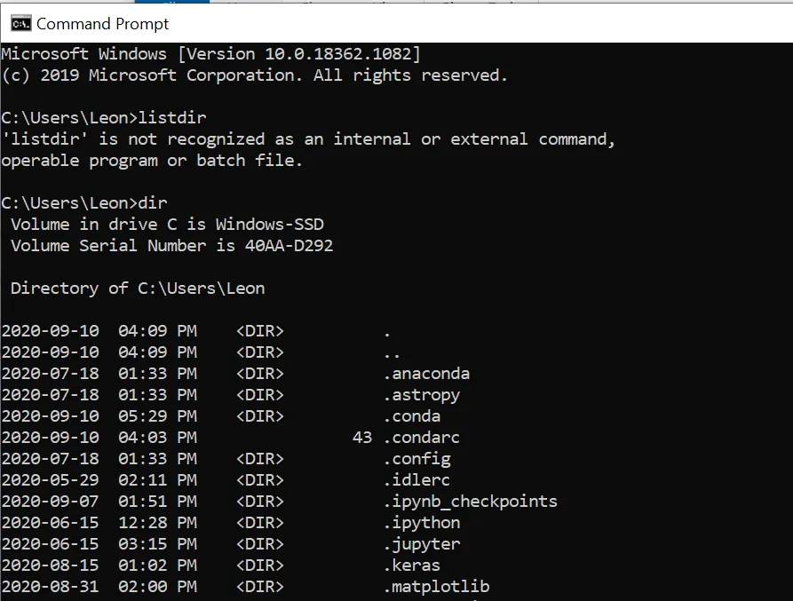
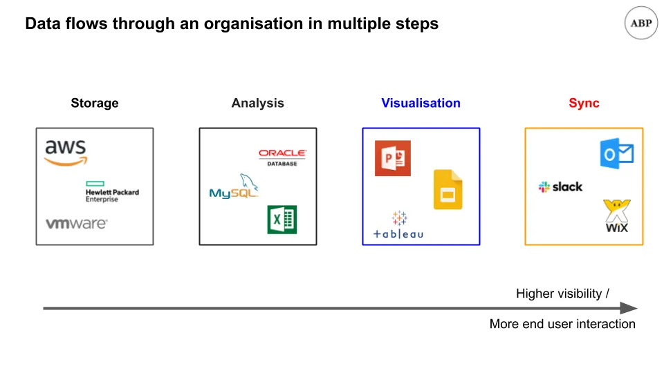
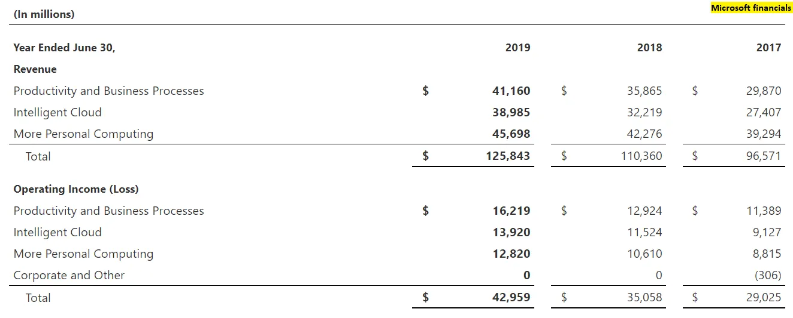
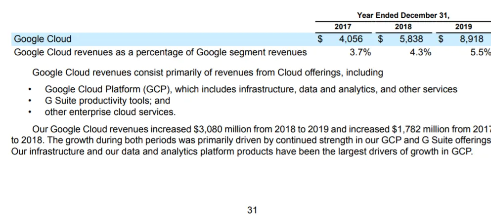
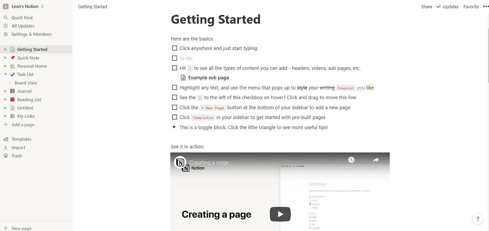
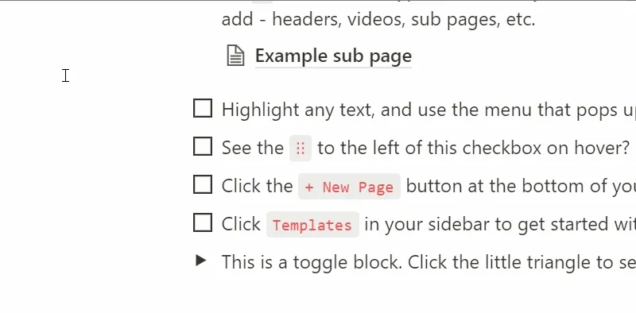
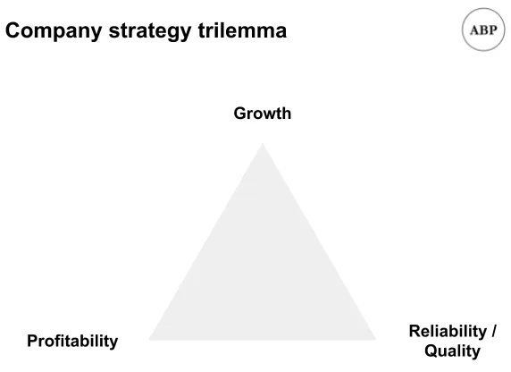

## 摘要

1. Notion 是一种基于视觉的信息组织与协作方法
2. Notion最大的优势是灵活的表单、基于视觉的构建和模板选项
3. Notion最大的问题很可能与质量有关，我会给出一些市场营销和产品建议来解决这些问题

## Notion工作区

在电影中 [Inception by Christopher Nolan,](https://en.wikipedia.org/wiki/Inception 'Inception') 主角们在层叠的梦境中游走，完成一项任务。他们在那层中的行为会影响层本身，也会影响上下层。有时你关心那层发生的事情，有时则想影响其他层。

我希望你记住这个框架—— **层、层中的相互作用以及层之间的相互作用。** 我们稍后会再回来讨论 [^1]\.

最近，像Notion、Coda、Roam这样的生产力初创公司都以较其规模的高估值融资。 [The hustle has Notion at a $2bn valuation, Coda at $600mm, and Roam at $200mm](https://thehustle.co/09142020-roam-research/ 'Hustle')\.考虑到这些公司都很年轻 [^2]这些都是对此类公司潜力的乐观风险评估。

今天我想更仔细地看看 [Notion](https://www.notion.so/ 'Notion')\.我们过去 [^3]\:

1. Notion的目的是什么
2. 示例功能演示
3. 给Notion团队的建议

这样在结束时，你就能了解这些初创公司为何存在、它们是什么样子，以及它们未来可能发生的变化。

我们开始吧。

## 1\. Notion 是一种基于视觉的信息组织与协作方法

为了更好地理解 Notion，我们需要更多关于我们与信息互动的历史背景，以及计算的演变。

我们可以粗略地把人类看作一个功能。我们把数据作为输入，处理它，然后给出某种反应作为输出。这些输出数据随后影响其他人，他们自己也处理并做出相应反应。

我们过去是物理存储数据的，你得亲自去图书馆或专业人士那里才能获得一些真理的卷轴 [how likely Jack Sparrow would have visited Singapore](https://www.reddit.com/r/AskHistorians/comments/gd7cww/in_pirates_of_carribbean_jack_sparrow_says_youve/ 'Reddit') [^4]\.

有了计算机，我们转向数字化存储数据，甚至允许多个协作者同时处理文档。 **我们不再受限于数据或个人的物理位置，这为全球范围内与信息互动打开了机会。** 以前，鉴于信息传递的速度，我几乎没有机会与乌干达的人合作。现在，我们不仅可以合作，甚至可以同时处理同一份文件。

不过，这一步花了很长时间，因为这需要改变思维方式、技术和设计，才能实现我们现有的工作习惯。

一个重大变化是 **[graphical user interface](https://www.youtube.com/watch?time_continue=39&v=BFlop4sP8Os&feature=emb_title 'GUI')\.** 在此之前， [people were interacting with computers via a command line interface,](https://www.wired.com/1997/12/web-101-a-history-of-the-gui/#:~:text=In%201979%2C%20the%20Xerox%20Palo,first%20prototype%20for%20a%20GUI.&text=When%20Jobs%20saw%20this%20prototype,expensive%3B%20no%20one%20bought%20it. 'CLI') 就像下面那种。

如你所见，这并不是与计算机合作最直观的方式。我可以说我把这个错误留在这里是为了学习\;事实上，我忘了正确的语法。命令行交互虽然强大，但对大多数用户来说是个很高的入门门槛。通过围绕视觉体验重新设计使用， [Apple achieved a breakthrough](https://en.wikipedia.org/wiki/History_of_the_graphical_user_interface 'Apple') 在将计算机推向大众市场 [^5]\.如果我们还只是用命令行操作，计算进展会大大放慢。

第二个重大变化是互联网，分两波出现。在此之前，人们将作品存储在软盘等实体介质上 [^6]\.如果你想分享某样东西，你仍然需要把临时存储物体运给对方。

**电子邮件帮助改变了这一点，** 通过逐步消除对硬件的需求，提高数据传输的便利性和速度。你的老板现在可以发送十封独立无关联的邮件，针对脚注大小格式的意见，不再只寄给你一个U盘。

在过去十年里，互联网带宽的提升也使我们 **搬到云端。** 现在大家不再是通过邮件来回交流，而是可以实时协作同一份文档，进一步提升了便利性并减少了版本控制问题。我现在可以穿着睡衣坐着看 [Dark](<https://en.wikipedia.org/wiki/Dark_(TV_series)> 'Dark') 同时半心半意地回复谷歌文档上的评论。当然，我不会这么做。

互联网和云为所有 [Software as a Service (SaaS)](https://www.bmc.com/blogs/saas-vs-paas-vs-iaas-whats-the-difference-and-how-to-choose/ 'SaaS') 我们今天看到的企业。通过理所当然地认为别人会提供支持它们所需的基础设施（IaaS）或平台（PaaS），软件公司就能专注于满足特定细分市场的需求。

与 [low cost of capital](/writing/capital 'low')高潜在利润率和稳定的收入基础，难怪我们看到这么多软件公司试图数字化曾经是实体的职能。公司维基取代了汇编，看板板取代了便利贴，笔记应用取代了日志。我们大多数人在工作时必须同时使用至少10个甚至更多不同的软件平台。

这正是Notion派上用场的地方。 **[Notion wants to be your all-in-one workspace,](https://www.notion.so/product 'Notion')** 你主要负责写作、规划和组织工作的地方。就是我们刚才提到的那些独立软件？Notion想把它们都捆绑在一起，给你一个统一的用户体验，并有足够的灵活性满足你大部分任务的需求。

想要公司维基吗？你可以在Notion里创建。

想要任务板吗？你可以在Notion里创建。

想要笔记页吗？你明白我的意思了。

如果你觉得我在编故事， [here's a quote from cofounder Ivan Zhou:](https://www.invisionapp.com/inside-design/ivan-zhou-notion-interview/ 'ivan')

> 我们正处于一个摆动中，从一个产品Microsoft Office转向过多的SaaS产品。而现在，这个钟摆又回到了更捆绑的方向。我希望Notion能抓住这股浪潮。它可以是一个和这五种不同SaaS工具一样强大的产品。

这已经是一个庞大且可行的市场，但让我们来推测Notion的潜力，以及它如何进一步发展。是时候从头引入《盗梦空间》的类比，并将其应用到公司中数据层的存在方式。

公司必须收集和存储数据。我们称之为 **数据存储层，** 并将所有与基础设施相关的公司归为一类，以便简便。例如，如果你是一家零售商，你会存储交易记录以便后续履行订单，并且会使用亚马逊网络服务（AWS）来完成 [^7]\.

公司还必须分析他们收集的数据。我们称之为 **数据分析层，** 并将所有能够与数据库交互进行计算的工具归类。例如，你可能想查询本月有多少客户，然后用SQL查询数据库中的信息，用Excel进一步完善你的研究。

公司还必须看到该分析的结果。我们称之为 **数据可视化层，** 并将所有与演示相关的软件归为一组。例如，你可以用谷歌幻灯片展示你刚刚提取的数据图表，显示你的客户周增长了50\%。

在这一切之上还有最后一层主要的。我们称之为 **数据同步层，** 这里也是信息协调的场所。如果只有你的团队知道业务表现如何，那就没用了，所以你需要一种方式来传达这些信息，让大家达成共识。例如，你可以发一条全公司范围的Slack消息，回顾一下最近的财务数据。

随着数据在这些层中流动， **它变得更加直观和可见，** 这让更多人能够与它互动。数据同步层的工具，由于本质上最“面向终端用户”，通常采用更注重视觉化的设计方式，使普通用户更容易上手。例如，电子邮件很简单， [hadoop](https://en.wikipedia.org/wiki/Apache_Hadoop 'hadoop') 很难。

上述框架让我们更好地了解了Notion的增值所在位置。 **Notion 目前处于数据同步层，并且正在逐步进入数据可视化层。** 我之前说过这是一个很大的市场，所以在探索扩张机会之前，我们先为这个观点做个解释。

数据同步层正在尝试解决一个问题 **所有尺度上的信息协调问题**从公司内的小团队到外部利益相关者。目标是确保每个人对某个问题达成共识。拥有消息应用可以让你的团队就下一步行动达成一致，拥有公开网站则能让客户获得关于你业务的信息。Slack是一家市值150亿美元的公司，专注于消息传递\;Wix是一家市值130亿美元的市值企业，专注于建立网站。我们可以列出更多公司，比如维基、任务板、笔记，但我认为这足以说明这里蕴藏着数十亿美元的机会。

至于数据可视化， [Tableau was bought for $15bn](https://techcrunch.com/2019/06/10/salesforce-is-buying-data-visualization-company-tableau-for-15-7b-in-all-stock-deal/ 'Tableau')所以我认为这里也蕴藏着数十亿美元的机会。不过我认为Notion只是这一层的一半，因为目前可用的功能远未达到与同行的同等水平，正如后续攻略所展示的那样。

你们中有些人可能注意到我在讨论上述层级时漏掉了Office和G Suite。这是因为我认为对大多数Office\/G Suite用户来说，具备一定的数据计算能力是工作必需的。因此，掌握数据分析层的能力对于像这些工具一样融入劳动力市场至关重要。Notion在这方面的表现较差，但这也意味着很大的扩展潜力。

这能打开多大的市场？

Microsoft将Office收入归入“生产力与业务流程”板块，将Office商务、Office消费者及其他一些小型企业归为一类。在他们的 [recent annual report](https://www.microsoft.com/investor/reports/ar19/index.html 'ar')他们整个细分市场共创收410亿美元，运营收入160亿美元，利润率为39\%。当然，这并非全部是办公室收入，但很可能是最大的子细分市场 [^8]\.

谷歌将G Suite收入归入“谷歌云”细分市场，同时也将谷歌云和其他企业服务列入该项。他们最近的 [10K](https://abc.xyz/investor/static/pdf/20200204_alphabet_10K.pdf?cache=cdd6dbf 'Google') 他们显示该细分市场的收入是90亿美元。谷歌云可能是这里收入的大部分，我认为G Suite可能在10亿美元甚至更多。

显然，“Word、PowerPoint、Excel”市场以收入计，规模达数十亿美元，且可能远大于此。市场规模正是原因 **我认为Notion应该获得更多的分析能力** 随着时间推移。你希望覆盖尽可能多的客户用例。

想象一下，如果你一天开始工作时先查看待办任务板，然后查看提案上的评论，再更新一个通用公告页面，添加新的任务分配给同事。 **这些现在都可以在 Notion 里完成。**

下午你会提取一些客户流失数据，筛选和削减，显示出你的需求，然后用图表总结，与团队分享。总体来说， **现在 Notion 做不到，但试想如果能做到会怎样？** 这样你几乎可以把所有时间都花在一个应用里。Notion有可能成为巨大成功的一个方式，就是用单一软件取代Office和G Suite。如果我在Microsoft或Google做企业开发，我会密切关注Notion，考虑投资或购买它们。

回想《盗梦空间》的比喻，我们不仅关心Notion在当前层中占用多少空间，还关心它如何与其他层互动甚至接管。如果你的数据分析、可视化和同步都能用Notion完成，那我们现在使用的很多软件将变得多余。

可能有 [pace layer](/writing/pace 'pace') 这里也要做个对比，上层、更快的视觉层移动得更快，主导了注意力循环。

当我在思考这篇文章时，最初想为Notion做一个财务模型， [like the one I did for newsletters](/writing/community 'news')\.不过，鉴于缺乏数据，我会做出太多假设。我读过他们已经盈利，收入为 [$30mm](https://www.forbes.com/sites/davidjeans/2020/04/01/buzzy-work-app-notion-hits-2-billion-valuation/#15da831578ec '30')我能看到他们能实现10倍的收入，利润率40\%，同时仍保持两位数增长。我们还得等待更多数据，但难怪大家都很兴奋 [^9]\.

以上就足以说明 Notion 的估值，之后我们会回到一些更疯狂的想法，如何扩大可触及市场。现在，让我们做一个产品特性的概述。

## 2\. Notion 最大的优势是灵活的表单、基于视觉的构建和模板选项

登录 Notion 很简单，但开始操作却不方便，这个问题我稍后会在建议部分详细说明。你可以用你的 Google 账号登录，然后选择是为自己还是团队设置工作区。

再往后，你会看到一个“入门”页面，中间有如何在 Notion 中开始工作的技巧。左侧你会看到你从一些预设模板开始，比如待办事项列表或阅读清单。

**Notion的基本单位是一个方块。** 想想Excel中的单元格是做工作的关键。Notion中的块类似，但功能更多。块可以自定义显示内容和显示方式。关键是Notion是一个视觉化设计型应用，你应该能根据需求排列和调整块。

你可以把一个积木变成很多东西，比如待办事项清单、日历或表格。这些本身就是积木，所以你可以在原始页面上移动创建的链接。

**你可以把一个块\/页面嵌套在另一个下面，** 这样更容易建立一个连接所有作品的网络。如果你喜欢思维导图，喜欢连接所有互动对象，这种设计风格非常适合你。

除了可以从块创建独立页面之外，我还喜欢的另一个功能是 **拨动块**\.如果你喜欢在Excel里分组和解组行， [^10]你会喜欢这个显示摘要和详细视图的功能。

我们已经谈过Notion的表现 **模块化的模块让你能够与正在构建的页面进行视觉互动。** 过去，如果你想改变网页的外观，受限于网页编辑器提供的各种功能。比如，Substack的文本格式选项有限。要获得更多格式，你得自己编写HTML\/JavaScript\/CSS代码。

有了 Notion，你获得了大量功能和灵活性，让非前端程序员也能做更多开发。 **这也带来了丰富的模板选择，用户以分享他们制作的内容为荣。** 例如，如果你要回学校，可以使用预制模板来规划所有课程。

**Notion模板目前既是一大优势，也可能是一个大弱点。** 我们先讲述优点，然后在建议部分讲缺点。模板的优势在于，一旦有人确定了想要什么并选择了模板，很快就能上手，因为他们想要的功能大多已经创建好了。例如，如果你想做任务板，不需要从头创建页面和部分，因为已有模板。

在下面，我找到了Notion上的任务清单模板：

然后我能快速把自己的任务添加到上面。注意，在任务中，我可以创建嵌套子任务，这有助于组织。

Notion的概述就到这里，你可以去他们的 [youtube page](https://www.youtube.com/c/Notion/featured 'youtube') 了解更多你可以在 Notion 中创造什么。现在我想介绍一下 Notion 的问题，最后给公司一些登月计划的建议。

## 3\. Notion很可能会面临选择质量问题，应投资于生态系统以防止此类问题

以下是我对 Notion 的一些问题，从更宏观的策略到设计上的小挑剔。

### 问题一：模板也是采用和入门的障碍

如果模板是Notion的优势，那么模板越多越好。我们已经看到很多人推广自己的模板，有些人甚至收费。假设Notion已经启动了一个飞轮，而且 [the quantity of templates is not going to be a problem](https://www.notion.so/Notion-Template-Gallery-181e961aeb5c4ee6915307c0dfd5156d#90f6a0e426e1403093bb2a54ea33140d 'Notion')

**问题在于模板的选择。** 这也和我在攻略开头指出的入门问题有关。现在，人们必须1）弄清楚自己想要什么，2）找到适合自己需求的模板。在目前的Notion状态下，这两者仍然很难，会阻碍使用。

**对于第一个，理解可能性本身就是一项任务。** 我一点也不惊讶，如果有人用 Notion 来规划自己想怎么用 Notion，结果陷入了不断寻找最优设计却不做实际工作的生产力死亡螺旋。

**对于第二种情况，筛选可用模板的质量也是一项任务。** 对于新用户来说，在缺乏背景信息的情况下找到一个好的选项很难。选择过多比选择太少要好，但这也意味着需要某种形式的策划。 [You're already seeing unofficial template directories](https://templates.notion.vip/ 'vip') 证明这一点。

还有一点有趣的是，我们大多数人在现有的Word\/Excel\/PowerPoint工具中并不常用太多模板。这并不是因为缺乏选项，因为这些工具都有现成模板。相反，我们意识到我们更喜欢从零开始时的灵活性。也许随着时间推移，人们会随着习惯Notion而减少模板，自己创建更多页面。

这就像艺术，你从参考（模板）开始绘制。一旦你提升了技能，你就会想开始创作自己的构图。Notion需要能够支持整个过程的用例。

### 问题二：视觉设计需要在人们“理解”之前亲眼见证

我们已经证明过Notion是一个视觉工具。这意味着，与其描述它， **你得把它拿给别人看** 在他们理解潜力之前。想象一下，如果这篇文章没有视觉效果\;你可能仍然不知道Notion讲的是什么。

在沟通方面，图片是最低限度，动图或视频远胜于纯文本。我不知道你怎么想，但我对必须看多个相关视频感到烦躁，而不是单纯阅读相关内容。这个问题不是致命缺陷，但会减缓大众的普及。

### 问题3：缺乏核心数据分析功能

我之前也提到过，Notion在功能上远不及Excel。作为 [RadReads](https://radreads.co/notion-formulas/ 'Rad') 指出，Notion就像数据库一样。它不是Excel，所以只能给你整个部分的功能视图。比如，你不能只对两个单元做计算，必须对整个列应用 [^11]

如果你看上面那张我试图加两个数字的图片，你也会发现公式看起来很不优雅。Notion里的公式看起来像是编程思维，函数把变量当作输入，排列成一长行。这与Notion的视觉设计理念完全相反，这让我很惊讶。

不过需要说明的是，要在功能上接近Excel将非常困难。我不指望Notion团队会优先考虑这一点，但从前面部分提到的观点来看，他们拥有巨大的机会。如果你能在同一个工具内完成数据分析、演示和协作，那就非常了不起。第三方正在创造 [chart plugins](https://www.notion.vip/charts/ 'charts') 说明市场会有的。

这个问题也说明了 Notion 在成长过程中必须做出的权衡，是服务更休闲的用户还是更高级的用户。高级用户愿意支付更多费用，但需要付费的休闲用户更多。

### 其他问题

下面这些比较吹毛求疵，我会全部列出来。观点 [used to have a feature roadmap](https://twitter.com/NotionHQ/status/766137732980613120?s=20 'Road') 但后来它已经消失了，所以我就假设是这样 [they're prioritising their top feature requests](https://www.notion.so/How-do-I-request-features-19830881751e4f68bcd674212c6c317c 'feature')

**搜索速度很慢：** 不知为何，搜索功能是 _真的_ 很慢。不太清楚这是怎么回事，但这确实拖累了整个“互联网络”设计

**无数次点击声：** 这可能是因为我是新用户，发现很多想要的功能都需要点击才能创建。如果能有更多快捷键和键盘操作就更好了。

**奇怪的空白：** 这是个人设计偏好。Notion中所有页面\/块的左右都有充足的空白。用户应该认为点击那里不会有反应，因为那里是空的。相反，块的选择区域超出了视觉区域，所以你最终会点击块，正如下面的动图所示。

我们已经讨论了一些问题，接下来来看一些想法。我会把这些想法分成更可行的社区\/营销想法和更离奇的产品想法。

### 营销理念1：投资模板质量

如果模板对Notion来说现在至关重要，公司应当确保其质量。一些策略：

- 要有评分系统，但这些系统会有很多限制
- 举办一个模板竞赛，比如 [Kaggle](https://www.kaggle.com/ 'Kaggle') 或 [ProductHunt](https://www.producthunt.com/ 'PH') 顶级模板获得奖励的地方
- 在线购买最好的模板，让所有人都能使用。

### 营销理念二：投资社区内容

Notion主要是通过口碑传播，根据一些文章，我猜市场营销部门也在做类似的工作。话虽如此，继续投资于那些创建模板、组织活动和撰写Notion相关内容的人，值得关注。

如果Notion能够投资或赞助倡导者，这将以相对较低的成本获得广泛的覆盖。换句话说，如果我们最终能通过教别人如何使用Notion谋生，那你就知道产品市场契合度高。

### 营销理念三：投资培训

围绕AWS认证、SQL培训以及如何在Excel中构建财务模型，有整个行业。同样，Notion也应该开始为人们创建认证，帮助他们成为产品专家。他们可以通过教育、研讨会、办公时间等来补充认证。社区已经非正式地在做这些工作，Notion提供更多资金和支持，以推动“Notion专业人士”职位规范的推广是合理的。最终目标是让公司开始招聘专门的Notion内部负责人来管理他们的Notion架构。

现在，说说一些更牵强的想法。

### 产品创意1：数据分析

我在上面讨论Excel时已经提到过了。

更广泛地说，如果我在Notion上运行产品，我会关注他们允许嵌入的所有内容。我会把它们看作是Notion的失败，也是扩展的机会。你甚至可以把它当作宏大愿景的产品路线图。比如，Google Drive的所有功能有一天都可以被复制。这将需要多年时间，最终目标是你无需离开Notion。

### 产品创意二：电子邮件

由于信件的物理概念，我们已经习惯了邮件必须来回传递的概念。并非所有沟通都必须如此。如果Notion能减少电子邮件或聊天的需求，并将这些内容整合到Notion页面中，这将是工作习惯的巨大转变，希望是朝着更好的方向发展。

### 产品创意三：更多代码

Notion目前是基于可视化的，但还有大量文字代码，无论是SQL数据拉取还是机器学习Jupyter Labs。整合这些功能将大大扩大产品的使用范围。

回到数据层框架，如果你能提供触及数据流所有部分（除了存储）的东西，你将拥有一个高可见度、高接触度的产品，数十亿用户可以互动。有了这样一个托管在云端的SaaS产品， **你甚至不需要操作系统。** 是的，这意味着这可能威胁到Microsoft 460亿美元的个人计算收入，或苹果的市场份额。如果你只需要一个浏览器来访问你工作用的工具，整个操作系统层就成了商品。

## 一个观念的概念\;一个观念的观念

Notion 是一种可视化、基于设计的方法，旨在重新思考我们的工作方式。它目前主要位于组织的“数据同步”层，并在“数据可视化”层取得进展。也许有一天它也会进入“数据分析”层，我们将整天专注于 Notion [^12]\.

思考 Notion 的权衡也很有趣。公司通常面临增长、盈利和质量三难困境。以 Notion 为例，他们据说已经实现盈利，鉴于早期采用的强劲，未来三年增长不太可能成为问题。 **速率决定步骤即为质量** 这也解释了为什么Notion的发布速度比竞争对手慢。

Notion允许你创造什么，有哪些定制选项可用？你对最终设计拥有多少控制权？突破这些问题的边界，将使Notion的工作方式渗透到我们生活的更多领域。

Notion目前的目标是降低信息共享的成本，未来有望做得更多。它从推动我们工作方式将改变的理念开始。

《盗梦空间》里有一句关于思想的名言：

> 最有韧性的寄生虫是什么？细菌？病毒？肠道蠕虫？一个想法。有韧性\.\.\.\.\.\.高度传染性。一旦一个想法占据了大脑，几乎不可能根除。一个完全形成、完全理解、会留下来的想法\;就在某个地方。

我留给你们的是这个想法，以及Notion可能成为什么样子的想法。我们拭目以待。

_鸣谢 [Hadar Dor](http://hadardor.com/ 'Hadar')\, [Ryan Rodenbaugh (who also writes an Asia tech newsletter)](https://eastmeetswest.substack.com/ 'Ryan')\, [Valentin Hernandez](https://www.linkedin.com/in/valentinhernandez/ 'Valentin')\, [Nathan Lui](http://nathanlui.com/ 'Nathan')\, [Theodore Wu](https://www.linkedin.com/in/theo/ 'Theo')\, [Nadia Eldeib](https://twitter.com/nseldeib 'Nadia') 关于Notion的资源， [Packy McCormick for corrections](https://notboring.substack.com/ 'packy')\.没错， [I’ve recreated this article in Notion as well](https://www.notion.so/Inception-Nolan-and-Notion-3478471a315945a9a0f87a79974714e1 'Notion')_

[^1]: 我承认我提到这个的一半原因是为了插入一张玛丽昂·歌迪亚的海报，但你以后会发现这个比喻其实很有道理。至少对我来说是这样。

[^2]: 我有 [Notion founded in 2013, ](https://www.crunchbase.com/organization/notion-so 'Notion') [Coda in 2014](https://www.crunchbase.com/organization/coda-add7 'Coda')， 和 [Roam in 2017](https://pitchbook.com/profiles/company/343764-28#funding 'Roam')但也听说过早期测试版在这些日期之前发布。

[^3]: 我更擅长分析网络业务和软件，但让我们看看会有什么发展。一如既往，欢迎评论，尤其是如果你不同意。另外请注意，由于时间限制，我在写这篇文章之前没有对Roam或Coda做过完整评测。

[^4]: 最上面的评论说不太可能，仅供参考。

[^5]: 是的，他们从施乐那里偷了这个想法\;我得给他们点赞，他们把这个想法的执行力。苹果把这个想法执行得很好\;施乐也执行了这个想法。是的，我自己走了。

[^6]: 我奇怪地记得当时对此感到非常自豪 [zip drive](https://en.wikipedia.org/wiki/Zip_drive 'zip') 那是我爸送给我的，因为它更新、更高级，而且 _更多的储藏空间\!\!_ 比别人更重要。或者当人们比较U盘大小时。

[^7]: 和其他层面一样，这只是现实的简化版本。许多公司跨越多个层面，提供多种产品。

[^8]: 我没能找到具体细节，但这些可能确实存在于申报文件中，如果你知道请告诉我。微软在财报电话会议中声称有43毫米的办公消费者订阅 [here](https://view.officeapps.live.com/op/view.aspx?src=https://c.s-microsoft.com/en-us/CMSFiles/TranscriptFY20Q4.docx?version=0d57e08d-7bdf-419e-da08-e83b4800706a 'MSF')\.在 [$100 per year](https://www.microsoft.com/en-us/microsoft-365/buy/compare-all-microsoft-365-products?tab=1 'pricing') 这意味着消费者收入达4亿美元，办公商业广告的收入可能是其数倍。

[^9]: 诺申的 [pricing page](https://www.notion.so/pricing 'pricing') 没有显示他们的企业版定价，但我猜大约是每个用户每月20美元左右，因为这差不多 [G suite is charging](https://support.google.com/a/answer/1247360?hl=en 'GOOG')\.像大多数软件公司一样，一旦他们克服了向企业销售的巨大障碍，之后的收入应该会变得稳定，因为切换起来很麻烦。这意味着Notion可以每隔几年针对特定客户进行价格调整。我认为现在建模任何增长率假设都很困难，除非你愿意接受最终估值中可能存在低价和高端之间巨大差异的范围。

[^10]: 顺便说一句，大多数情况下，电子表格里千万不要“隐藏”行或列。而是分组和拆分组。隐藏会让人难以意识到还有额外的数据，这会降低下一个用户的使用便利性。投资银行分析师们，我说的是你们。

[^11]: 在这方面它更接近SQL。

[^12]: 说清楚点，我觉得这不太可能。我没有深入讲述，但鉴于市面上有大量专门软件，我认为构建一个通用工具来创建所有这些软件，最终意味着你要做一种编程语言。这不是重点。
