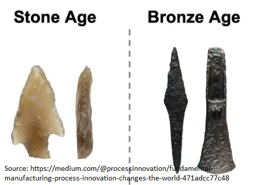

## 摘要

Michael Filler 和 Matthew Realff 提出，所有流程都来自8种不同类型的步骤。通过了解可用的步骤，你可以重新排列它们以实现流程改进。流程改进因其无形性而被低估。

## 工艺与产品

如果让你比较左边的物体和右边的物体，你会提出哪些观点？

你首先会注意到的就是材料。左边是石头，右边是青铜。

你还可以提到石制箭头可能没有青铜那么锋利，耐用性可能较差，而且不对称。

你推断但可能没明确说明的是制造工艺也不同。石头需要切割，青铜则需要冶炼。

聚焦于这个过程的话题， [Michael Filler and Matthew Realff propose that Fundamental Manufacturing Process Innovation (FMPI) is central to progress.](https://medium.com/@processinnovation/fundamental-manufacturing-process-innovation-changes-the-world-471adcc77c48 'FMPI') 让我们来看看他们所说的FMPI是什么意思，为什么它重要，以及几个例子。

作者提出，工艺的改进带来了人类显著的可见进步。然而，人们忽视了无形工艺的变化，过于关注物理产品的变化。在我们上面的箭头示例中，人们关注石头与青铜的结果，而忽视切割与冶炼工艺的改进 [^1]\.这些高影响力的流程创新被称为FMPI。

很难察觉过程的改进，因为它们是无形的，需要你从不同的角度看待情况。你是在抽象细节，试图找到高层次的关系来代表你正在做的事情。这有点像数学中的群论试图抽象化，远离实际应用。

研究FMPI很重要，因为如果你能量化导致人类进步的各种方法，就有一个提升的替代框架。例如，知道装配线通过将流程分解成顺序部分能提高效率，有助于发现还能在哪些地方应用同样的技术。

这对你日常生活的实际影响是回顾你参与的所有重复流程。无论是在工作中还是在爱好中，尝试看看是否有办法重新安排步骤，使你的流程更有效：

- 如果数据从一个软件转移到另一个软件是一个重复的过程， [zapier](https://zapier.com/ 'zapier') 也许能自动化这个
- 如果你总是得教别人怎么做事， [scribe](https://cursive.io/scribe 'scribe') 也许能帮你减轻工作量
- 如果你一直默认做某件事，也许录下自己视频并目视回顾整个过程会有帮助

下面，我们将探讨流程改进的不同步骤，并展示FMPI带来的创新实例。

### FMPI通过八个模式实现

他们将流程定义为一系列相互关联的步骤，将初始状态转变为另一种状态。重新排列这些步骤可以带来流程改进。“步骤”是流程的基石，重新排列步骤可以让你获得更有效的流程。

作者提出了8种流程改进类型（模式）：

并行化（类型1）指的是同一步骤的多个实例同时执行。

如果你有并行化，这意味着你可以拆分步骤（类型2）和合并步骤（类型3）。

如果你把一个步骤拆分，然后把零件送到不同的下游步骤，这就叫做分离（第4类）

你可以将多个步骤合并（类型5），或者将一个步骤分解成多个步骤（类型6）。 [^2]

最后，你可以通过减法（类型7）来去除东西，或者通过加法（类型8）来添加东西

通过使用上述8种类型的各种变体，你可以改善做事的方式。让我们来看一些更具体的例子。

### 集成电路的制造需要并行化、减法和加法

让·霍尔尼和罗伯特·诺伊斯在20世纪50年代末在仙兆半导体的工作表明 [a transistor could be made within silicon, and that circuitry could be built on top of the surface](https://www.computerhistory.org/revolution/digital-logic/12/329 'wafer') [^3]\.能够在一个表面上放置多个晶体管是并行化（类型1）的一个例子

制造过程中还包括许多减法（类型7）和加法（类型8）步骤。下图中来自 [Electronics Tutorial](https://www.electronics-tutorial.net/CMOS-Processing-Technology/planar-process-technology/ 'Elec')你可以看到硅（SiO2）被去除，并添加掺杂材料以创造材料的半导体性能。

### 通过并行化，DNA测序得到了改进

在1970年代，DNA测序过程缓慢且劳动密集，因为人们认为必须对整个DNA链进行顺序处理。Joachim Messing和Peter Seeburg开发了 [shotgun approach](https://en.wikipedia.org/wiki/Joachim_Messing 'DNA')，将DNA分解为随机片段，从而加快测序速度。通过进行多个重叠片段，这允许测序过程中实现并行化（1型），大大提高了速度，降低了成本，并减少了所需的DNA量 [^4]\.

### 3D打印是从减法转向加法的思维方式

大多数传统制造技术都涉及从原材料的原始形态中减去材料（类型7）。例如，如果你想制作一张桌子，你就要砍树，然后锯掉不需要的部分。

正如你所想，这会导致材料浪费。对许多公司来说，优化原材料中能获得的中间产品数量对于盈利至关重要。例如， [fabric optimisation](https://www.resourceefficient.eu/en/technology/design-efficiency-%E2%80%93-zero-waste-patterns 'shirt') 服装行业可能导致 [30% cost savings](https://fashioninsiders.co/toolkit/how-to/cutting-fabric-for-production-versus-sampling/#:~:text=In%20clothing%20manufacturing%20fabric%2C%20costs,%2D30%25%20in%20a%20fabric. 'fabric') [^5]

相比之下， [3D printing](https://3dprintingindustry.com/3d-printing-basics-free-beginners-guide '3D') 是添加式（类型8）。这意味着生产过程中的浪费大大减少，因为你几乎从底层向上打印所需的内容。 [Besides the cost savings, this also allows creation of more complicated structures in fewer steps.](https://bitfab.io/blog/additive-manufacturing/ 'bit')

### 关于FMPI的开放性问题

作者声称上述工艺改进对这些行业的成本降低至关重要，如下所示。

除了为技术扩展开辟路径外，FMPI还具备以下特点：

- S曲线行为，初期采用缓慢，问题解决后广泛采用，随后市场趋于饱和
- 通过在旧有改进基础上叠加益处。例如，由于早期工艺改进，集成电路芯片上增加了更多层数
- 在生产中引入不同的偏差。例如，集成电路生产的优化和高固定成本意味着我们被“锁定”在硅作为基材上，而非探索其他选项

他们以几个未解的问题作结：

- FMPI发生频率如何？影响范围如何？
- 哪些行业从FMPI中受益更多，哪些行业受益较少？
- 他们提出了8种FMPI类型，但会不会还有更多？
- 我们如何预测FMPI？
- 我们如何激励FMPI？

[^1]: 他们提出了三个原因：a）流程具有短暂性质，比产品更短暂\;b）流程改进应用范围广泛，专业从业者容易忽略（不太清楚具体指什么）c）流程被认为是步骤的重新排列，是一项琐碎的活动

[^2]: 在我看来，保理很像分离，我觉得他们想做的区别是分拆会进入不同的下游步骤。保理会进入同一个步骤

[^3]: 我对半导体芯片生产的具体细节不太清楚，参见 [here](https://www.mepits.com/tutorial/384/vlsi/steps-for-ic-manufacturing 'IC') 或 [this youtube video](https://www.youtube.com/watch?v=oBKhN4n-EGI 'yout') 需要更多细节。我认为整个生产过程被称为平面工艺，因为硅晶圆必须是平整的，然后你在硅氧化物层上叠加电路，添加光刻胶层，加上掩膜，曝光紫外线，选择性地去除掩膜，这样可以蚀刻氧化层，然后选择性掺杂曝光的硅片。

[^4]: 你可以在他们的论文中找到更多细节 [here](https://academic.oup.com/nar/article-abstract/9/2/309/2359970 'paper')\.这超出我所知，所以这里不多说细节。一个更容易理解的霰弹枪流程版本是 [here](https://www.yourgenome.org/facts/what-is-shotgun-sequencing 'genome')

[^5]: 这需要用电脑（或者说是人工）生成面料图案，通过排列面料图案，使其“覆盖”面料，几乎没有缝隙。
