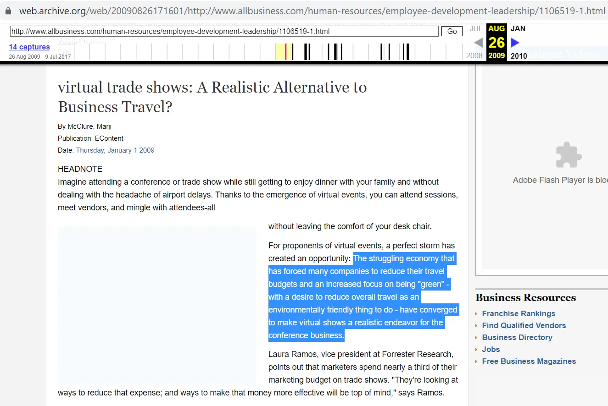
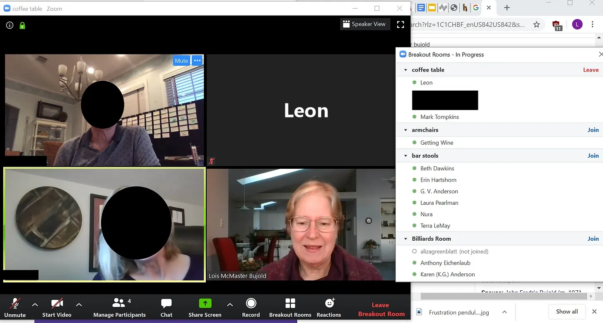
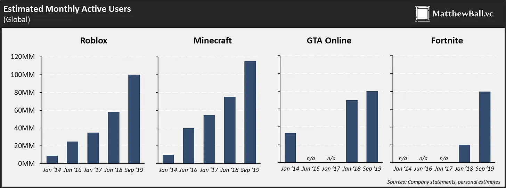
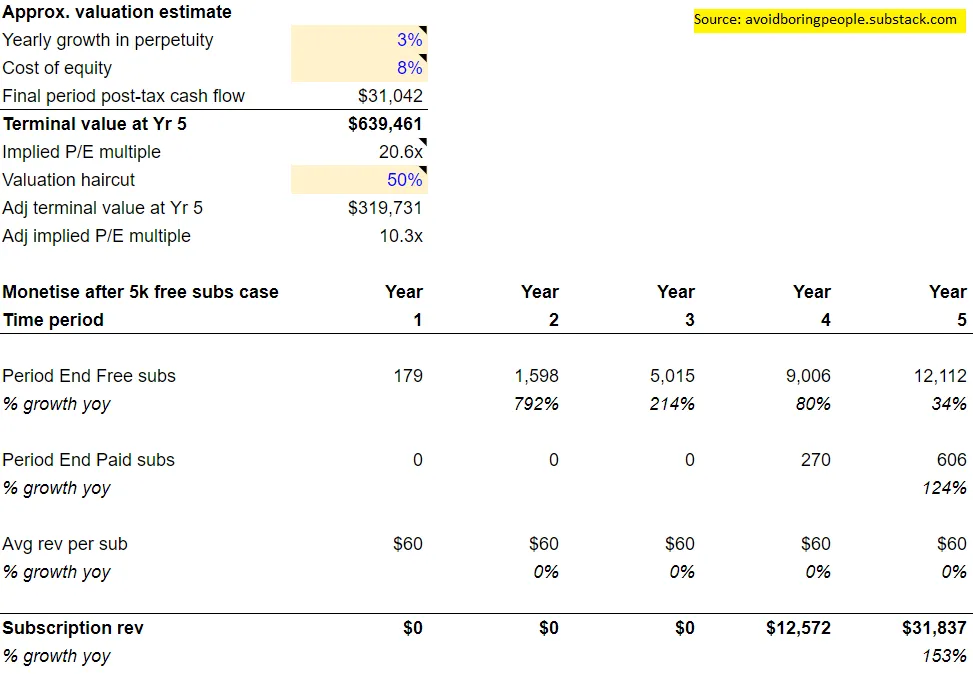

## 要点

1. 虚拟活动和小组应通过增加互动机会来建立社区。如果你没有加入或建立社区，你很可能错过了许多。
2. 新闻通讯因成本、便利性和控制力而成为热门。我分享了一个财务模型，你可以用它来构建企业的经济结构
3. 个人在私人市场投资中变得越来越重要，无论是作为个人资本家还是作为辛迪加的小额支票

---

我以前经常去多伦多工作。

有一家我喜欢去的餐厅，食物、饮料和员工都非常出色 [^1]\.我半希望能成为那里的常客，品尝菜单上的每道菜，和调酒师闲聊鸡尾酒。

不再如此。

我以前主持过鸡尾酒会。

我会邀请客人到我公寓，同时自己端酒。有时我们甚至会上鸡尾酒课。这变成了一种可持续且经常发生的活动，我可以与老朋友叙旧，也能结交新朋友。

不再如此。

我以前每月都会参加集体晚餐。

我们会选曼哈顿的一家餐厅，提前几周预订约会，然后分享美食和故事。集体晚餐很棒\;这意味着有更多美食可以尝试。

[No more no more no more.](https://youtu.be/a8HoZlhenZ4?t=141 'Dr Who')

考虑到所有情况，我今年算是幸运的。我还活着，身体健康，还有工作。没有重大损失。

然而，总有一种不祥的预感 _什么东西_ 已经消失了。

我觉得不只是我一个人。我看到越来越多帖子说有人感到无精打采。那个你从没说过话但总是和你同时出现的健身伙伴，你以为在调情但只是友好的调酒师，或者那个你每季度能聊一次但最多的朋友\;事实证明，他们都在某种程度上促成了你在城市里感受到的社区感。

现在这种状态已经消失了，人们的反应也各不相同。有些人通过虚拟渠道寻找社区，有些人则试图放弃。找到别人从未如此容易，孤独也从未如此容易。

今天我想探讨这个主题， **社区与个体性，** 从几个不同角度来看。我们首先会看看那些为个人寻求者群体做出调整的事件和团体。然后，我们会关注个人在媒体领域的崛起，特别是通讯行业。最后，我们会概述个人在投资领域的情况，特别是个人风险投资家 [^2]\.

### 1\. 虚拟活动和团体应致力于构建社区

虚拟活动和团体并非新鲜事。本文来自 _2009_ 讨论了如何：

> 经济困境迫使许多公司削减差旅预算，以及对“绿色”的关注加剧，使虚拟展会成为会议业务的现实选择。

我们大多数人都熟悉 [MSN messenger, ](https://www.hulldailymail.co.uk/news/hull-east-yorkshire-news/msn-messenger-logged-back-in-3393323 'msn') [online forums](https://www.makeuseof.com/tag/how-we-talk-online-a-history-of-online-forums-from-cavemen-days-to-the-present/ 'forum')以及今天的社交媒体，这些都是人们在线上相互认识的方式。

虽然主要理念本身并不新鲜，但技术进步和社会规范的变化促使这些概念的执行得到了提升。我们先看看赛事是如何适应的，然后再看看群体。

#### 虚拟活动作为互动活动

如果你和我一样，现在的日子大概是居家办公、睡觉，还有找点别的娱乐方式，不用一遍遍追看《吸血鬼猎人巴菲》 [^3]\.

过去几个月我参加了、做志愿者并主持了许多不同的线上活动。大多数都很平淡，只有少数特别。以下是我的亮点：

许多活动组织者似乎认为，你只需把所有活动场次转成Zoom会议即可。发邮件发送日历邀请链接，播放几分钟“你能不能赐我主持权，这样我就能分享屏幕”，然后让演讲者像现场活动一样发言。这方法还行，但我觉得这只是我们2020年应期待的最低限度。

一个简单且高附加价值的活动是 **允许观众进行问答。** 这是一种方便的方式，可以增加活动中的互动，让活动更有效率。这也意味着现场观看和观看回放之间有很大区别。大多数组织者现在已经明白这一点，尽管问答时间仍然较短。我建议在演讲活动中将大约一半的时间用于问答，尤其是当活动目的是与观众建立关系时 [^4]\.

另一个增值是 **包含所呈现的材料。** 你可以在会议前或后做，取决于你是否想要惊喜元素。我参加过的很多活动都只是给我视频的回放链接。这很好，我们可以做得更好。如果我以后想引用你的专业知识，链接静态内容比动态内容更方便，因为解析视频内容需要更多时间。既然这样做基本免费且简单，发送幻灯片也能节省观众时间。

我看到的其他想法更多是情境适用的。

如果你是小团体，想促进一对一的交流，我发现 [Icebreaker](https://icebreaker.video/ 'Icebreaker') 非常适合这种使用场景。破冰者会把所有人聚集在一个主房间，然后随机把人分成1x1聊天室。1x1聊天室还有引导提示，以防有人不知道该聊什么。5分钟后，聊天会自动结束，所有人都会被送回主房间。你可以无限次重复这个过程。

如果你有一大群人，但仍然希望大家能自己互动，你可能需要遵循 [2020 Nebula Awards](https://events.sfwa.org/ 'SFWA') 确实如此。星云是 [one of the most prestigious Sci Fi awards,](https://en.wikipedia.org/wiki/Nebula_Award 'Nebula') 今年他们的整个会议都在线上进行。他们从一个链接出发，举办了大量不同大小的Zoom分组讨论室。然后他们赋予每位参与者共同主持权，方便参与者在分组讨论室中自由活动，加入他们觉得有趣的内容。除了主演讲室外，他们还有一些随机房间，比如酒吧里有调酒师讲授食谱、写作室和小狗直播。下面你可以看到我在分组讨论室里，和一位著名科幻作家一起 [Lois Bujold](https://en.wikipedia.org/wiki/Lois_McMaster_Bujold 'Lois') （为了隐私我已经把其他人都遮断了）。

一个让我感觉复杂的实验性想法是 [Online Town](https://theonline.town/ 'Online')，其中 [Long Now Foundation](https://longnow.org/seminars/ 'Long') 在他们的一次研讨会后尝试过。在《在线城镇》中，你会在屏幕上以虚拟形象出现，你可以像在现实中一样在房间里走动。你可以听到的对话基于距离，进一步模拟现实。我觉得这个想法很有趣，而且需要更高的用户教育才能带来更独特的体验。

到目前为止，我们已经报道了“工作”相关的活动，但娱乐人员也在虚拟环境中有所适应。

举个例子，我看了一本 [Ellie Goulding live virtual concert recently.](https://inews.co.uk/culture/music/ellie-goulding-live-review-victoria-and-albert-museum-london-brightest-blue-613122 'Ellie') 她把它拿到了 [Victoria and Albert Museum](https://www.vam.ac.uk/ 'VAM') 在伦敦，举办了一个精彩的展览，在博物馆里巡回演出。制作质量非常棒，社交媒体上反响也很好。

另一个例子是 [Tomorrowland](https://www.tomorrowland.com/global/ 'TMR')，顶级DJ节。他们还提升了制作质量， [creating visual experiences](https://www.youtube.com/watch?v=BinQqIX3aig 'alan') 观众可以在听DJ现场演奏时享受演出。我没去，但有个去过的人说她很喜欢。

不过，我认为我们可以做得更好。艾莉的演唱会很棒，明日世界看起来也很有趣，但两者都缺乏与粉丝的互动 [^5]\.如果你举办的是现场活动，应该充分利用它。数字体验简化了沟通，我推荐这样做 **娱乐活动应以互动为目标，就像上述“专业”活动一样。** 如果你的直播活动唯一的优势就是高制作水准，那我还不如自己找时间看回放。

KT·坦斯托尔就是这一理念的典范 [her live session with the Royal Albert Hall](https://www.youtube.com/watch?v=T_FHtCvpTOI 'KT')\.你可以看到相比上面两个例子制作质量较低，但真正让我有区别的是直播聊天。它让粉丝们既能与彼此互动，也能与她互动，打造出特别的亲密体验。直播已经\.\.\.\.\.\.成为主流。

如果你认为这在大规模上无法持续，那就看看 [what KPop groups such as Super Junior are doing.](https://www.youtube.com/watch?v=3H_MiOghwJw&fbclid=IwAR3nFY0s2ccu6tXA4dig9_e37jvNC3QGxCNOL9WE9E-DyJeRMrWtoMAQUIo 'Kpop') （感谢Gabriel Tan）他们重新构想了演唱会体验，特别规划了演唱会中的粉丝互动。现在让粉丝感到特别容易多了，艺人应该从中吸取教训。我越来越觉得亚洲公司在消费者体验创新方面走在前列，这感觉像是西方公司的又一个案例研究 [^6]\.

这对线下活动市场意味着什么？ [Rafat Ali of Skift believes that this is a watershed moment for the industry](https://skift.com/2020/08/26/the-event-industry-is-being-confronted-by-its-napster-moment/ 'Skift')就像Napster对音乐的介绍一样。他认为10\%的商务旅行可能会永久退出市场，并且估计虚拟活动的收入大约只有线下活动的四分之一，因此市场必须适应新的经济形态。

我对线下活动的悲观态度不那么强烈，觉得疫情过后线下活动会重新兴起。大多数商务会议通常不太注重效率，更多是建立人脉和带薪假期，远离老板。不过，我看到活动可能会采用混合模式，这甚至可能对利润增加。把线下体验包装成奢侈品，把线上体验当作预算替代品。这意味着知道如何举办好的虚拟活动对未来依然很重要。

总之，虚拟活动应以更多互动为目标，以建立社区。现在实现这一点更加容易，也将带来更狂热的粉丝群。

#### 虚拟社区作为策划俱乐部

社区建设的重要性也日益提升，无论是对个人还是公司。对个人来说，网络始终相关，虚拟小组是其延伸。对公司而言，活跃的社区意味着忠诚客户，降低流失率和客户获取成本（CAC）\;公司版本的 [1,000 true fans for creators.](https://kk.org/thetechnium/1000-true-fans/ '1000')

在个人层面，社区的问题是 **这是选择性的问题。** 太挑剔，随机遭遇就不够多。不挑剔，你会觉得一切都无关紧要。成为社区成员是一种 [signalling,](<https://en.wikipedia.org/wiki/Signalling_(economics)> 'signal') 信号的强弱取决于你的俱乐部有多酷。

比如，你的MSN联系人对某个群体的选择过于严格，而Facebook的群组则不够挑剔。商学院的重点是选择性所暗示的品牌价值。Reddit的轻度管理导致一定程度的选择性。平均来说，你从学校网络中获得的专业价值比你亲密的朋友周日早午餐小组更多，或者从Reddit帖子中获得更多信息，而你的Reddit帖子则比你的更重要 [180,000 member Facebook group about genuinely stoked goats](https://www.facebook.com/genuinelystokedgoats/ 'goat') 你甚至不记得自己是怎么加入的 [^7]\.

我们看到策划社区越来越受欢迎，作为解决这一问题的尝试。这类社区的目标是找到平衡价值与选择性的最佳平衡点。它们通常会有某种形式的入会流程来筛选成员。当它们运作时，形成一个反馈循环，优秀成员会激发社区更多的兴趣，进而带来更多优质成员。尤其是社区规模较小时，每个人都有动力去努力工作，这样你才能为自己的成员感到自豪。

此类社区的一些例子包括：

- [Renaissance Collective](https://www.renaissancecollective.co/for-smart-generalists 'Renco') 这是一个由“聪明通才”运营者组成的社区
- [On Deck](https://www.beondeck.com/ 'On Deck') 那就是“顶尖人才去探索下一步的地方”
- [The Progress Studies slack group](https://patrickcollison.com/progress 'Progress') 对于对“进步科学”感兴趣的人
- [Soho House](https://www.sohohouse.com/about 'Soho') 其成员是“志同道合、拥有创造性灵魂的人”
- [The Interintellect](https://www.interintellect.com/ 'inter') 它正在“构建一种成为21世纪多产且成功的知识分子的新途径”

在公司层面， **建立社区就像拥有你的受众，** 我们稍后在讨论通讯和媒体时会再回来讨论这个问题。通常，获取新客户的成本比卖给现有客户要高，因此建立更忠实的粉丝群直接影响业务增长。 [Gavin Baker elaborates on loyalty here](https://medium.com/@gavin_baker/scale-and-loyalty-are-more-important-online-than-offline-which-drives-much-of-the-winner-take-992345be93a9 'Loyalty')主要结论是，通过客户忠诚度避免客户获取成本，使企业拥有竞争优势。

一个非常了解这一点的行业是游戏市场。看看Minecraft、Fortnite或Roblox背后的公司如何锁定目标客户。 [Minecraft has 126mm monthly active users](https://www.theverge.com/2020/5/18/21262045/minecraft-sales-monthly-players-statistics-youtube 'Minecraft')\. [Fortnite is still breaking attendance records for its in game concerts](https://www.gamesradar.com/how-many-people-play-fortnite/ 'Fortnite')\. [Roblox makes >$1bn in rev and is played by half of all children in the US](https://www.thegamer.com/roblox-played-by-most-american-kids/ 'Roblox')\.在许多游戏中，人们去那里是因为他们的朋友在那里。他们是2020年新的MSN [^8]\.

除了价值和选择性，我对虚拟小组最后考虑的因素是 **增长潜力。** 增长通常是以选择性为代价\;随着群体的增长，下一个成员带来的价值平均降低。

有办法绕过这个问题，比如定期批量招生。这是大学、创业加速器或在线课程社区采用的模式。另一种选择是设定固定名额，只有在有人离开后才录取新成员。对于那些旨在保持常青的团体，比如RenCo或The Interintellect，看看他们如何管理增长与其他竞争因素的关系会很有趣。

总之，团体一直以来都很强大，尽管组织方式会随着时代变化。如果你还没有在建设或加入社区，值得探索现有的资源。如果你有兴趣建立社区但不知道从哪里开始， [there's also a community for that.](https://www.community.club/ 'club')

另外，为了说到实，我正在考虑为“避免无聊的人”建立一个社区——我下个月会发问卷，但在此之前，如果你感兴趣，请回复这封邮件告诉我。

### 2\. 通讯可以是可持续且有利可图的小企业，但难以扩展

在内容世界里，个人选择机会自己影响和赚钱。独立后，他们放弃了平台的稳定和支持，换取更高的回报和责任。我想重点谈谈当今个人运营的电子邮件通讯行业，虽然这一趋势并非独有——YouTube、Twitch、抖音、腾讯视频、OnlyFans都是个人取得成功的例子，如下： [unbundling the value of their personal content.](https://hbr.org/2014/06/how-to-succeed-in-business-by-bundling-and-unbundling 'bundle')

让我们来看：

- 是什么推动了新闻通讯制作的趋势
- 大规模发布通讯的商业模式和经济可能是什么
- 媒体的未来可能是什么样子

#### 以成本、便利性和控制为驱动的通讯

李晋写过激情经济 [here](https://li-jin.co/2019/10/22/the-passion-economy-and-the-future-of-work/ 'Li Jin')，提出：

> 过去，最大的在线劳动力市场压制了工人的个体性，而新平台则允许任何人将独特技能变现。零工工作不会消失——但现在有更多方式可以利用创造力。用户现在可以大规模积累受众，将热情转化为生计，无论是玩电子游戏还是制作视频内容。这对创业以及我们未来所理解的“工作”有着巨大影响。

所有商业模式都可以简化为：

1. 寻找人
2. 卖东西给他们 [^9]

当单一企业在这些方面成本高昂时，公司就会进来填补空缺。你可以称这些为聚合商、平台、中间人、捆绑商、分销商，随便什么。他们所做的是认识到需要有人将固定成本分摊到庞大的客户群中。

**互联网大幅降低了这两项工作的成本，** 而且看起来还会继续这样做。有人有可能找到客户并完成订单，同时保持低固定成本基础。通过自动降低进入门槛，意味着能吸引更多新手。对所有人来说，杠杆力也会增加。

以通讯为例，现在获得读者比20年前容易得多。我会收到来自来自我意想不到地点和生活境地的随机读者邮件（请继续发来！），更别说开始针对我的营销目标了。当我想发送通讯时，我支付的费用也远低于所有内容都是印刷版。

除了降低成本外，还有一个 **便利性的提升** 也促进了通讯的流行。我可能记错了，但我觉得新闻通讯的热潮是在之后开始回升的 [substack announced their funding round.](https://techcrunch.com/2019/07/16/substack-series-a/ 'substack') Substack所做的是让入门变得更简单，正如我在 [older post](/writing/substack 'substack')\.通过减少对任何事情的担忧 [cname record](https://support.dnsimple.com/articles/differences-a-cname-records/ 'cname') Substack 通过能够立即开始写作，吸引了许多人尝试。

通讯的另一个重要功能是 **增强对受众的控制**\; [a direct relationship with readers.](https://www.protocol.com/substack-ceo-newsletter-obsession 'substack') 目前，电子邮件仍处于一个“甜蜜”阶段，人们会打开并查看收到的内容。相比之下，邮寄时我一半时间收到卖我租公寓的广告，或者任何基于信息流的内容平台，一半时间我看到的是所谓受欢迎的内容，但我并不关心。拥有一个受众给你一个属于自己的社区去关心。

关于上述的一个细微差别。我说过获取读者的成本低，发送通讯的便利性也高。然而，获取读者并不方便。建立读者基础需要付出努力， [unless you're Bella Thorne and trying to scam sex workers.](https://reddit.com/r/ChoosingBeggars/comments/ikotvd/can_celebs_be_choosing_beggars_edited_for_sub/ 'Bella') 有些创作者花了一半以上的时间在推广自己的作品，而不是实际创作内容。这种增加的摩擦——你要找读者，读者又要给你邮箱——反而加深了关系的感觉。我报名参加了这个，所以它一定不错，我应该去读。既然你已经预先投入了客户获取成本（和努力），以后向那个群体销售会容易得多。

#### 大规模的单一通讯似乎可能达到30万美元规模

我们把内容世界分成三种主要类型，因为我记不清同时包含的三样东西：

1. 为了娱乐
2. 教育
3. 激发情感

如果你是通讯作者，你会追求三者中独特的组合。你最终得到的地点会影响你的定价。 [Byrne Hobart has written about newsletter pricing before](https://diff.substack.com/p/whats-next-for-the-diff 'Diff')，归结为： **这会不会在公司卡上花费？**

如果通讯能教我工作做得更好，赚更多钱 [^10]你可以调高价格。如果更多是为了个人娱乐或情感，就更难做到。我可以试试，但读完我的文字后，几乎不可能让你有同样的感觉 [after watching Arrival.](https://www.reddit.com/r/movies/comments/8z720w/movies_that_destroy_you_emotionally/ 'Arrival')

一份通讯的合理上限是多少？ [This post by Andreas Stegmann](https://medium.com/hyperlinked/ben-thompsons-stratechery-should-be-crossing-3-million-in-profits-this-year-c146433f0458 'andreas') 猜测本·汤普森 [Stratechery](https://stratechery.com/ 'Strat') 年收入大约300万美元。由于缺乏更好的信息，我就用这个作为顶级通讯的上限 [^11]\.

听起来很多，但请再想想。成为世界顶尖之一只能让你身价达到百万美元左右。 [Compare this to being the best in the world at a sport](https://www.forbes.com/athletes/#2c6842d155ae 'Forbes')顶尖运动员每年赚取约1亿美元。或者成为世界上最顶尖的企业管理者，你的收入以数十亿美元计。如果你想要最大的收益，写通讯不是正确的选择。

不过，如果你愿意经营小型企业，写通讯可能是个可靠的选择。 **我做了一个五年期的通讯财务模型 [here](https://docs.google.com/spreadsheets/d/1QS2lKHhDDCe5vwHiJPd7QpDjQRxJ3mHl4VgCq6e8Q6M/edit?usp=sharing 'model')** 你可以尝试看看经济学可能是什么样子。如果有，请复印一份，不要试图修改原文。感谢 [Jacob Donnelly](https://www.amediaoperator.com/ 'Jacob') 以及 [Josh Constine](https://constine.substack.com/ 'Josh') 为模型提供意见。

模型对假设非常敏感，这些假设在表格中列出，我将在脚注中简要介绍 [^12]\.目前假设订阅加广告的商业模式，但你可以改变。这意味着五年内达到30万美元估值虽然困难但合理，这对新闻通讯创作者来说可能是目标。

当然，也会有优秀的创作者年收入\>10万美元，但那需要更激进的模型假设，你可以相应调整。每年10万美元 [1000 true fans](https://kk.org/thetechnium/1000-true-fans/ '1000') 每年支付100美元，且免费转为付费转换率为5\-10\%，意味着你需要大约1万到2万个免费订阅者。可行但困难。

#### 通讯可能没有太多退出选择

最近Reddit上讨论过的一个帖子 [how huge a star Michael Jackson was, and how we don't see celebrities like that anymore](https://www.reddit.com/r/todayilearned/comments/ikuuhu/til_michael_jacksons_super_bowl_half_time_show/ 'MJ')\.互联网成本的紧缩使内容世界变得分散，催生了难以想象的新创作者。集中度降低，多元化更多。接下来会怎样？

一个简单的预测是支持这些内容的行业。关于新闻通讯，可以关注 [paid courses](https://www.journalism.cuny.edu/centers/tow-knight-center-entrepreneurial-journalism/entrepreneurial-journalism-creators-program/ 'paid')\, [support groups](https://www.indiehackers.com/group/newsletter-crew 'support')以及更多关于如何入门的建议。

另一个简单的预测是个别创作者会捆绑销售。对于新闻通讯， [Nathan Baschez and Dan Shipper put together the Everything Substack bundle](https://everything.substack.com/ 'Everything')，经济上也让其他人效仿。你可能不仅捆绑通讯，还包括播客或咨询等其他媒体。

我也相信许多创作者会建立社区，正如我在第一节提到的。这对新闻通讯来说会更难，因为邮件流向像Slack这样的服务的流失率非常高。他们还会面临增长与质量的平衡，必须明确优先事项。

我不确定通讯的退出机会。鉴于规模，大多数甚至全部公开对他们来说都难以实现。这意味着收购和更多的整合是正确的选择。然而，留住作者很难，而且大部分价值可能属于作者本人。考虑到风险，交易倍数很可能偏低 [^13]\.如果你寻求选择权，大额退出的可能性比起因写作而产生的咨询或其他机会更不容易获得收益。

### 3\. 个人投资的崛起

[Nikhil Basu Trivedi did a post about solo capitalists recently.](https://nbt.substack.com/p/the-rise-of-the-solo-capitalists 'NBT') 给定 [SEC news about relaxing accredited investor rules](https://www.sec.gov/news/press-release/2020-191 'SEC')我想简要介绍一下个人在投资中日益重要的因素。

尼基尔指出：

> 天使投资人长期以来一直是募资生态系统中非常重要的成员。但在过去几年里，越来越多的人不仅在公司早期阶段投资，也在A轮及以后阶段投资。这些人不仅投资自己的资金，还在筹集专门的资金，不仅仅是与风险投资公司并肩参与，且经常与风险投资公司竞争，创始人们选择与风险投资合作而非风险投资

由于个人能更快做出决策，且可能比风险投资公司更灵活、更专注，因此有机会向创始人提供更便宜或更方便的资金。鉴于现在资本的廉价，以及显然除了我之外，其他人都在赚取巨额资金，看到更多人希望在这方面拥有更多杠杆也就不足为奇了。

风险投资公司也是一个整体。如果你是创始人，选择与某个知名人士合作，你可能对直接从那个人那里获得资金还是从风险投资公司获得资金无所谓 [^14]\.某个时候，这个人可能会意识到，如果将自己的价值从公司中剥离出来，作为独立产品提供，他们可以赚得更多。启动 [rolling funds by angellist](https://angel.co/blog/rolling-venture-fund-launch 'rolling') 这让他们更容易独立发展。

熊市的说法是，我们以前在公开市场中见过类似情况，许多著名投资者尝试单独打击都失败了。 [Bill Gross leaving PIMCO for Janus](https://en.wikipedia.org/wiki/Bill_H._Gross 'Janus') 是一个例子，而且可能有同样多的例子 [Tiger Cubs](https://en.wikipedia.org/wiki/Tiger_Management 'Tiger') 他们已经转型为家族办公室，像虎熊队一样试图筹集新基金。和所有事情一样，杠杆是双向的，你会获得高风险，但期望回报也较高。

我也想知道个人资本家模式能否扩大规模。这些是私募市场的投资者，通常是早期的A轮融资。假设一个独立资本家非常成功，获得了现在10倍的资本。他们会怎么处理这些？他们会转向后期公司吗？如果不，考虑到只有一家公司管理一切，他们能向多少家公司投入资金？

随着从富人投资转向试图通过投资致富的人，新的SEC规则应允许大量小额支票天使投资人参与。 [Charles Rubenfeld pointed out that the Series 65 qualifies you to angel invest](https://twitter.com/Crubenfeld/status/1298666723806257161?s=20 'angel')即使没有赞助的金融机构，也可以被接受。鉴于天使投资是半个身份信号，规则放宽可能导致许多天使投资联合体的兴起，甚至为创始人带来更低的资本。

我支持这种放宽，因为我认为人们可以自由地以任何方式输钱。投资早期公司既有社会资本，也有资金资本的好处。更多的接触可能是件好事。只要每个投资者都了解风险，并且披露足够的信息，我支持让人们有更多投资选择。

## 其他

1. [Math and physics guide to animation](http://acko.net/blog/animate-your-way-to-glory/ 'Acko')是我今年最棒的读物之一
2. [Reining in the Banking as a Service Euphoria](https://medium.com/@nikilkonduru/reining-in-the-baas-euphoria-1cc90469bcc4 'Baas')
3. [Revenue breakdown of big tech companies](https://www.visualcapitalist.com/how-big-tech-makes-their-billions-2020/ 'Tech')\.感谢景勇介绍我进入视觉资本家网站
4. ["It’s impossible to delete and control all of \[your data,\] logs are a liability, and they’re growing exponentially.](https://vicki.substack.com/p/the-data-lake-overfloweth 'vicki')
5. [Introduction to knot theory using rational tangles](https://www.mathteacherscircle.org/assets/session-materials/JTantonRationalTangles.pdf 'Knot')\.数学要求不难，但理解概念需要努力。

[^1]: [Aloette](https://aloetterestaurant.com/ 'Aloette') 给好奇的人。

[^2]: 说清楚，我并不是在为新冠辩护 _原因_ 这些趋势。它可能加速了部分人的发展，而对另一些人则没有影响。我更想从不同的解读角度探讨社区的总体主题

[^3]: 第一次看这部剧时，我很惊讶它有这么多精彩的剧集依然经得起时间考验。而且，斯派克和巴菲的关系无论如何都非常诡异。

[^4]: 有问答环节意味着你需要更有效地进行主持，但大多数时候这并不是什么大问题。

[^5]: 这也是我没能买《明日世界》票的主要原因，因为我个人没看到它的价值。

[^6]: 例如，给直播主打赏或订阅一直是中国主播的重要市场，西方主播则较晚兴起

[^7]: 注意，我并不是说你的私人友谊没有价值\;这更多是从“职业”角度来说。

[^8]: 我还没读过，但有一篇Matthew Ball关于游戏的详细文章 [here](https://www.matthewball.vc/all/digitalthemeparkplatforms 'ball') 还有一位乔恩·莱的 [here](https://a16z.com/2020/09/01/tabletop-games-go-digital/ 'Jon')

[^9]: 理想情况下是盈利，不过现在卖东西卖得比它值低似乎很流行。我想你只能靠成交量来弥补\.\.\.\.\.\.

[^10]: 我曾考虑把“赚”放为第四个因素，但我会把它归入更大的教育类别，以保持整体的三位一体。

[^11]: 谢谢 [Lenny Rachitsky](https://www.lennyrachitsky.com/ 'Lenny') 为了文章。你可以说，很多企业就像通讯一样，赚的钱远远超过这个数字。比如，如果你把股票研究看作昂贵的新闻通讯，市场规模很大。为了简化，我大部分分析都选择了更偏向个人的新闻通讯。

[^12]: 模型最大的问题是它只有5年，之后假设了期末价值。如果你做过财务建模，你会知道这是个坏主意，因为第5年和期末增长率会差别很大。下一个最大问题是期末价值假设。我假设合理的期末增长率和股权成本所得到的隐含估值倍数太高，考虑到实际收购倍数是3\-5倍EBITDA。模型有两种可切换的情况，一种假设你立即变现，但增长受影响，另一种是你在获得市场支持后才变现。欢迎再次核对模型并指出任何错误

[^13]: 感谢Nathan在一篇文章中提到了这个 [Highlighter call](https://blog.highlighter.com/ 'highlighter')

[^14]: 这是一个很大的概括，当然风险投资公司相比个人还能提供许多其他优势。
