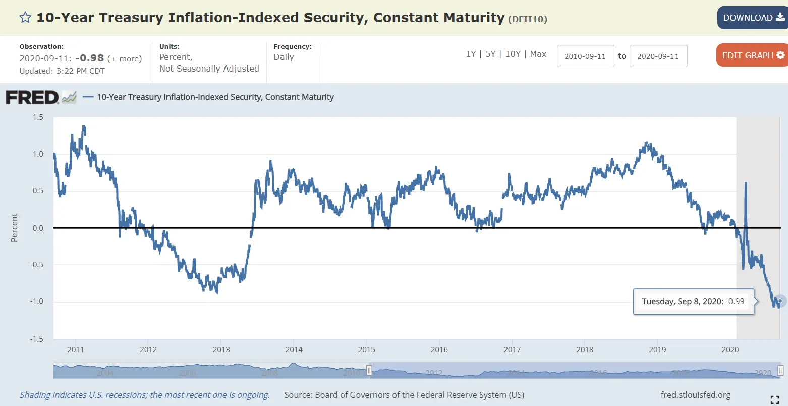
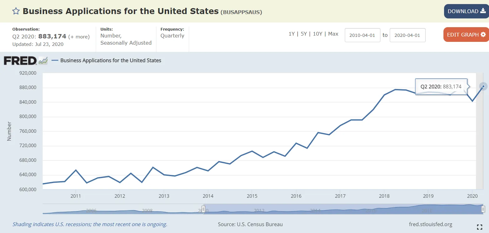

## 摘要

资本成本的降低意味着财富从储蓄者转移到借款人，因此人们今天承担比以往更多的风险是最优选择。

## 低资本成本的影响

我想看看 **资本成本** 今天。我一直在想，我们当前低成本环境会带来什么影响，另外 [Michael Pettis](https://carnegieendowment.org/chinafinancialmarkets/82610 'Pettis') 我最近写了一篇关于利率与增长的好文章，所以我们来仔细看看这个话题。我也不会有所有答案，所以非常欢迎评论，无论是直接回复还是在帖子的评论框里。

对于那些不知道资本成本是什么的人，不用担心。在提出以下观点之前，我会简要解释这个概念：

1. 现在的资本成本比历史上要低
2. 因此，储蓄者向借款人转移财富
3. 这也意味着应该承担更多风险

### 资本成本是融资你想法的综合成本

想象一下你有一个想法。这可能是新的商业想法、扩展计划，甚至是你正在考虑的投资。重要的是，这需要资金（资本），并且希望能让你获得比投入更多的回报。

你如何获得这笔钱？资本主要有两种来源：债务和股权 [^1]\.

当你用现金换取债务时，你同意按时间偿还部分债务。我们可以根据最终的百分比回报率计算出这笔费用。例如，如果你在100美元上支付10美元，那就是10\%的成本 [^2]\.

当你用股权换取现金时，你不必偿还现金，但你放弃了所有权。你放弃的金额取决于投资者预期的回报。我们可以计算出隐含成本。例如，如果投资者投入资金，期望获得20\%的回报，那就是20\%的成本 [^3]\.

这两种主要资本来源的混合成本结合起来，给出了你的资本成本。这就是你尝试这个想法时平均会产生的成本。例如，如果你的资本成本是5\%，你每年都在“损失”5\%。

这也意味着你希望赚得比资本成本更高。如果你每年亏损5\%，你需要赚超过5\%，才能获得正回报。如果你的企业每年只赚1\%，而成本是5\%，你会随着时间亏损。

这只是一个简化的解释，但应该能为文章的后续内容提供足够的直觉。如果你有兴趣了解更多，估值之王，纽约大学达莫达兰教授， [has a paper explaining this in detail](http://people.stern.nyu.edu/adamodar/pdfiles/papers/costofcapital.pdf 'Cost')其中包括像下面这样严格扩展我们上述框架的图形。

换句话说：我们想赚钱。我们需要钱。这笔钱是有代价的，那就是资本的成本。

### 1\. 资本成本现在降低了

首先，让我们确立现在获得资金的成本比以前低。为此，我们将看一些时间变化的图表。

这是十年期TIPS收益率的过去10年， [pulled from the Fed](https://fred.stlouisfed.org/series/DFII10 'Fed') [^4]\.对于不熟悉TIPS的人来说，它们是 [inflation linked, "safe" type of debt](https://www.investopedia.com/terms/t/tips.asp 'tips')\.正如我们所见，收益率目前处于负值状态，且随着时间呈下降趋势。

这是过去10年30年固定利率抵押贷款的成本， [also pulled from the Fed](https://fred.stlouisfed.org/graph/?g=NUh 'Fed') [^5]\.我们也可以看到，买房的借贷成本也在下降。

如果你觉得我只看10年期是在挑选，那我们就往过去54年里看看10年期国债利率。你可以看到之前利率的飙升 [Volcker killed inflation](https://en.wikipedia.org/wiki/Paul_Volcker 'Volcker')，并且此后持续下跌趋势。

到现在，我认为我们已经展示了 **债务** 已经下降了。股权成本呢？

我在找到平均股本成本时遇到了更多困难，但我们知道股本成本与债务成本相关，加上股权风险带来的额外回报 [^6]\.我们已经证明债务成本下降了，如果能找到额外回报（股权风险溢价）的趋势，就能更好地理解趋势。

[Damodaran has a table in pg 142 of this report](https://poseidon01.ssrn.com/delivery.php?ID=425124115112025116020118020011112064052051040011030092064114074119081098025103109118097012061055040113125093125106096026106103051022049037045010068078022028103006044010102031118000094024104112069074071073106074113116005029084117013074087122064008&EXT=pdf 'Damodaran') 显示风险溢价随时间略有上升。想要更直观的版本， [KPMG has the numbers below.](https://assets.kpmg/content/dam/kpmg/nl/pdf/2020/services/equitiy-market-risk-premium-research-summary-march-2020.pdf 'KPMG') 它们不会完全对齐，但相对稳定。

近几个月略有上升，但整体股权风险溢价的上涨幅度并未超过债务成本的下降。这意味着从净值来看，成本 **公平** 要么持平，要么有所下滑。

从上述情况来看，资本成本已经下降。这意味着现在通过债务或股权筹集资金比以前更便宜。

### 2\. 资本成本降低意味着财富从储户向借款人转移

让我们引入一个复杂情况。上面我们说过企业应当目标增长超过其成本。人们将这一概念推广到国家，声称当GDP增长率（回报率）高于利率（资本成本）时，债务是可持续的。为此，他们常引用著名经济学家托马斯·皮凯蒂的著作， [Capital in the Twenty-First Century](https://en.wikipedia.org/wiki/Capital_in_the_Twenty-First_Century 'Capital')\.

[Michael Pettis argues here](https://carnegieendowment.org/chinafinancialmarkets/82610 'int') 将框架扩展到各国是没有意义的。相反地：

> 在宏观经济层面，利率与GDP的关系更多反映的是经济体内的收入转移和收入分配，而非该经济体债务的整体可持续性。在这方面，各国的条件与个人或企业的运作方式大不相同

我们来拆解一下他的意思，因为这并不显而易见。佩蒂斯的意思是，成本低于增长的一个含义是 **经济将资金从提供资本的人转移到借款者身上。**

如果你有钱并且放贷出去，你是在以市场成本放出。如果你把钱投资到整体经济，你得到了市场增长。如果成本低于平均增长率（收益率），你得到的资产收益率会低于之前的高收益资产。反过来，如果成本高于增长率，则相反。

这对未来增长和财富不平等有不同的影响。富人储蓄更多，因此成本降低导致财富从富人转移到穷人。这被资产投机增加抵消，财富向相反方向转移。这种净效应取决于双方的相对规模。佩蒂斯没有提出这一点，但 **我相信投机部分已经远远抵消了前者的影响，而这正是财富不平等加剧的原因。**

### 3\. 资本成本降低意味着风险承担增加

这里我开始更多推测。资本成本降低与增长成本也意味着 **每个人都应该提高风险承受能力。** 如果做事的机会成本较低，最佳风险也越高。例如，如果以前每年为企业借钱需要5\%，现在只需1\%，你应该多借钱，开更多企业。

实际数据噪声更大。该 [Fed data on business applications](https://fred.stlouisfed.org/series/BUSAPPSAUS 'Biz') 这似乎证实了我的假设 [^7]但我也读过 [that the quality of businesses has declined](https://www.census.gov/newsroom/blogs/research-matters/2018/02/bfs.html 'decline')\.基于 [inflation of valuations for private companies trying to raise money](https://news.crunchbase.com/news/its-not-just-you-seed-rounds-are-actually-getting-bigger/ 'inflatoin')我仍然认为更多人以更低成本承担风险，但如果你不同意，请告诉我。

更高的风险容忍度也意味着 **更多关于可投资资产的投机。** 我认为这也是为什么我们持续看到公开股价上涨的原因之一，因为人们寻求回报并推动股市进一步上涨。

由于所有资产相互关联，这一趋势不仅限于公开股权。随着成本下降，所有资产类别的价格都应上涨，回报率下降。我们应当看到更多天使基金、风险投资或私募股权收购。当前新闻似乎证实了这一点。

听起来很棒，毕竟大家都喜欢东西往上走。我能想到至少两个前提，还在想更多。

首先，更高的风险承受能力伴随着以下权衡 **又是欺诈。** 如果每个人都能筹到钱，诈骗的可能性应该会提高。当人们看到某件事的坏处低而收益高时，最优的选择就是多做一些。会有更多人试图利用这种情况，欺骗他人。我相信这就是为什么我们看到更多像勒肯咖啡、尼古拉，或者柯达这个月在搞什么鬼东西这样的欺诈企业。

第二，我听说资本成本降低是 **分布不均。** 据说小企业贷款仍然很贵。我不是专家，我查阅的初步数据 [here](https://cdcloans.com/lender/504-rate-history/ 'rate') 但似乎情况并非如此，但我能理解这是一个合理的现象。例如，我一直对个人贷款利率仍然处于正值感到恼火，而整体平均利率则为负 [^8]\.

总体结论是，每个人都应该 **提高风险承受能力，参与更具风险的活动**，因为基础成本下降了。这是否意味着对公开股、另类资产类别的更多投资，还是你朋友的新业务，由你自己决定。一如既往，这不是投资建议，我很想听听对方的反驳意见。

[^1]: 债务、股权和混合证券如可转换债券（部分债务，部分股权）有许多变体。为了方便讨论，我们只谈这两种

[^2]: 我不打算讨论收益率和利率的比较，为了简化情况，请阅读 [here](https://www.fidelity.com/learning-center/investment-products/fixed-income-bonds/bond-prices-rates-yields 'fidelity') 作为了解的开始。

[^3]: 至于他们是否能获得回报，那是另一回事。记住，我们这里讨论的是预期，而不是实际回报。为了让这个例子更具体，想象一下如果投资者面临更高的股权成本回报门槛，比如100\%。如果他们仍然想投资你，他们要么必须要求降低估值，以便获得更高的退出倍数与入场倍数。要么他们要求以相同金额的更多持股。

[^4]: 美国联邦储备系统理事会，10年期国债通胀指数证券，固定期限\\\[DFII10\\\]，检索自圣路易斯联邦储备银行FRED\; https://fred.stlouisfed.org/series/DFII10，2020年9月14日。

[^5]: 房地美，美国30年期固定利率抵押贷款平均值 \\\[MORTGAGE30US\\\]，检索自圣路易斯联邦储备银行FRED\; https://fred.stlouisfed.org/series/MORTGAGE30US，2020年9月14日。

[^6]: 更准确地说， [the risk free rate plus beta times the equity risk premium](http://pages.stern.nyu.edu/~igiddy/articles/wacc_tutorial.pdf 'ERP')

[^7]: 美国人口普查局，美国商业申请 \\\[BUSAPPSAUS\\\]，检索自圣路易斯联邦储备银行FRED\; https://fred.stlouisfed.org/series/BUSAPPSAUS，2020年9月14日。

[^8]: 我理解为什么会这样，你必须根据个人风险做出调整，诸如此类。我还是很烦，因为我想要免费的钱。
