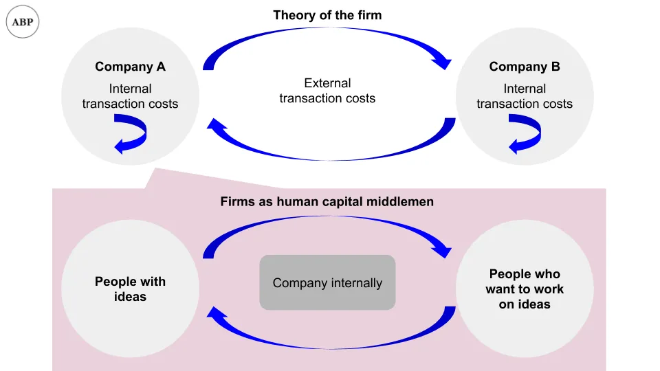

## 摘要

一篇研究论文建议，如果你对创新感兴趣，应该选择与强大的团队伙伴合作，而不是与强大的公司合作

## 人与公司

我们讨论过 [middlemen in financial capital last week](/writing/ib_value 'ib')\.本周，让我们来看看人力资本中的中间人。

在报纸中 ["Are Inventors or Firms the Engines of Innovation?"](https://papers.ssrn.com/sol3/papers.cfm?abstract_id=3081933 'paper') Ajay Bhaskarabhatla、Luis Cabral、Deepak Hegde 和 Thomas Peeters 探讨了我们应更多地应将创新归功于人类还是企业。令人惊讶的是，他们发现 **人类值得更多的功德。** 让我们仔细看看。

我们可以把公司看作是“撮合人”的中间人，把有想法的人和愿意执行的人聚集在一起。有一个整体 [Theory of the Firm](https://en.wikipedia.org/wiki/Theory_of_the_firm 'Theory') 关于公司如何存在以降低交易成本\[\^1\]。在这个框架下，我们可以尝试将创新的影响在人与企业之间分离。

企业还是人力应获得更多认可，都可能 **帮助我们确定该关注哪些方面** 如果我们想获得更多创新：

> 事实上，如果发明能力依赖于企业特定的结构、文化和难以跨组织迁移的惯例，那么发明者可能成为替代者，企业应发展提升创新的能力。另一方面，如果人力资本对创新至关重要，那么企业的创新力将取决于其筛选、吸引和留住有才华员工的能力。

为此，研究人员首先将发明人专利数量定义为创新的衡量标准。一个人创造的专利越多，创新性就越强\[\^2\]。

然后他们会观察一组发明人在该公司内部流动的公司。直观上，发明人从一家公司转到另一家公司，可以衡量个人与公司之间的影响，无论是搬迁前还是搬家后。这一限制让他们在2500家美国上市公司中获得了709\,000名发明人进行分析\[\^3\]。

利用这些数据，他们进行了回归分析，看看专利数量是否可以从发明人相关的原因、企业相关的原因或其他变量预测出来。他们发现，虽然发明人和公司都是统计学上显著的专利计数解释因素， **发明家的重要性几乎是公司本身的10倍：**

> 发明人特定固定效应解释了发明人专利表现中观察到的18\-37\%的差异。相比之下，发明人生产力整体方差中只有2\-7\%被固定效应解释。观察到的公司层面变量，如年龄、规模、专利库存和研发强度，则解释了整体方差的1\%到8\%。这些结果表明，发明人专属的人力资本解释了发明人产出的方差性很大程度上

下表包含大量数字，我们忽略除红框中的两个数字外的所有数字。研究人员在上述引用中指的是发明人0\.341与企业0\.032的比较\;数字越高，专利计数的解释力越强。就我们而言，将固定效应理解为“效应”，但你可以阅读更多关于实际定义的内容 [here](http://www.jblumenstock.com/files/courses/econ174/FEModels.pdf 'fixed')\.

如果上述情况成立，那么作为个体， **我们应该关注与强大的团队伙伴合作，而非强大的公司** 如果我们想变得更具创新性。换句话说，这也是一个数据点，说明为什么你应该更关心你将直接合作的人，而不是公司的声誉。

研究人员发现的另一个反直觉结果是，“好”公司不一定有更多“好”发明人：

> 低人力资本发明家与高创新能力企业匹配。其理念是，高创新能力企业带来的创新推动对低人力资本发明家尤为有价值，他们愿意接受较低工资以换取更高创新率的“便利性”。

> 相比之下，高人力资本发明家通常集中在创新能力较低的公司。直观上，这些发明人从雇主的创新能力中获益较少，因此对其财务报酬的权重相对较大

上面的意思是，如果你觉得自己不够创新，你会去一家更以创新著称的公司工作，试图为自己争取一些好处。作为交换，你愿意接受较低的薪水。

如果你觉得自己更有创新性，你会对公司兴趣降低，更倾向于更高的薪水，因为你不需要公司的创新福利\[\^4\]。

这个结果对我来说更难接受和理解。论文确实声称控制了公司规模和阶段\[\^5\]，但我仍然怀疑这里是否存在初创公司效应。如果初创企业作为新公司专利产出更少，且招聘更具选择性，你可能会看到高人力资本加入低创新公司，并在纳入股权后谈判更高的薪酬。我对他们的方法了解不多，但这可能是值得考虑的方向。

研究人员还在研究中列出了整整一页的其他限制。其中最重要的限制包括将专利数量作为创新的定义，以及假设工资和潜在创新产出是相互权衡的。你可以在脚注或第23页阅读更多内容 [the paper](https://papers.ssrn.com/sol3/papers.cfm?abstract_id=3081933 'paper') \[\^6\]。

不过，假设你相信他们的研究，主要结论是：

- 推动创新的是人，而非公司
- 如果你想突破创新的边界，最好找到优秀的人才合作，而不是找一家好公司
- 一个有趣的副作用是，你的薪水也可能因此更高

1. 维基百科指出：“根据罗纳德·科斯的文章《企业的本质》，当通过市场交换协调生产的交易成本（在不完全信息下）高于企业内部时，人们开始组织企业内的生产。”
2. 具体来说，“对于 t 年公司 ݆j 的每位发明人 ݅i，我们衡量专利发布后前五年内按前引加权（不含自我引用）的专利总数。”他们还会针对团队合作进行校正，并对“突破性”专利和“无用”专利进行调整
3. “为了区分企业和发明人对创新的相对贡献，我们采用了Abowd、Kramarz和Margolis（1999）（以下简称AKM）的识别策略。该策略要求我们使用一组发明家子样本，这些发明家通过迁移发明者相互关联的公司工作。”我还没看过AKM的论文，所以对这里的方法论还不太清楚
4. 团队假设人们在工资和创新之间进行权衡。“我们的模型形式化了Bonhomme等人（2019）提出的观点，他们指出工人可能愿意牺牲工资，以换取更好的非工资工作特征或\'便利设施\'。”Lamadon等人（2019）展示了便利设施（如靠近工作地点、灵活工作时间表、对所执行任务类型的偏好）在美国劳动力市场中工人排序中的重要性。在我们的案例中，我们假设对发明者来说，重要的便利性由创新产出赋予。具体来说，我们的理论模型考虑了一个工人效用函数，包含两个输入：工资和创新产出。”
5. “企业效应解释了发明人数少于50人的小型企业在方差中所占比更大比例，而发明人超过1000人的企业（10\%对1\%）。如前所述，小型企业的企业效应可能承担部分集团层面人力资本的影响。即便如此，发明者效应在整个企业规模分布中的贡献更大，数值范围在34\.5\%到40\%之间。”
6. “然而，我们模型的一个关键假设是，发明家不仅关心工资，也关心其努力的直接成果，即创新
   产出。发明人可能对创新产出有内在偏好（例如，发表的出版物或专利，如Stern 2004），或将产出视为其生产力向劳动力市场的信号（Melero、Palomeras 和 Wehrheim 2019\;Kline 等 2019）。此外，我们假设发明家的边际创新效用正在递减：对拥有较少专利的发明人来说，额外的专利比拥有更多专利的发明者更重要。具体来说，我们假设创新的边际效用下降速度高于对数函数。”
