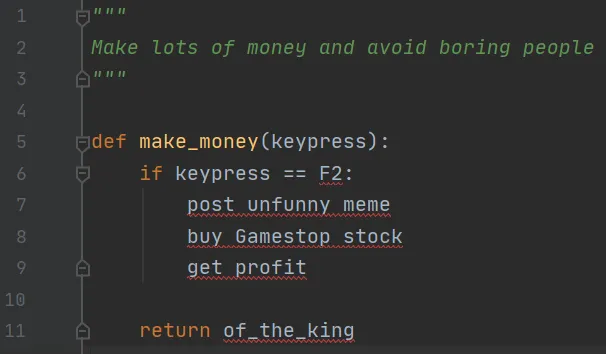
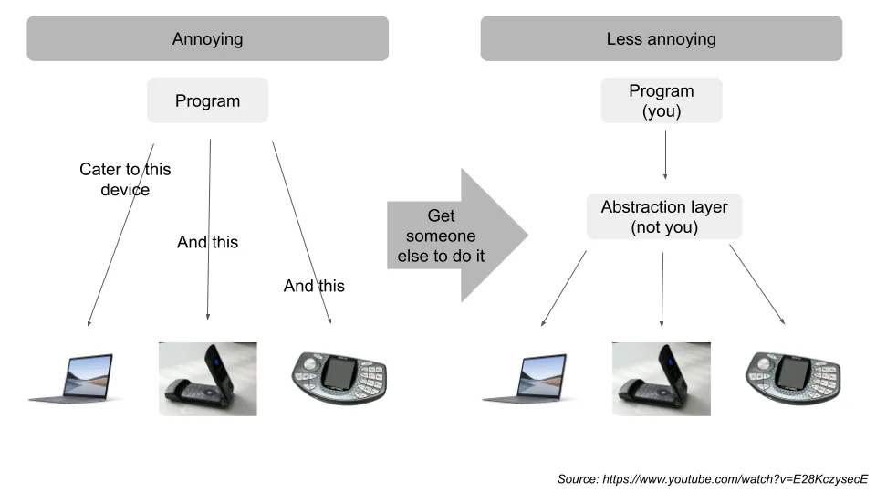
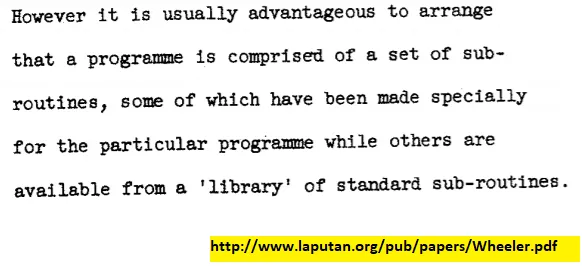
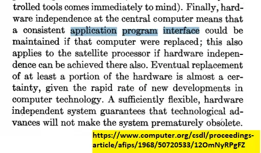
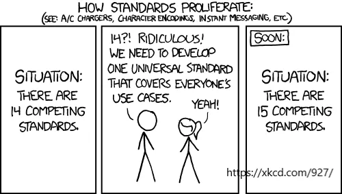

## 摘要

Plaid是一家金融科技公司，帮助其他公司连接银行数据。通过做别人不想做的无聊事情，这让大家的生活更方便，也成为一个高度粘性的产品。

## 1\. 抽象化层叠的工作

我将讨论一家金融科技公司 [Plaid](https://plaid.com/ 'plaid') 今天。在此之前，先了解一些抽象和应用程序接口（API）的直觉会很有帮助。我会把第一部分讲抽象，第二部分讲API\;如果你已经熟悉这些概念，可以跳到第三部分。像往常一样，我会倾向于技术准确度较低，以便更容易理解。

我们先讨论抽象：

假设你有一个开创性的应用创意，想赚很多钱。你把应用写成每次有人按下键盘的F2键时，事情就会发生，他们就能赚钱：

你在笔记本电脑上测试，一切顺利，开始赚钱。效果好到你告诉所有朋友，他们也想参与其中。你把代码发给他们，让他们继续努力，繁荣发展。

你的一个朋友（那个烦人的文青）告诉你，他的Mac上代码不行，他很难过下一杯单一来源单一管单株咖啡赚不到钱。你想知道为什么，于是去排查代码。

结果发现Mac有个奇怪的问题 [Touch Bar thing](https://support.apple.com/en-gb/guide/mac-help/mchlbfd5b039/mac 'touch') 功能键，据你所知，其唯一目的似乎就是让生活变得痛苦。你为Mac用户添加了专用代码：

现在这对他来说很管用，他继续 [suing magazines for saying all hipsters look alike.](https://www.independent.co.uk/news/media/hipster-magazine-photo-lawsuit-mit-technology-review-a8813941.html 'hipster')

还有朋友问你是否也能支持手机，以便随时随地赚钱。还有人问能否支持Blackberry。还有一个朋友想知道该应用什么时候会在 [KFC gaming console](https://www.bbc.com/news/business-55433318 'kfc')\.

当你盯着为各种计算设备添加更多代码的任务时，你开始感到绝望。为什么赚钱不能像按一个按钮那么简单？ **你只需要写一次代码，然后能在多个设备上使用。**

上面这个想法其实是计算机领域常见的问题（多设备支持，而不是赚钱的设备）。如果你写的软件是要做所有事情的，就需要考虑所有可能的终端用户设备。代码被翻译成二进制（1和0）后，它仍然需要做同样的事情。设备各有其特点，你花更多时间处理例外，而不是写主要功能。

90年代末，人们意识到了一个解决方案——在中间增加一层，也就是说 **让别人来承担。** [As Shimon Schocken explains,](https://www.youtube.com/watch?v=E28KczysecE 'Shimon') 有了“中间人”，你的任务变得简单了。你不必为所有可能的设备写代码，而是“写一次，随处跑”，让中间人负责让你的代码兼容 [^1]\:

**将一个大任务拆分成更小的任务，对所有人来说都更容易。** 你已经抽象化了部分问题，因为你想写“高级”代码，不想担心具体的实现漏洞。还有人可能喜欢“低级”实现细节，但不想在上面写应用。根据能力和需求各写一个，等等。

我们会回到抽象的概念，它让人们能够 **专注于任务的具体部分。**

现在，假设你和你的朋友想把所有这些钱存进世界各地的银行。各银行有不同的程序，如果你不遵守他们的规则，他们会把你赶出去：

- 纽约那家门店只需要你输入账户号码、密码和订单， [banning you if you talk too much](https://www.youtube.com/watch?v=euLQOQNVzgY 'soup')
- 旧金山门店除非你在笔记本上贴上至少5个公司贴纸，否则不会为你服务
- 新加坡分部想知道你什么时候结婚生子，为了国家的利益

大多数成员讨厌背这些规则，但April是个例外。她喜欢处理一些晦涩的选择，自愿代表团队处理所有银行事务。她不在乎交易如何进行，只关心交易是否会发生，团队让她处理一切。

你参加过的迷幻静修营里的一些熟人听说了你们的安排。他们也不喜欢直接和银行打交道，想知道April是否也能帮忙。她很乐意帮忙，只要他们付她一小笔费用。消息传开了，很快大家都找April做中间人。

我们再次看到人们最关心的 **更大任务的一部分** \- 存款和取款。人们不在乎April为什么喜欢这个，或者她怎么记住一切，只关心她能完成。有April让生活更方便。

最后，假设你想检查账户余额，确认April没有挪用钱支付她租赁AirBNB的隐藏服务费。你开始在电子表格中输入最近的存款：

作为程序员，你不喜欢Excel，也不熟悉它的功能。不过你知道用“\+”符号添加内容，然后开始手动计算余额：

一百个单元格和一个小时后，你快完成时，一个朋友问你在做什么。他们解释说sum（）函数能实现你想要的效果：

他们还告诉你整个情况 **函数的“库”** Excel必须帮助简化数学，比如AVG（）、count（）等。有趣的是，无论你用的是Windows笔记本、朋友的Mac、你爸的手机，这个函数都能有同样的表现。一旦你知道这个函数是做什么的，怎么调用它，你就能节省时间。你不在乎Excel怎么做，只要它在任何地方、随时都能用就行。

抽象化不同层次的工作 **在每个层面上都增加了可能性和机会。** 编写sum（）的人不想花时间帮你计算存款。你也不想编写sum（）函数。人们只专注于自己想做的部分。不做所有事情，人们可以创造很多东西。

**抽象的概念在编程之外同样适用。** 我们都在处理问题的“层面”，相信下面的一切都是可靠的。你正在邮件中看到这些信息，并不关心邮件服务的工作原理，只关心它们的行为是可预测的。

## 2\. 应用程序编程接口作为合同

现在我们准备开始思考应用程序接口（API）。想象一下你编写了一个数学函数库，比如上面提到的sum（）。 **如果能在其他程序中使用这些功能，那不是很方便吗？**

如果你能让这个库对所有人开放，别人也可以用它来构建他们自己有趣的东西。你可以专注于制作数学函数，其他人则可以专注于开发能够根据需要调用你库功能的应用程序。

作为 [Joshua Bloch](https://www.youtube.com/watch?v=LzMp6uQbmns 'Josh') 指出，早在1952年，人们就喜欢 [David Wheeler](<https://en.wikipedia.org/wiki/David_Wheeler_(computer_scientist)> 'David') [^2] 我们已经提出了这个想法 [having libraries of functions (sub-routines)](http://www.laputan.org/pub/papers/Wheeler.pdf 'wheeler')\:

**我们将该函数库称为 API [^3]\.** 约书亚认为这个词最早是在 [a 1968 paper by Ira Cotton and Frank Greatorex:](https://www.computer.org/csdl/pds/api/csdl/proceedings/download-article/12OmNyRPgFZ/pdf 'ira')

这种用法涉及我们在示例中讨论的概念：

- **抽象。** 你不在乎数学函数如何运作，只要它们能做到就行。拆分大任务能在每一层打开有趣的工作可能性
- **硬件独立性。** 无论使用什么设备，我们都可以使用API，期望它负责集成
- **可重复使用性。** 这个库可以被多个想要不同东西的人使用。

我们的API是 **明确定义的契约**，告诉我们所需的输入和预期的输出。例如，我们希望sum（）函数始终返回输入的总和，而在某些情况下不返回总和，另一些情况下返回平均值。

我们也 **不能指望我们的API能做合同之外的任何事。** 例如，sum（） 在 Excel 中是可行的，但 make\_me\_money（） 不行，除非 Excel 的创建者编写了该功能代码。

我们 **相信API被正确编程，** 经过严格测试。例如，sum（）函数每次都应该给出相同的结果，适用于相同的数据集。

想象一下没有任何API的生活。你每次编程都得从零开始，还得考虑所有可能的终端用户场景。这就像这样 [making a sandwich from scratch](https://www.smithsonianmag.com/smart-news/making-sandwich-scratch-took-man-six-months-180956674/ 'sandwich')\.

## 3\. Plaid 作为 API

我们已经确定了什么是API以及它们为何重要。那么，Plaid是做什么的？

对于不了解的人来说，Plaid是一家金融科技公司，曾经 [supposed to be bought by Visa for $5bn](https://www.justice.gov/opa/pr/visa-and-plaid-abandon-merger-after-antitrust-division-s-suit-block 'plaid')，但因反垄断问题放弃了收购。与我的恋爱生活不同，被拒绝反而让他们失望 _更多_ 很有价值，而且现在 [rumoured to be raising money at $15bn.](https://www.theinformation.com/articles/plaid-shareholders-field-offers-at-15-billion-after-merger-collapse '15')

还记得四月在你和银行之间跑吗？把四月当作一个API。

**Plaid是银行和其他想使用银行数据的机构之间的API。** 他们让客户能够在API之上构建应用，而无需担心幕后集成工作。而且这工作量非常大。

假设你正在构建一个预算应用，它需要访问用户的消费历史。如果你用自己的代码连接银行，每当新增银行时，你就得写一整块新部分。鉴于新标准不断变化，你可能会花在这上面比应用的主要功能还多。

Plaid可以为你提供始终可用的API，以及用户连接银行时能看到的用户界面 [(Plaid Link).](https://plaid.com/docs/link/ 'link') 你的问题已经成了他们的问题。

我们将通过Plaid的快速入门指南，一窥这到底是什么样子 [here](https://plaid.com/docs/quickstart/ 'quickstart')\.它会给你一些文件，可以在自己的电脑上设置演示应用。

经过一天的排查、多次重启电脑，以及盲目安装几乎所有可能的程序 [^4]\:

我终于让部分功能正常工作，连接了一个测试银行账户：

这让我可以查看虚拟数据，比如我的银行账户余额：

或者最近的交易数据：

如果我 ~~想要~~ 我知道怎么做，我可以继续这样构建一个金融应用。应用会用Plaid API拉取余额数据，记录交易并更新余额。不过这时我遇到了更多bug， ~~放弃了~~ 留待以后再说。

如果我要创业，你可以想象让Plaid帮我做所有基础财务工作能节省多少时间。我不想处理银行整合问题，那是下一层\;那对我来说并不令人兴奋。我更愿意做那个闪亮的股票轮盘赌轮盘，骗取人们的钱\;那是 [doing god's work](https://dealbook.nytimes.com/2009/11/09/goldman-chief-says-he-is-just-doing-gods-work/ 'god')\.

如果你把现在大多数公司都看作“科技”公司，再考虑有多少公司需要“财务”数据， **你会开始感受到Plaid的机会有多大。** 越多公司希望直接与客户银行账户集成，Plaid的相关性就越大。

**Plaid收费公司，** 不是消费者，而是用来使用API。 [^5]\.它 [seems to take](https://plaid.com/pricing/ 'pricing') 小公司收取基于交易的费用，大公司收取订阅费。通过做那些“无聊”的事情，他们为自己和其他愿意为便利付费的创新者创造了双赢的局面。

一旦你开始使用Plaid， **你不太可能换专业，** 因为那意味着重写大量使用 Plaid API 的代码 [^6]\.想想这对Plaid涨价的能力意味着什么。你多久更换一次管道？

如果这听起来不现实，可以考虑Fortran，一种早期编程语言。它的函数库是 [defined in **1958**](http://ed-thelen.org/LaFarr/IBM-FORTRAN-II-704-C28-6000-2-c-1958.pdf 'fortran')，并且至今仍在使用。一旦实现，API的使用寿命很长：

我们今天涵盖了很多内容——抽象背后的直觉、API，以及Plaid的功能。主要结论是 **有很多事情是人们不想做的，但做这些事能赚很多钱。** 通讯告诉你要避免无聊的人，但在这里，制造无聊的东西是一项数十亿美元的生意。

### 更多资源：

1. [What does Plaid do?](https://technically.substack.com/p/what-does-plaid-do 'plaid') 技术上
2. [Fireside chat with Plaid CEO Zach Perret](https://www.youtube.com/watch?v=sgnCs34mopw 'youtube') 作者：FirstMark
3. [APIs all the way down](https://notboring.substack.com/p/apis-all-the-way-down 'nb') 作者：Not Boring
4. [A brief, opinionated history of the API](https://www.youtube.com/watch?v=LzMp6uQbmns 'youtube') 作者：约书亚·布洛赫
5. [How to build a fintech app in Python using Plaid's banking API](https://www.youtube.com/watch?v=Lv2jIOi2fao 'youtube') 作者：埃罗尔·阿斯普罗马蒂斯

感谢 [Brian Rubinton](https://twitter.com/brianru 'b')\, [Justin Gage](https://mobile.twitter.com/itunpredictable 'j')本·莫尔西略， [Denis Papathanasiou](https://github.com/dpapathanasiou 'd')，迈·施瓦茨， [Aditya Athalye](https://evalapply.org/ 'a')\, [Jeremy Presser](https://mobile.twitter.com/JeremyPresser 'j')\, [Ian Kar](https://mobile.twitter.com/iankar_ 'i') 关于本文的建议

## 其他

1. [Why working from home will stick.](https://nbloom.people.stanford.edu/sites/g/files/sbiybj4746/f/why_wfh_stick1_0.pdf 'wfh') 这与我目前的想法一致，我们会回归办公室工作，更多的居家办公天数。
2. [What is an IP address?](https://outofips.netlify.app/ 'IP')
3. [The sting of poverty](http://archive.boston.com/bostonglobe/ideas/articles/2008/03/30/the_sting_of_poverty/?page=1 'poverty')
4. [How I blew out my knee and came back to win a national championship](https://www.jasonshen.com/2011/blew-out-knee-win-national-championship/ 'jason')
5. [Judgement is an exercise in discretion](https://aeon.co/essays/judgment-is-an-exercise-in-discretion-circumstances-are-everything? 'judge')

[^1]: 更准确地说，编译器必须与所有设备兼容，而不是代码本身，因为代码是编译器上方的一层。

[^2]: 大卫显然是首位获得计算机科学博士学位的人。

[^3]: 技术上来说，界面应该是双方之间的合同本身，但我觉得把它们合并起来对初学者来说更容易理解

[^4]: 我99\%确定Plaid的Python文件夹是错误的，因为里面有空的index\.html文件。plaid和plaid\-python之间还有一些奇怪的命名空间问题，我当时不太理解，但最终修复了。我不明白为什么他们需要用Docker，而Docker是我软件运行所需的众多额外程序之一。更新：Plaid后来提到这些bug已经修复，但快速启动流程不同。

[^5]: 我相信公司会试图将成本转嫁给消费者，但关键是，直接付费的客户是那些制作需要金融集成应用的公司

[^6]: 我相信是这样，但如果我错了请告诉我。
