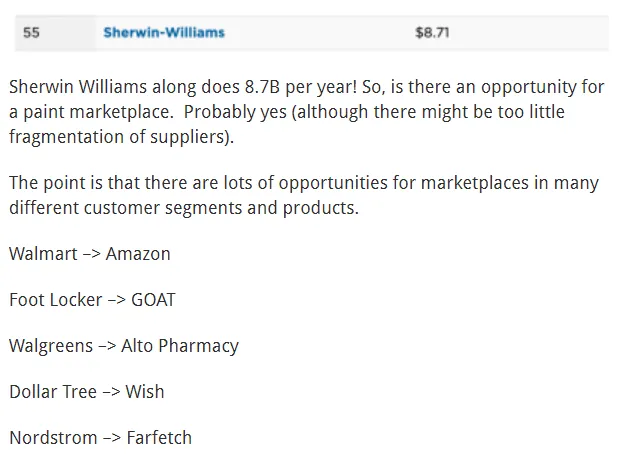

## 摘要

自然垄断很少见，监管往往弊大于利

## 赢家全拿？

Turtle Ventures的风险投资人Josh Breinlinger在他的网站上有一篇简短的帖子，内容是 [how most marketplaces are not "winner takes all":](https://acrowdedspace.com/post/642666403989684224/winner-take-all-or-not 'win')

我倾向于同意。我们经常听说“赢家通吃”。这就引出了一个问题，为什么没有更多的垄断？

“等等，难道不是有很多垄断吗？”

按照单一玩家拥有全部份额的定义——我不确定有没有？

定义为少数玩家占据大量份额——当然，但那我们不是在显著改变定义吗？

“那只是语义问题，大家都知道垄断其实是指不止一个玩家，市场占比少，但人数更多。”

好吧，我们用这个定义，或者像美国联邦贸易委员会（FTC）用的“某家公司”这样的定义 ["with significant and durable market power"](https://www.ftc.gov/tips-advice/competition-guidance/guide-antitrust-laws/single-firm-conduct/monopolization-defined 'monopoly') [^1]\.大富翁 \- [I know it when I see it](https://en.wikipedia.org/wiki/I_know_it_when_I_see_it 'wiki')\.

模糊定义的问题在于，会导致不同的假设和不同的结论。对你来说显然正确的事，对别人来说显然是错的。如果你们连问题所在都达不到共识，那该如何解决？

以下是本·埃文斯对此话题的分析：

起步越难，现有企业增长和保持市场份额就越容易。

历史上，物理障碍是主要的限制。进入铁路？你得铺设轨道。进入航运？你需要船只。中世纪时期试图建立贸易路线？你需要马车和雇佣兵， [maps](https://www.visualcapitalist.com/medieval-trade-route-map/ 'map')\.

这些内容如今已被抽象化，比如我们对 [abstraction in computing](/writing/plaid 'abstract')\.许多公司可以把物理层视为理所当然，能够更快且成本更低地扩展。

但监管障碍没有改变。我们已经克服了自然，但还没有克服人类。我也不相信我们会战胜，因为规则永远是社会的一部分。

我在查找垄断的例子时，发现了 [Open Markets Institute,](https://www.openmarketsinstitute.org/learn/monopoly-by-the-numbers 'omi') 该组织旨在“揭露垄断的危险”。以下是一些垄断 [their list:](https://www.openmarketsinstitute.org/learn/monopoly-by-the-numbers 'monopoly')

1. 制药公司
2. 酒精
3. 眼镜
4. 互联网广告
5. 著作

制药、酒精和眼镜都是高度监管的行业，这不利于竞争的起步。

在广告方面，我们都说顶尖公司现在领先势不可挡，但如果十年前我们这么说，那就算是前五名公司 [we'd have been wrong on 3 out of 5 names.](https://www.emarketer.com/Article/US-Digital-Ad-Spending-Top-37-Billion-2012-Market-Consolidates/1009362 'ad') 我觉得很难说现在的“垄断”未来会是同样的。

关于在线图书销售，可能有更强有力的反驳理由。但话说回来，这并不是买书的唯一方式。乍一看，这似乎又回到了物理学的世界——有限的空间，内容无限。

我今天的观点不是说监管不好——如果没有，我们仍然会有童工问题。然而，所有面临的问题都很复杂，缺乏明确指导和知识的监管往往弊于利。监管是必要的，但需要的是理解复杂性的人才，而不是 [wonder how Facebook makes money](https://www.youtube.com/watch?v=n2H8wx1aBiQ 'ads')\.

举个更具体的例子，看看GDPR，这是欧洲的数据隐私法规，也是现在浏览网页时那些烦人cookie通知的原因。数据隐私是个好概念，还有更多工作空间。

GDPR最大的受益者是谁？

[Google and Facebook.](https://www.wsj.com/articles/gdpr-has-been-a-boon-for-google-and-facebook-11560789219 'goog')

最大的输家？

那些无法承担合规法律费用的小企业。还有你、我和其他所有人现在都得应对弹出窗口。

我们需要既理解问题，又需要提出应对的解决方案。目前，我认为太多人跳过了解决方案，却没有先明确定义他们真正认为的问题是什么。如果我们对此不达成共识，难怪我们会有如此糟糕的结果。

[^1]: 我认为实际上，\<50\%的市场份额很难追究垄断案件，所以人们一直以此为参考。
