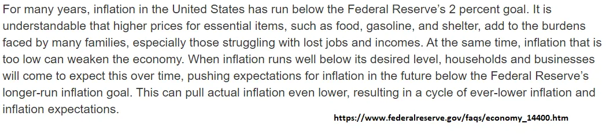

## 摘要

我们对通胀的了解可能比我们想象的要少。

## 我不理解通胀的一点

我不懂通胀。

我理解价格上涨的概念，当然。但很长一段时间我一直不明白到底是什么 _成因_ 通货膨胀，如何操作 _度量_ 通胀，以及如何 _调整_ 通货膨胀。

**我也觉得没人真正知道。**

你可能会说这很荒谬，外面有一整群人 [making policy based on inflation targets](https://www.federalreserve.gov/faqs/economy_14400.htm 'fed')， 正在谈论 [hedging against inverted yield curves](https://www.chathamfinancial.com/insights/hedging-in-an-inverted-yield-curve-environment 'yield')如果谷歌趋势可信的话，还有一些《刺猬索尼克》游戏 [(apparently some weird nsfw meme).](https://tvtropes.org/pmwiki/pmwiki.php/VideoGame/SonicInflationAdventure 'sonic')

是的，但这并不意味着他们懂得事情的运作方式。如果我的工作经验教会了我什么，那就是人们可以在不理解自己在做什么的情况下完成大量工作 [^1]\.纳西姆·塔勒布此前写过类似内容，讲述一位金融交易员成功从事绿色木材交易的故事 [without understanding what it was.](https://fs.blog/2016/11/green-lumber-fallacy/ 'taleb')

通胀的一个大问题首先是 **决定什么算数** 朝着它走去。 **这绝非一件小事，** 如果你认为是，请问问自己这些问题：

- 你想涵盖哪些广泛的“事物”类别？只包括实物商品吗？那服务呢？
- 无论你包含什么，你打算如何衡量它的价格？
- 如何考虑一些异常数据点，比如卫生纸价格何时飙升？
- 你多久测量一次？
- 你如何解释这些商品的质量提升？如果质量上升而价格保持不变，这算通缩吗？

正如你所见，这不仅仅是“拿消费者价格指数”就算了。事实上，美联储并未正式使用CPI，而是选择了另一个个人消费支出（PCE）价格指数 [^2]\.即便如此， [they acknowledge its imperfect nature:](https://www.federalreserve.gov/econres/notes/feds-notes/comparing-two-measures-of-core-inflation-20190802.htm 'fed')

> 总体PCE物价通胀即使在年际也极为波动。因此，经济学家和政策制定者建议采用替代方法重新加权该指数组成部分，以降低通胀的方差，更好地区分暂时性与持续性波动，最终更好地预见未来通胀的发展

我们最近讨论了定义在处理 [monopolies](/writing/monopoly 'monopoly')\;法规取决于定义。

同样，你所定义的通胀对公共政策和经济都有巨大影响。想象一下，如果美联储只关注城市成本上升，而不考虑郊区。或者他们只关注能源成本，忽略住房成本。

通胀的另一个大问题是 **受期待影响。** 指望它遵循某种数学定律，就像指望股市能完美反映未来现金流的现值一样。这也是为什么很难设定通胀目标：

美国联储的目标是2\%，所以上面第一句话可以被解读为：1）美联储做得很糟糕，或者2）这确实是一件很难做到的事情。鉴于系统的复杂性，我倾向于相信后者 [^3]\.

知道这是个期待游戏，也解释了为什么游戏总是充满不确定性 [interpreting Fed statements](https://www.stlouisfed.org/open-vault/2019/may/how-read-fomc-statement 'Fed') 关于货币政策（利率）， [even though the Fed is trying to speak more plainly in recent years](https://www.bankrate.com/banking/federal-reserve/fed-simple-communication-may-be-confusing-markets/ 'Fed')

这样做给了他们灵活性，因为经济中有许多尚未完全理解的地方。 **这种模糊性为未知的未知提供了缓冲空间。** 然后你可以假装这一直是计划，建立更多信心，继续控制预期。如果人们失去对美联储知道自己在做什么的信心，就会产生负反馈循环，就像银行遭遇挤兑，试图说服客户他们没有遭遇挤兑。

当人们失去信心时，就会出现以下情况：

我觉得关于通胀，我唯一能说的就是这些：

1. 价格通常会随着时间小幅上涨，复利后，名义价值在长期内会变得较大
2. 价格可能会在短时间内大幅上涨，但具体原因难以说清
3. 很难针对小幅涨价，而针对大幅涨价则更容易。不过没人想要大幅涨价
4. 很多价格变动都是基于预期，所以也许本质上是不可预测的

顺便说一句，我并不是唯一一个这么想的人。 [Economist John Cochrane wrote about inflation recently](https://johnhcochrane.blogspot.com/2021/02/inflation-issues.html 'john') [^4]，同时也在思考我们到底知道多少。他认为服务业可能会随着时间推移成为通胀中更大组成部分，服务业通胀和商品通缩的趋势将持续。

也许通胀就像潮水一样—— [it goes in, it goes out, you can't explain that.](https://www.newser.com/story/109164/bill-oreilly-to-atheists-you-cant-explain-the-tides.html 'tide')

[^1]: 我自己也经历过多次。

[^2]: ["While the CPI and PCE price index both provide measures of how prices are changing over time, they are not constructed in the same way. One difference is the smaller number of items in the basket of the CPI. The CPI reflects out-of-pocket expenditures of all urban households, while the PCE price index also includes goods and services purchased on behalf of households. Another difference is the expenditure weights assigned to each of the CPI and PCE categories of items"](https://www.clevelandfed.org/en/our-research/center-for-inflation-research/consumer-price-data.aspx 'fed')

[^3]: 我找不到方法把它放进主体流程中，但测量误差也存在一个整体问题。想象一下你有一把普通的尺子，可以用厘米来测量东西（美国人就这么说）。如果你被告知测量的是毫米（对美国人来说比厘米还小），你能做到吗？鉴于你的测量工具的精度，你做不到。同样，尤其是在目标是如此低的通胀率时，你不得不怀疑置信区间有多宽。

[^4]: 他的文章激励我把这个话题的想法写下来。
