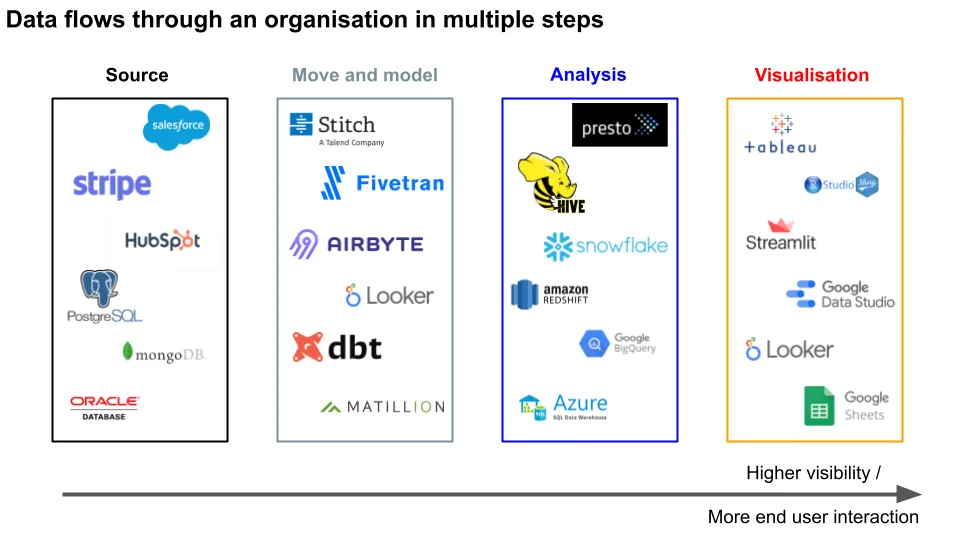

## 摘要

我最近不得不整理一些关于数据管道行业的分析，觉得应该分享出来。我们将逐一介绍：

1.  市场概览，
2.  风险，
3.  各阶段参与的公司

## 1\. 市场概览

数据管道行业的年度总值为\>000亿美元，仅一些公司估值就接近这个数字 [^1]\.由于数据管道是一个广泛的领域，我将讨论范围限制在与数据分析更相关的领域。公共和私营公司竞争着融入使用数据的组织技术栈，而这几乎是当今所有大型企业的普遍存在 [^2]\.

客户或供应商产生的交互数据流向原始交易 **数据库**\.然后数据被\*\*移动\*\*且 **变革** 分析数据仓库的合适模型。分析师可以查询他们感兴趣的数据 **分析**\.他们会将结果用于终端用户 **数据可视化** 商业指标。

所有这些加粗的流程中，公司要么专注于软件开发，要么提供实施咨询。大多数新公司都是基于云的（部分本地部署），建立在亚马逊云服务（AWS）等服务提供商之上 [^3]并利用其可扩展性、灵活性和节俭性，打造高利润率企业。

鉴于数据生成的增长率和相关收入（\>20\%），该领域的大多数初创企业都是令人振奋的投资机会，代表着不对称的风险\/回报比和已证明的高退出倍数。如果你相信初创行业会增长，你就必须相信支持它的数据管道行业。

## 2\. 风险

- 安全性（95\%的可能性）——高额利润意味着非法获取数据的恶意行为者获得高额奖励 [^4]\.如果安全成本上升（而且确实会上升），这将损害业务利润
- 数据隐私监管（70\%）——这增加了合规成本，帮助现有企业，同时损害初创企业
- 上游利润率压力（30\%）——如果数据堆栈某些层级出现更多行业整合，这些公司可能会挤压无替代方案的公司的利润率 [^5]

## 3\. 景观

我们将从用户能看到的内容开始，在 **可视化** 结束。当分析师已经整理好了他们想要的结构格式化的数据时，他们需要对这些信息进行组织。这通常以带有图表和表格的仪表盘形式出现。该领域的一些工具包括Tableau、Looker、Google Data Studio、R Shiny（基于浏览器的用户友好仪表盘）、Streamlit（交互式数据应用），甚至Google Sheets。

选择工具的权衡在于用户的技术能力与数据的复杂性。如果组织有许多用户想在同一项目上协作，像Sheets这样的简单工具就足够了。如果用户和功能请求较少，构建能够处理更大负载的仪表盘软件可能更合理。

在可视化之前，分析师需要\.\.\.\.\.\.**分析数据**\.它们通过查询语言从结构化数据库中查询数据来实现这一点。这可以是像Presto（低延迟、低吞吐量）或Hive（高延迟、高吞吐量）这样的方式。

这些计算是在数据仓库层上完成的，比如Snowflake、Redshift、BigQuery、Azure。越来越受欢迎的是基于云的，有些还允许计算和存储使用量的分开扩展和计费。数据仓库在分析方面可能比数据库更适合存储数据。

这里的权衡包括价格、扩展性和支持。例如，你可能一开始使用开源的Postgres，但当公司扩展到超出Postgres适用范围并遇到更多技术性漏洞时，最终会转向Snowflake。

为了将这些数据送到仓库，可以有 **数据移动** 以及\*\*数据建模\*\*图层。像Stitch、Fivetran、Segment、Airbyte这样的公司会帮助你从原始来源提取数据（我们稍后会讲到），并将其放入数据库以便查询。数据移动工具通常被称为提取、加载、转换（ELT）、提取、转换、加载（ETL）或这些组合的某种子集。

数据建模工具如 dbt、Matillion 和 Looker 允许你将原始数据映射到仓库所需的结构中。例如，dbt 允许你在集成开发环境（IDE）中转换数据，安排转换作业，并创建数据文档。

这里的权衡是通常的价格、复杂度和其他技术特性。例如，我认为Fivetran有更多集成，而Stitch则更少。数据移动工具的选择也会影响所用的数据建模工具——你可以把它看作不需要对数据进行第二次转换。

所有这些数据都来自客户和供应商的原始互动 **来源数据**\.这包括Salesforce、Zendesk、Hubspot（CRM）等软件工具。由于这些都是不同的公司，它们的数据格式也不同——可以把它们看作是不同国家的不同货币。因此需要前面提到的数据流动和数据建模层。

源数据很可能存储在某些数据库中，比如Postgres、MongoDB [^6]或者如果你喜欢痛苦，也可以用Oracle。与数据仓库不同，这些数据库更擅长实时存储交互数据\;写入更快，读取速度较慢。

综合来看：

感谢Paul Tune、Recurse Center参与者Shae Matijs Erisson、Ori Dean Bernstein、Mikkel Paulson、Steven Li、Ryan Prior、Luke Barone\-Adesi、Chirag Davé、Nathan Goldbaum，以及Locally Optimistic成员Jacob Matson、Arpit Choudhury、Gordon Wong、Kevin Hu、Itto Korneyki的关注。

[^1]: 我需要为分析提供TAM，我认为这些通常是虚构的数字。无论如何，这是我的观点：Snowflake（SNOW）本身的市值为700亿美元，估值为2亿美元。数据可视化为100亿美元，数据分析为400亿美元，数据仓库为200亿美元，ELT\/ETL为100亿美元，数据库每则行业新闻稿为500亿美元

[^2]: 超过一定规模后，将数据存储在免费的个人套餐电子表格软件中已不再可行

[^3]: AWS在100亿美元的估值中可能价值数千亿美元\;为了简化，我已排除它和其他主要服务提供商

[^4]: 这些数据随后可能被在线出售、用于欺诈或勒索赎金。对大多数公司来说，关键是何时被黑，而非是否。

[^5]: 鉴于大多数层级的竞争，整体上通常是成本通缩，而非通胀

[^6]: 正如Paul Tune指出的，你可以同时拥有关系型数据库（Postgres、MySQL）和非关系型数据库，比如MongoDB和DynamoDB（AWS产品）。后者的非结构化特性给试图进行分析的企业带来了挑战。
