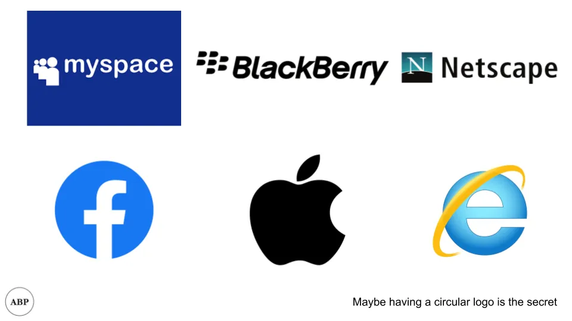

## 摘要

早期互联网潮流与当今流行的事物有很多相似之处。

## 书评

我读过 [How the internet happened](https://www.amazon.com/How-Internet-Happened-Netscape-iPhone/dp/1631493078 'how') 作者是布莱恩·麦卡洛，最近读了一本关于消费互联网历史的好书。这本书从Mosaic（最早的互联网浏览器之一）的起源开始，一直延伸到Facebook和iPhone。一章一章地阅读互联网公司的创始故事时，我惊讶于许多问题与今天的相似之处。

以下是我的心得，以下是较长的笔记：

- 成本降低、便利性增加，带来更多创造力、自我表达，从而带来粘性
- 社区对互联网一直很重要\;它的近期复兴不应令人意外
- 大多数公司的创始故事就是这样——为了公关而编造的故事

## 消费者创造力与控制权

互联网帮助改变了文化思维，使任何人都能创造：

> 相比之下，网络允许用户消费内容并创造内容。任何用户。任何地方。任何类型的内容。

公司通常一开始反对创造力，希望对生态系统拥有更高的控制权。然而，赋予用户自由所带来的价值通常远远超过其缺点。这也是为什么我们现在在网上看到这么多垃圾——权力越大，乐趣越大。

> 他也担心自己和安德烈森会打开无聊和垃圾的闸门。“我说得没错！人们对它进行了严重的滥用，”\\\[Mosaic浏览器联合创作者\]比纳后来说。“但马克也是对的。由于这些光鲜亮丽，成千上万的人浪费时间在网上放上漂亮的图片和有价值的信息，数百万人使用它。”

> 最终，建立应用商店的争夺战重演了几年前关于向Windows用户开放iTunes的争论。和以前一样，苹果内部每个人都想做，但乔布斯一直拒绝。

我们在书籍中见过这种现象，在桌面浏览体验中见过，现在又在移动端使用中看到。人们想要一切，最终会得到，因为有赚钱的空间：

> 无限选择。即时满足。任何设备上。谈到数字媒体颠覆，核心几乎从来不是免费内容或盗版。它始终是给人们他们想要的东西，时间和方式。

> 随机事件或随机人物能在网络上走红的想法，正是因为YouTube而进入主流

当你找到喜欢相同事物的人时，这种创造力还能带来社区感。

## 社区与参与的重要性

我们看到“社区经理”角色的兴趣重新兴起，公司雇佣员工与客户在类似的在线论坛中互动，无论是Slack、Circle、Discord还是其他平台。最近有许多文章讨论如何构建社区

这并不新鲜，互联网的先驱们已经发现了参与度的重要性：

> 但CompuServe——作为首个互联网提供商——在其生命周期中的主要特色是其论坛，数百个经过管理的特殊兴趣网站，几乎涵盖所有兴趣和细分领域

> 关注社区，赋能用户并让他们自主运作，将是 eBay 成功的关键。

> eBay是最早展示出一个大多匿名的社区，受少数指导方针和法规严格约束，但投入在线声誉体系的网站之一

> 水星中心的一个关键创新是鼓励记者与读者互动，分享他们的报道

## 先行者失败

我们听说过先行者优势，书中也展示了许多先行者失败的案例。

尽管 Netscape 拥有 70\% 的用户份额，Microsoft 的 Internet Explorer 还是取代了 Netscape：

> 他们会遵循传统的Microsoft策略：第一个版本是模仿产品，不必非常出色\;只要足够好就行。后续版本会更好。

我们现在知道Chrome会取代IE。同样，Facebook会取代MySpace，苹果会取代Blackberry，等等。

原因很简单，因为变化很快，需要改变商业战略。想象一下，如果你的商业模式在未来“保守”地假设广告点击率在40多处？考虑到现在是\<5\%，你会误差一个数量级。

> \\\[第一批横幅广告\\\]点击率在大约2\-3周内徘徊在70多\%到80\%出头之间

> 为了获得更多曝光量，搜索网站的计算开始发生变化，\[\.\.\.\\\] 雅虎需要找到方法让用户留在其页面上。

## 更愿意成为平台

[As we discussed on abstraction](/writing/plaid 'api')，公司希望将其下层商品化：

> Netscape 受益于此，因为这是用户最信任和最重视的底层平台 \\\[\.\.\.\\\] Netscape 甚至鼓励他人开发插件和插件，与 Netscape 自家软件交互，添加 Netscape 自己无法想象的功能和功能。

> Andreesen 曾表示，Netscape 会把 Windows 变成“一个平凡且未完全调试的设备驱动程序集合”。

而这通常意味着让别人变得多余：

> 贝索斯会把线下零售商引向他选择的战场——网络。

## 持有科技股很流行，人们用无形资产为其辩解

以下内容都不是新内容\;你可以输入任何其他行业或“热门”公司的名字，得到的结论都是一样的—— [shipping routes](https://en.wikipedia.org/wiki/East_India_Company 'shipping')\, [railroads](https://en.wikipedia.org/wiki/Railway_Mania 'rail')\, [japanese stocks](https://en.wikipedia.org/wiki/Japanese_asset_price_bubble 'jap')\.

总会有很酷的公司。

> 未持有科技股的基金经理，其回报落后于同行甚至市场指数

> 后来被问及为何雅虎的股市估值高于竞争对手搜索公司如Excite时，一位股票分析师会回答：“雅虎很酷！它不是一家科技公司。它是一个品牌，是一件文化文章。”

## 性驾驶技术

性是关键技术的驱动力，至今仍是一个因素。Facebook、Snapchat、TikTok——这些都是作为性促进者，且在不同程度上仍然是：

> 可以肯定地说，AOL的流行和增长是由性感聊天推动的。大量大量的性感聊天。

下面这句话是2006年说的，但你可能会以为是2021年某个Snapchat\/Instagram\/OnlyFans的创作者：

> [“There’s a million hot naked chicks on the Internet. There’s a difference between those girls and me. Those chicks don’t talk back to you.”](http://content.time.com/time/magazine/article/0,9171,1570728,00.html 'time')

## 建国事实与虚构

这本书还打破了一些科技公司公关创立故事：

> 流传着一个老生常谈的传说，杰夫·贝索斯和他的妻子麦肯齐收拾好车子，向西出发，不知道目的地，杰夫一边开车一边在笔记本电脑上敲打商业计划，一边用手机给天使投资人打电话。但事实是，贝索斯已经飞往加州招募软件工程人才。据多方说法，他很可能知道这次跨州汽车之旅的目的地是西雅图。

> 许多人都熟悉eBay的创立神话：Pierre Omidyar创建该网站，是为了让他的未婚妻能扩展她的Pez糖果分配器收藏。但像许多公司创立故事一样，Pez的故事是虚构的。Pez的故事由Mary Lou Song创作，旨在吸引记者关注eBay在收藏品现象中的角色。

> 尽管后来它塑造了民粹主义形象，Napster从一开始就被设想为一个企业 \\\[\.\.\.\]这种倾向部分源于Napster诞生的时代\;1998年至1999年，Napster正在开发，正值纪录片狂热的巅峰期。但这也因为Napster理念的卓越性对所有参与者来说都立刻显而易见

> Netflix诞生的官方说法是，CEO里德·黑斯廷斯因未能及时归还《阿波罗13号》而被罚了40美元的滞纳金。他创办了一家DVD租赁公司，不会对自己的客户如此苛刻。然而，就像eBay的Pez分发器一样，这个滞纳金作为灵光一现的时刻不过是一个事后为公关而设想的起源故事。Netflix实际上是马克·兰道夫的创意，他曾在黑斯廷斯之前的公司工作
