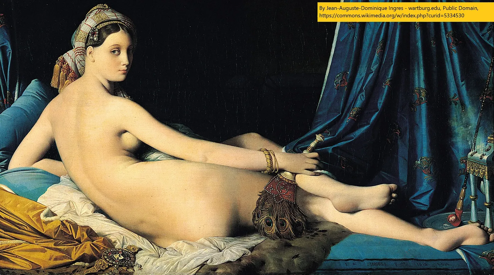
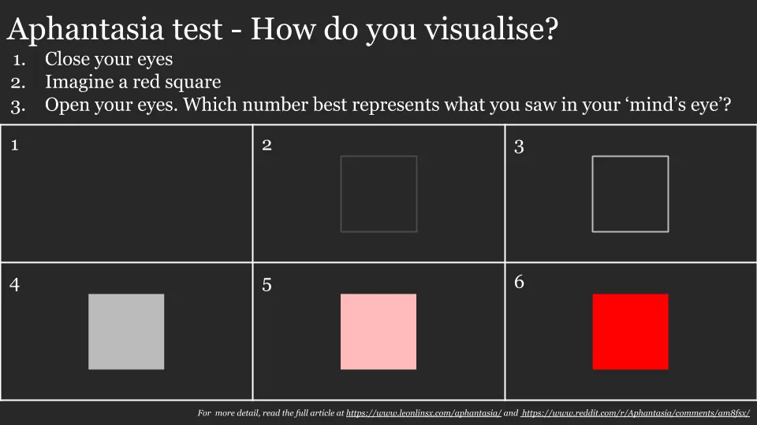

我前段时间开始学习艺术史，以便更好地理解我在博物馆里看到的东西。后来我开始学习绘画，更好地欣赏艺术史。随着近期非同质化代币（NFT）的兴起，我想分享今天学到的艺术知识，然后在后续文章中讨论NFT的内容 [^1]\.

## 1\. 什么是纯艺术？

我主要用的是 [smarthistory](https://smarthistory.org/ 'smart') 学习艺术史，虽然开启我旅程的视频是 [this MoMa one on how to paint like Picasso](https://www.youtube.com/watch?v=rGZYfSzvPvs&list=PLfYVzk0sNiGEZXlIltPP7Yy_s5gTM7hf8 'moma')\.

我之前也通过文章涉及艺术史 [Picasso](/writing/picasso 'picasso') 以及 [Manet](/writing/art 'manet') 如果你想看看那些。

**我学到的艺术史最重要的一点就是要保持开放的心态。**

我的意思是：

假设有人来找你说：“我厌倦了当今的假艺术，我想看到真正纯粹的艺术。”

你会给他们看什么？

也许你会让他们看看 [The School of Athens,](https://en.wikipedia.org/wiki/The_School_of_Athens 'school') 这是拉斐尔在16世纪意大利文艺复兴高峰期创作的一幅画作。作品中对著名哲学家的写实描绘及其运用 [linear perspective](<https://en.wikipedia.org/wiki/Perspective_(graphical)> 'perspective') 为了让画面看起来立体，这幅著名的壁画被视为文艺复兴的杰作。

或者你会拒绝历史题材，认为艺术不应该附加道德教训。相反，你展出了多米尼克·安格尔19世纪的一幅纯粹的享乐与幻想画作，声称真正的艺术不必写实。 [La Grand Odalisque looks realistic on first glance, but taking a closer look shows that the spine is weirdly long, and the back leg is attached at a weird angle.](https://en.wikipedia.org/wiki/Grande_Odalisque 'wiki')

你可能会说快乐是表面的，纪念现代苦难更为纯粹，比如戈雅19世纪的作品 [The Third of May](https://en.wikipedia.org/wiki/The_Third_of_May_1808 'may')\.它不如早期作品写实，人物更扁平且不够精细。它也不再是虚构的，因为它描绘了戈雅时代的真实悲剧 [^2]\.它与以往传统大相径庭，被称为“现代时代最早的画作之一”。

但为什么要把绘画限制在只展示一个时间的快照？如果你从各种角度看一个物体，然后试着把它放在平坦的画布上呢？可以想象成《黑客帝国》的子弹时间，但作为一幅画\;这样不是更贴近物体本身吗？展示像毕加索20世纪初那样的立体主义作品 [Girl with a Mandolin](https://www.pablopicasso.org/girl-with-mandolin.jsp 'girl') 因此，它试图在二维表面上从多个视角展示三维人物，这会是一个不错的选择。

你可以说以上一切都很矫揉造作，艺术不过是画布上的色彩和线条。展示20世纪初的蒙德里安作品，说明我们不应用现实主义自欺欺人。纯艺术是柏拉图式的形状 [^3]\.

我可以继续说下去\;艺术运动和加密货币一样多。我想强调的主要观点是，艺术是主观的，保持开放心态至关重要。讨论某件事是否是艺术，是那些无法回答的哲学问题。

许多新运动在当时受到批评，却成为后来几代艺术家的灵感来源 [^4]\.对许多艺术家来说，突破界限是关键所在。

不喜欢某样东西没关系——我还是不太懂大多数当代艺术。但仅仅因为不喜欢就否定它，会限制你对世界的理解。那一点也不好玩。

## 2\. 艺术上的灵活性

我去年也开始学画画，原因有几个：

- 作为我永无止境的努力的一部分，我努力不再被刻板印象 [^5]
- 更好地理解艺术家创作的方式，区分技巧与废话
- 我在思考哪些技能可以长期练习，哪些技能可以延续到老年
- 加入我表达和沟通的工具箱

我一开始是这样 [draw a box](https://drawabox.com/ 'draw')然后继续 [New Masters Academy](https://www.nma.art/ 'nma')，我还在用 [^6]\.我主要用铅笔和钢笔 [^7]\.

顺便说一句，如果 [aphantasia is real](/writing/aphantasia 'abp')，我大概有，因为我在下面的测试中是3\-4分。从参考图画时这不是障碍，但从想象中画时可能会。

大约一年的每日练习和600张纸之后 [^8]这是一张进展图。是的，他们应该是同一个人：

以下是我一路上学到的东西：

**绘画是一种技能，** 天赋被高估了。我没有天赋，正如第一张照片所见。但规律练习会带来成果，随着时间推移你可以慢慢变得更好。天赋有帮助，但不是唯一的因素。

**你是在画画，不是临摹。** 画完后这幅画会独立存在，因为别人看不到参考。你可以也应该做任何修改，让作品更有趣。这让我对超写实作品兴趣减弱\;为什么不直接拍照呢 [^9]\.

**你学的是工具，不是规则。** 课程教你做事的方法，但不是唯一的做法。

**小事能带来巨大影响。** 用铅笔画画和用钢笔画是不同的（试试看！）。肖像画上的细小标记会改变整幅画的感觉。

**匆忙会毁了工作。** 每次我试图匆忙完成作品，结果都很糟糕。我做过的好作品都是耐心地分层堆砌的，虽然花时间长并不保证质量。而且通常需要多次草图才能做出好作品。

虽然很有压力，但我很庆幸自己开始了绘画。我可能永远不是专家，但这非常有趣 [^10]\!我们都需要更多有趣的东西去学习。

## 其他

1. ["San Francisco bans affordable housing"](https://johnhcochrane.blogspot.com/2021/04/san-francisco-bans-affordable-housing.html 'jc')
2. ["What I talk about when I talk about Chinese tech"](https://lillianli.substack.com/p/what-i-talk-about-when-i-talk-about 'll')
3. [Best practices for writing SQL queries](https://www.metabase.com/learn/building-analytics/sql-templates/sql-best-practices 'sql')\.这部分是为Metabase做广告，但里面有一些不错的建议
4. [Angel investing, beginner's reading list](https://alltheangels.substack.com/p/-angel-investing-beginners-reading 'angel')
5. [How the BBC makes Planet Earth look like a Hollywood movie](https://www.youtube.com/watch?v=qAOKOJhzYXk 'yt')，YouTube

[^1]: 是的，我错过了一次性完成所有内容的截止日期。为自己辩解一下，我最近一直在吃零食。

[^2]: 画作描绘了法国对西班牙叛乱的报复

[^3]: 也就是说，蒙德里安认为我们应该只是看着、享受线条、颜色和形状的样子，因为这正是绘画的本质。假装让事物栩栩如生是假的

[^4]: 多米尼克·安格尔、莫奈、毕加索都是有争议的。也许艺术就是关于争议的\.\.\.\.\.\.

[^5]: 说实话，效果参差不齐。

[^6]: 我用过 [quickposes](https://quickposes.com/ 'qp') 练习手势

[^7]: 我用的是Staedtler Mars荧光仪，从3H到8B（虽然我用暗色不多），一个揉面橡皮、一个树桩和一个细尖的Pilot Metropolitan。我用铅笔做了drawabox练习，虽然应该用毡笔\;我更喜欢铅笔。

[^8]: 我主要在一本200页的速写本里练习，看了其中3本，还有一点点。给那些出于某种原因特别感兴趣的人 [here's a link](https://drive.google.com/drive/folders/1JuCf-pNB8amh2xsFSYmXyuNWUd5oBv8j?usp=sharing 'link') 对我画过的所有草图。不过页面顺序是错的，因为扫描时遇到了困难。说到每天练习，有些天我花10秒画东西，有些天则花上几个小时。

[^9]: 你可以欣赏某项技能，但不再像以前那样喜欢它。

[^10]: 这和我现在在无聊会议上也能涂鸦有些许关联。
